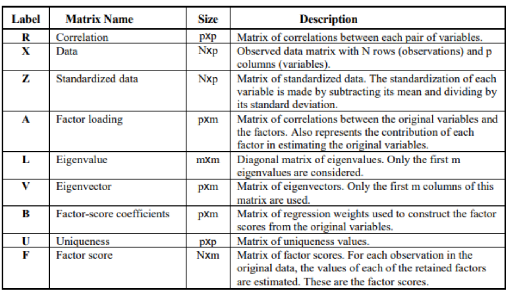

# A revision of probability

## Conditional Probability

$P(A|B)$ is the conditional probability of A given B, calculated with:

\begin{equation}
P(A|B) = \frac{P(A \cap B)}{P(B)}
\end{equation}

Two events are *independent* if $P(A|B) = P(A)$. If they are independent, then we find that $P(A \cap B) = P(A) \cdot P(B)$ . This formula can be extended to any set of independent events!

## Law of Total Probability

\begin{thm}
Let $A_1, A_2, ... A_k$ be mutually exclusive and exhaustive events. Then for any other event $B$,

\[P(B) = P(B|A_1)P(A_1) + .... P(B|A_k)P(A_k)\]

\end{thm}

## Bayes' Theorem

\begin{thm}
Given two events A and B where $P(B) \ne 0$, then we have

\[ P(A|B) = \frac{P(B|A)P(A)}{P(B)} \]
\end{thm}

This isn't the complete form of the Bayes' Theorem, which can be extended to $k$ events.

\begin{thm}
Let $A_1,A_2,...A_k$ be a collection of k mutually exclusive and exhaustive events with prior probabilities $P(A_i)$. Then, for any other event $B$ for which $P(B) > 0$, the posterior probability of $A_j$ given $B$ is:

\[P(A_j|B) =\frac{P(B|A_j)P(A_j)}{\sum_{i=1}^{k}P(B|A_i) \cdot P(A_i)}\]
\end{thm}

## Random Variables

Random variable is a numerical outcome that results from a random experiment. It may be discrete or continuous. In a discrete random variable, the set of values random variable $X$ can take is finite, while in a continuous random variable it is infinite.

## Probability functions

The **probability mass function** gives the probability that a discrete random variable $X$ is equal to some value. It is denoted by $p_{X}(x)$

The **probability density function** is a function of a continuous random variable, whose integral over an interval gives the probability that the value of a variable lies within the same interval. It is denoted by $f_{X}(x)$

The **cumulative density function** is the probability that $X$ will take a value less than or equal to $x$. It is denoted by $F_{X}(x)$

The **expectation** of a function is the expected value of a given function. It is given by the value:

\begin{equation}
E[X] = \int xf(x)dx
\end{equation}

Of course, in the case of discrete variables, this becomes a sum.

Some properties of expectations are:

* $E[aX+bY] = aE[X] + bE[Y]$
* $E[XY] = E[X]E[Y]$ if $X$ and $Y$ are independent

The **variance** of a function $\sigma^2$ is given by:
\begin{align*}
\sigma^2 &= \sum (x-\mu)^2 \cdot p(x) \\
         &= E[(X-\mu)^2] \\
         &= E[X^2] -E[X]^2
\end{align*}
The **standard deviation** is $\sigma$. Let us see some properties of variance:

* $Var(X+a) = Var(X)$
* $Var(aX) = a^2 Var(X)$
* $Var(aX+bY) = a^2Var(X) + b^2Var(Y) + 2abCov(X,Y)$

The **covariance** of two random variables is given by:
\begin{align*}
  Cov[X,Y] &= E[(X-E[X])(Y-E[Y])] \\
  &= E[XY] - E[X]E[Y]
\end{align*}
Let us see some properties of covariance:

* $Cov(X,a) = 0$
* $Cov(X,X) = Var(X)$
* $Cov(aX,bY) = abCov(X,Y)$
* $Cov(X+a,Y+b) = Cov(X,Y)$
* $Cov(aX+bY, cW + dV) = acCov(X,W) + bcCov(Y,W) + adCov(X,V) + bdCov(Y,V)$

## Distributions

### Binomial distribution

A **binomial experiment** is one where we take multiple trials, which have only two results - success or failure. The probability of success (and of course failure) remains constant throughout the experiment.

The binomial random variable $X$ is the number of successes among $n$ trials. The PMF of the random variable $X$ is is denoted by $b(x;n,p)$ where $n$ is the number of trials and $p$ is the probability of success. The value of this PMF is as given below.

\begin{equation}
b(x;n,p) = {n \choose x} p^x (1-p)^{n-x}
\end{equation}

Of course, this only applies for $x \in [1,n]$

We also can calculate the mean and variance of $X$

\begin{equation}
E[X] = np
\end{equation}

\begin{equation}
\sigma^2 = npq
\end{equation}

### Poisson distribution

The PMF of a Poisson random variable $X$ depends on a variable $\mu > 0$ and is denoted by $p(x;\mu)$

\begin{equation}
p(x;\mu) = \frac{e^{-\mu} \cdot \mu^x}{x!}
\end{equation}

\begin{thm}
Suppose in a binomial distribution $b(x;n,p)$, we let $n \rightarrow \infty$ and $p \rightarrow 0$ such that $np \rightarrow \mu$, then $b(x;n,p) \rightarrow p(x;\mu)$
\end{thm}

The mean and variance of a Poisson random variable is $\mu$.

The Poisson distribution describes the occurrences of events over time. We assume that for a given time interval, the probability of an event occurring is directly proportional to the length of that interval, with constant of proportionality $\alpha$. So, we are able to describe this with a Poisson distribution, where the number of events occurring over a time interval $t$ is a Poisson random variable with $\mu = \alpha t$.

The expected number of events during any time interval is $\alpha t$, so the number of events in unit interval is $\alpha$. It is hence called the *rate* of the process.

### Hypergeometric distribution

In a hypergeometric distribution, we assume we are given a population of $N$ individuals, each of which can be success or a failure. We have $M$ successes. Each sample of $n$ individuals is selected without replacement in such a way that each subset of size $n$ is equally likely.

The hypergeometric random variable $X$ is the number of successes in a random sample of size $n$ drawn from the population, where there are $M$ successes and $N-M$ failures. The PMF is denoted by $h(x;n,M,N)$ :

\begin{equation}
h(x;n,M,N) = \frac{{M \choose x}{N-M \choose n-x}}{{N \choose n}}
\end{equation}

The mean and variance is as given below:

\begin{equation}
E(X) = n \cdot \frac{M}{N}
\end{equation}

\begin{equation}
\sigma^2 = (\frac{N-n}{N-1}) \cdot n \cdot \frac{M}{N} \cdot (1-\frac{M}{N})
\end{equation}

### Normal distribution

A continuous random variable $X$ is said to have a normal distribution with parameters $\mu$ and $\sigma$ if the pdf of $X$ is:

\begin{equation}
f(x;\mu,\sigma) = \frac{1}{\sqrt{2 \pi}\sigma} e^{-\frac{(x-\mu)^2}{2\sigma^2}}
\end{equation}

If $\mu$ is 0 and $\sigma$ is 1, then we have the standard normal distribution, given by:

\begin{equation}
f(z) = \frac{1}{\sqrt{2\pi}}e^{-\frac{z^2}{2}}
\end{equation}

In the standard normal curve, $z_{\alpha}$ denotes the value on the $z$ axis such that area of the curve to the right of it is $\alpha$. 

We can easily compute probabilities of any normal random variable $X$ by standardizing it into $Z$ and finding the associated probabilities, with the transformation:

\begin{equation}
Z = \frac{X-\mu}{\sigma}
\end{equation}

The coefficient of skewness is 0, and the coefficient of kurtosis is 3. Almost all values lie between $-3\sigma$ and $3\sigma$.

If $X$ and $Y$ are independent random variables that are normally distributed, then their sum is also normally distributed, i.e. if $X = N(\mu_X, \sigma_X^2)$ and $Y = N(\mu_Y,\sigma_Y^2)$, then $Z = X+Y = N(\mu_X+\mu_Y, \sigma_X^2 + \sigma_Y^2)$

### Exponential distribution

$X$ is said to have an exponential distribution with parameter $\lambda > 0$ if the pdf of $X$ is:

\begin{equation}
f(x,\lambda) =\begin{cases} 
\lambda e^{-\lambda x} & \text{ if } x \geq 0\\
0 & \text{ otherwise}
\end{cases}
\end{equation}

The mean is $\frac{1}{\lambda}$ and the variance is $\frac{1}{\lambda^2}$

We can also easily integrate to find the CDF:

\begin{equation}
F(x) = \begin{cases}
0 & x < 0 \\
1 - e^{- \lambda x} & x \geq 0
\end{cases}
\end{equation}

Suppose that the number of events occurring in any time interval of length $t$ has a Poisson distribution with parameter $\alpha t$ and that the number of occurrences in non-overlapping intervals are independent of one another. Then the distribution of the elapsed time between two successive events is exponential with parameter $\lambda = \alpha$

### Gamma distribution

For $\alpha > 0$, the gamma function $\Gamma(\alpha)$ is defined by:

\begin{equation}
\Gamma(\alpha) = \int_{0}^{\infty} x^{\alpha-1} e^{-x} dx
\end{equation}

1. For any $\alpha > 1$, $\Gamma(\alpha) = (\alpha - 1) \cdot \Gamma(\alpha - 1)$
2. For any positive integer $n$, the gamma function is $n!$
3. $\Gamma(\frac{1}{2}) = \sqrt{\pi}$

A continuous rv $X$ has a gamma distribution if the pdf of $X$ is:

\begin{equation}
f(x;\alpha, \beta) = \begin{cases}
\frac{1}{\beta^{\alpha} \Gamma(\alpha)} x^{\alpha - 1} e^{-\frac{x}{\beta}} & x \geq 0 \\
0 & \text{otherwise}
\end{cases}
\end{equation}

The mean of the function is $\alpha \beta$ and the variance is $\alpha \beta^2$. The standard gamma distribution is one that has $\beta = 1$

The sum of exponential distributions, i.i.d. follows a gamma distribution.

### Chi-Squared Distribution

If, in a gamma distribution, we let $\alpha = \nu/2$ and $\beta = 2$, we have a Chi-squared distribution $\nu$ degrees of freedom.

### Joint distribution

The **joint probability mass function** is $p(x,y)$ such that $p(x,y) = P[X=x, Y=Y]$. The sum of this over all $x$ and $y$ is 1.

The **marginal probability mass function of X**, denoted by $p_{X}(x)$ is given by:

\begin{equation}
p_{X}(x) = \sum_{y : p(x,y) > 0} p(x,y)
\end{equation}

The **marginal probability mass function of Y**, denoted by $p_{Y}(y)$ is given by:

\begin{equation}
p_{Y}(y) = \sum_{x : p(x,y) > 0} p(x,y)
\end{equation}

The **joint pdf** $f(x,y)$ is the function such that the probability of $(x,y)$ lying in a region $A$ is given by:

\begin{equation}
P[(X,Y) \in A] = \int_{A} \int f(x,y) dx dy
\end{equation}

The **marginal probability density function of X**, denoted by $f_{X}(x)$ is given by:

\begin{equation}
f_{X}(x) = \int_{-\infty}^{\infty} f(x,y)
\end{equation}

The **marginal probability mass function of Y**, denoted by $f_{Y}(y)$ is given by:

\begin{equation}
f_{Y}(y) = \int_{-\infty}^{\infty} f(x,y)
\end{equation}

If $X$ and $Y$ are independent, then their joint distribution will be the product of their respective distributions. 

# Statistics

A **statistic** is any quantity whose value can be calculated from sample data.

The random variables $X_i$ are said to form a **random sample** if they are all independent and have the same probability distribution.

Some properties of random samples are:

* $E(X_1+X_2+...+X_n) = n \mu$
* $Var(X_1+X_2+...+X_n) = n \sigma^2$
* $E(X_1X_2...X_n) = \mu^n$
* $f_{X_1,X_2,..X_n}(x_1,x_2,...x_n) = f_{X_1}(x_1)f_{X_2}(x_2)...f_{X_3}(x_3)$
* $F_{X_1,X_2,..X_n}(x_1,x_2,...x_n) = F_{X_1}(x_1)F_{X_2}(x_2)...F_{X_3}(x_3)$

## The Sample Mean

Let $X_1, X_2, X_3,...$ be a random sample from a distribution with mean value $\mu$ and standard deviation $\sigma$. Then:

1. $E(\overline{X}) = \mu$
2. $V(\overline{X}) = \frac{\sigma^2}{n}$

So, $\sigma_{\overline{X}} = \frac{\sigma}{\sqrt{n}}$

If this sample is drawn from a normal distribution, then the sample mean also follows a normal distribution with the same mean and standard deviation scaled down by $\sqrt{n}$.

## Central Limit Theorem

\begin{thm}
Let $X_1, X_2,.. X_n$ be a random sample from a distribution with mean $\mu$ and standard deviation $\sigma$. If $n$ is large enough, $\overline{X}$ has approximately normal distribution with $\mu_{\overline{X}} = \mu$ and $\sigma^{2}_{\overline{X}} = \frac{\sigma^2}{n}$
\end{thm}

By rule of thumb, this applies if $n > 30$. We can use even smaller values of $n$ if the distribution is symmetric.

##  The Sample Variance

The sample variance $S^2$ is given by:

\begin{equation}
S^2 = \frac{\sum_{i=1}^{n}(X_i-(\overline{X}))^2}{n-1} = \frac{n\sum_{i=1}^{n}X_{i}^{2} - (\sum_{i=1}^{n}X_i)^2}{n(n-1)}
\end{equation}

This is an unbiased estimator of $\sigma^2$. However, it is important to remember that $S$ is not an unbiased estimator of $\sigma$.

When $S^2$ is the sample variance of a random normal sample, $(n-1)S^2/\sigma^2$ has a chi-squared distribution with $n-1$ degrees of freedom.

## The Sample Proportion

If $X_1,X_2,... X_n$ is a random sample, sample proportion $\overline{p} = \frac{X}{n}$ is a random variable.

The mean and variance will be:

\begin{equation}
E(\overline{p}) = p
\end{equation}

\begin{equation}
\sigma_p = \begin{cases}
\sqrt{\frac{N-n}{N-1}}\sqrt{\frac{p(1-p)}{n}} & \text{finite population} \\
\sqrt{\frac{p(1-p)}{n}} & \text{infinite population}
\end{cases}
\end{equation}

If $np \geq 5$ and $n(1-p) \geq 5$, sampling distribution of $\overline{p}$ can be approximated by a normal distribution with mean $p$ and s.d. $\sqrt{\frac{p(1-p)}{n}}$

## Estimators

A statistic (which is a function of a random sample, and hence a random variable) used to estimate the population parameter $\theta$ is called a point estimator for $\theta$ and is denoted by $\widehat{\theta}$

We ideally want $\widehat{\theta}$ to be an unbiased estimator, that is, $E[\widehat{\theta}] = \theta$, and that the variance should be small over a large sample size.

A given statistic is said to be a more efficient unbiased estimator of the parameter $\theta$ than a different statistic if they are both unbiased, and the variance of the first estimator is no larger than the second and smaller for some value of $\theta$.

# Confidence Intervals

Let us assume, we have a normal distribution whose $\sigma$ is known and we want to estimate $\mu$. The confidence interval on $\mu$ with confidence level $\alpha$ is a random interval such that, in the long run, the probability that this value will contain $\mu$ is $1-\alpha$.

This will be the interval on the standard normal curve, such that the area under the curve in the interval will be $1-\alpha$. So, this can be given by the interval

\begin{equation}
-z_{\alpha/2} < \frac{\overline{X}-\mu}{\sigma/\sqrt{n}} < z_{\alpha/2} = \overline{X} - z_{\alpha/2} \cdot \frac{\sigma}{\sqrt{n}} < \mu <  \overline{X} + z_{\alpha/2} \cdot \frac{\sigma}{\sqrt{n}} 
\end{equation}

*Prettify*

However, $\sigma$ is not usually known. For a large enough sample, we can use the sample variance $S$ in it's place. Note also, that this interval is random, since the sample mean is random!

What if we know that it is a normal distribution? We can use the sample variance and the T-distribution instead, so the confidence interval will be:

$$ \overline{X} \pm \frac{S}{\sqrt{n}}t_{\alpha/2} $$

Also, we can do this over **any** distribution for the parameter! We did this with a normal distribution because the sample mean follows a normal distribution. For instance, to estimate the parameter for an exponential distribution, we might use a Chi-squared distribution. The idea is the same - choose two ends of the intervals such that the area under the curve outside the interval is $\alpha/2$ on either side.

# Hypothesis Testing

We use hypothesis testing to verify whether a statement about a population parameter should be rejected or not.

$H_0$ is the null hypothesis, which is a tentative assumption about population parameter. It always includes a statement of equality. $H_a$ is the alternative hypothesis, denoted by $H_a$ which is the opposite of the null hypothesis. If our testing contradicts $H_0$ we reject it, otherwise we accept it.

If we are able to find evidence in favour of $H_a$, we say we reject the null hypothesis in favour of the alternative hypothesis. If we are unable to find this, we say that we fail to reject the null hypothesis. Notice, that we do not say that we accept it!

From this, we must realize one very important thing. What we are trying to prove must go in $H_a$.

## Types of error

||$H_0$ accepted|$H_0$ rejected|
|---|---|---|
|$H_0$ true| No error | Type I error |
|$H_0$ false | Type II error | No error|

**Type I error** is when we reject a null hypothesis when it is actually true. The probability of this is denoted by $\alpha$, and it essentially P[$H_0$ is rejected | $H_0$ is true]. This is also known as the **level of significance**

**Type II error** is when we fail to reject a null hypothesis when it is false. The probability of this is denoted by $\beta$. This is essentially P[$H_0$ is accepted | $H_0$ is false]

The **power of a test** is the probability of rejecting a null hypothesis when it is false, denoted by $1-\beta$

It is not possible to reduce both of these together, but we can try to make them reasonably small.

The set of values of the test statistic that leads us to reject the null hypothesis is termed as the **critical region**

## Constructing null and alternative hypotheses

A test can be one-tailed (left-tailed):

$\displaystyle H_0: \theta \geq \theta_0$

$\displaystyle H_a: \theta < \theta_0$

A test can be one-tailed (right-tailed):

$\displaystyle H_0: \theta \leq \theta_0$

$\displaystyle H_a: \theta > \theta_0$

A test can be one-tailed (left-tailed):

$\displaystyle H_0: \theta = \theta_0$

$\displaystyle H_a: \theta \neq \theta_0$

## Test procedures

A procedure has two consituents:

* A test statistic, or function of the sample data used to make a decision

* A rejection region consisting of those $x$ values for which $H_0$ will be rejected in favour of $H_a$

The null hypothesis is only rejected if the observed or computed test statistic falls in the rejection region.

*See slides for a bunch of examples*

### Tests about a population mean

If the population is normal with known $\mu$ and $\sigma$ we can easily solve it with confidence intervals. Let the null hypothesis $H_0$ be $\mu = \mu_0$ and the $H_a$ be what we want to prove in the problem. Then, the test statistic will be the normal random variable:

\begin{equation}
z = \frac{\overline{x}-\mu_0}{\sigma/\sqrt{n}}
\end{equation}

Depending on the tail of the test and the significance level $\alpha$, we will check with respect to $z_\alpha$ or $z_{\alpha/2}$.

In case the sample size is large, we could use an approximation for the z-statistic:

\begin{equation}
z = \frac{\overline{x}-\mu_0}{S/\sqrt{n}}
\end{equation}

If the population variance is unknown, but we know the population is normally distributed, we use the statistic $T$ given by:

\begin{equation}
T = \frac{\overline{x}-\mu}{S/\sqrt(n)}
\end{equation}

The $T$ statistic follows a T distribution with n-1 degrees of freedom.

### Tests about a population proportion

For the population proportion, we use the test statistic:

\begin{equation}
Z = \frac{(\widehat{p}-p_0)}{\sqrt{\frac{p_0(1-p_0)}{n}}}
\end{equation}

## P-value

Sometimes, even though we have taken a decision about which hypothesis to accept, we still want to support it by seeing whether it is deep inside the critical region or on the border. We do this by computing the p-value. The p-value is the area under the curve outside the calculated statistic. Of course, if p-value is greater than $\alpha$, we fail to reject $H_0$ and otherwise, we may reject it.

# Inference with two populations

## Inference on $\mu_1-\mu_2$ (S.D. known)

We consider $\mu_1$ to be the mean of population 1, $\mu_2$ to be the mean of population 2.

The point estimator of $\mu_1-\mu_2$ is given by $\overline{x_1} - \overline{x_2}$. It is an unbiased estimator, in that its expected value is $\mu_1-\mu_2$. It's standard deviation is given by:

\begin{equation}
\sigma_{\overline{x_1}-\overline{x_2}} = \sqrt{\frac{\sigma_1^2}{n_1} + \frac{\sigma_2^2}{n_2}}
\end{equation}

If both of the populations are normal, or if their sample sizes are large enough to use Central Limit Theorem, we can say that $\overline{x_1} - \overline{x_2}$ is a normal distribution.

The interval estimate of the difference between two population means is given by:

\begin{equation}
(\overline{x_1} - \overline{x_2}) \pm z_{\alpha/2} \sqrt{\frac{\sigma_1^2}{n_1}+\frac{\sigma_2^2}{n_2}}
\end{equation}

where $1-\alpha$ is the confidence coefficient

The test statistic for hypothesis testing about $\mu_1-\mu_2$ is:

\begin{equation}
z = \frac{(\overline{x_1}-\overline{x_2})-D_0}{\sqrt{\frac{\sigma_1^2}{n_1} + \frac{\sigma_2^2}{n_2}}}
\end{equation}

$D_0$ is the hypothesized difference between the two population means. The normal rules about hypothesis testing still apply here, with respect to the tailedness of the test and critical region.

## Inference on $\mu_1 - \mu_2$ (S.D. unknown)

The interval estimate of the difference between two population means will be:

\begin{equation}
\overline{x_1}-\overline{x_2} \pm t_{\alpha/2}\sqrt{\frac{s_1^2}{n_1}+\frac{s_2^2}{n_2}}
\end{equation}

where $1-\alpha$ is the confidence coefficient

The degrees of freedom of the T-distribution will be:

\begin{equation}
df = \frac{\left(\frac{s_1^2}{n_1} + \frac{s_2^2}{n_2} \right)^2}{\frac{1}{n_1-1}\left(\frac{s_1^2}{n_1}\right)^2 + \frac{1}{n_2-1}\left(\frac{s_2^2}{n_2}\right)}
\end{equation}

This information also helps us with hypothesis testing. The test statistic is:

\begin{equation}
t = \frac{(x_1-x_2) - D_0}{\sqrt{\frac{s_1^2}{n_1} + \frac{s_2^2}{n_2}}}
\end{equation}

The degrees of freedom of $t$ is given by (35).

## Inference on $p_1-p_2$

The point estimator of $p_1-p_2$ is $\overline{p}_1 - \overline{p}_2$

$$\sigma_{p_1-p_2} = \sqrt{\frac{p_1(1-p_1)}{n_1} + \frac{p_2(1-p_2)}{n_2}}$$

If the sample size is large enough, we can use CLT and say this is a normal distribution.

The interval estimator is:

$$(p_1-p_2) \pm z_{\alpha/2}\sigma_{p_1-p_2}$$

The statistic will be:

$$z=(p_1-p_2)/\sqrt{p(1-p)(\frac{1}{n_1} + \frac{1}{n_2})}$$

where $p$ is:

$$p=\frac{n_1p_1 + n_2p_2}{n_1+n_2}$$

*Everything is overlined, I should add them*

# Estimating Variance

## Single population

Let $X_1, X_2, ... X_n$ be a random sample of size $n$ from a normal population with mean $\mu$ and standard deviation $\sigma$. Then, 

$$(n-1)\frac{S^2}{\sigma^2} = \frac{\sum_{i=1}^{n}(X_i-\overline{X})^2}{n-1}$$

has a chi-squared distribution with $n-1$ degrees of freedom

From this, we can get an interval estimate for variance! The 100(1-$\alpha$)\% confidence interval for $\sigma^2$ is:

$$\frac{(n-1)S^2}{\chi^2_{\alpha/2}} \leq \sigma^2 \leq \frac{(n-1)S^2}{\chi^2_{1-\alpha/2}}$$

Armed with this knowledge, we will be able to conduct hypothesis testing. The test statistic for it will be:

$$\chi^2_{n-1} = \frac{(n-1)s^2}{\sigma_0^2}$$

where $\sigma_0^2$ is the value from the null hypothesis. This test could be right tailed (critical value $\chi^2_{\alpha}$), left tailed (critical value $\chi^2_{1-\alpha}$) or two tailed (critical values $\chi^2_{1-\alpha/2}, \chi^2_{\alpha/2}$)

## Two populations

Whenever independent random samples of size $n_1$ and $n_2$ are collected from two normal distributions with equal variances, the sampling distribution of $S_1^2/S_2^2$ (where $S_1^2 > S_2^2$) has an F distribution with $n_1-1$ degrees of freedom for the numerator and $n_2-1$ degrees of freedom for the denominator

The test statistic for this will be:

$$F_{n_1-1,n_2-1} = \frac{s_1^2}{s_2^2} $$

Our null hypothesis could be two tailed ($\sigma_1^2 = \sigma_2^2$) or upper tailed ($\sigma_1^2 \leq \sigma_2^2$). We don't have a lower tailed test since any lower tailed test could be formulated as an upper tailed one!

In the former case, we can reject $H_0$ if $F \geq F_{\alpha/2}$, while in the latter if $F \geq F_\alpha$.

# Testing Equality of Proportions

Here, we have the following hypotheses:

$$H_0: p_1=p_2 = ... = p_k$$
$$H_a: \text{Not all population proportions are equal}$$

Let us select a random sample from each of the populations and record the observed frequencies of each event, $f_{ij}$. Next, we try to estimate the expected frequencies given $H_0$ is true, $e_{ij}$. We can calculate this with the formula:

$$e_{ij} = \frac{\text{(Row i Total)(Column j total)}}{\text{Total Sample size}}$$

An example can be seen in the table below:

||Impala|Fusion|Accord|Total|
|---|---|---|---|---|
|Yes|69|120|123|312|
|No|56|80|52|188|
|Total|125|200|175|500|

So, $e_{13}$ would be 312*175/500 = 109.2, which would be the expected frequencies of "Yes" responses from Honda Accord owners.

Now, if the expected frequencies and the sample frequencies differ by a lot, we can reject the null hypothesis. To measure this, we can use the chi-squared test statistic:

$$\chi^2 = \sum_{i} \sum_{j} \frac{(f_{ij}-e_{ij})^2}{e_{ij}}$$

The test statistic has a chi-squared distribution with $k-1$ degrees of freedom, as long as all the expected frequencies exceeds 5. Now, we can use this statistic to test our null hypothesis. If $\chi^2 \geq \chi^2_\alpha$, we can reject $H_0$.

If we are able to reject our null hypothesis, we may want to see how different our proportions are! This is called a **comparison test**. First, let us find our sample proportions $\overline{p_i}$. Then for each pair of numbers $i,j$ we compute the absolute difference $|\overline{p_i}-\overline{p_j}|$. Using the Marascuilo procedure, we can calculate multiple critical values $CV_{ij}$ given by:

$$CV_{ij} = \sqrt{\chi_{\alpha}^2} \sqrt{\frac{p_i(1-p_i)}{n_i} + \frac{p_j(1-p_j)}{n_j}}$$

If $|p_i-p_j| > CV_{ij}$, we say the difference is *significant*. Otherwise, it is not significant.

# Testing independence

Here, we have the following hypotheses:

$$H_0: \text{A and B are independent}$$
$$H_a: \text{A and B are not independent}$$

Here, $A$ and $B$ are categorical variables, like gender, wine preference, etc.

We first select a random sample from the population and collect the data for both variables for every element in the sample. We then record the observed frequencies $f_{ij}$ and also compute he expected frequencies $e_{ij}$ assuming $H_0$ is true. If for every cell, $e_{ij} \geq 5$ we can compute the test statistic

$$\chi^2 = \sum_{i} \sum_{j} \frac{(f_{ij}-e_{ij})^2}{e_{ij}}$$

This chi-square distribution has $(r-1)(c-1)$ degrees of freedom, where $r$ is the number of categories in $A$ and $c$ is the number of categories in $B$. We can use this statistic for hypothesis testing. Keep in mind this test is single tailed, so we can reject $H_0$ if $\chi^2 \geq \chi^2_\alpha$.

# Goodness of Fit Test

The goodness of fit test is used to indicate whether a population being sampled has a particular probability distribution.

## Multinomial Probability Distribution

In a multinomial probability distribution, any member of a population is assigned to one and only one of three or more categories. Let us consider an example where a customer is buying one of 3 products, A, B or C. Let $p_A = 0.3$, $p_B=0.5$ and $p_C=0.2$. Now let us assume product C had a huge advertizing campaign, which could change the multinomial distribution! We end up with the following hypotheses

$$H_0: p_A = 0.3, p_B=0.5, p_C=0.2$$
$$H_a: \text{The population proportions have changed}$$

Now, let us select a random sample and record the observed frequencies $f_i$ for each category. Let us also compute the expected frequency $e_i$ by multiplying $p_i$ and the sample size. If $e_i$ is at least 5, we can compute the following test statistic:

$$\chi^2 = \sum_{i=1}^{k} \frac{(f_i-e_i)^2}{e_i}$$

with k-1 degrees of freedom. We can reject $H_0$ is $\chi^2 \geq \chi_{\alpha}^2$  (one tailed test).

## Normal probability distribution

Let us assume we took a sample of values from a population, and we want to see if it has a normal distribution. First, let us calculate the sample mean $\overline{x}$ and sample standard deviation $S$. So, we have the following hypotheses:
$$H_0: \text{The population comes from a normal distribution with mean } \overline{x} \text{ and standard deviation } S$$
$$H_a: \text{The population does not come from the aforementioned normal distribution}$$

Now, let us define $k$ intervals of values so that the expected frequency is at least 5 for each interval. We generally choose  equal probability intervals. Let us also record the observed frequency of data values $f_i$ in each interval. We also have to compute the expected number of occurrences $e_i$ for each interval. Finally, we can compute the value of the test statistic:

$$\chi^2 = \sum_{i=1}^{k} \frac{(f_i-e_i)^2}{e_i}$$

with $k-p-1$ degrees of freedom, where $p$ is the number of parameters of the distribution. In this case, $p=2$, so $k-3$ degrees of freedom. Once again, its a one tailed test, so we can reject if $\chi^2 \geq \chi_{\alpha}^2$.

# ANOVA

## Terminology

**Experiment** A way of getting an answer to a question which the experimenter wants to know

**Treatment** Different objects/procedures which are to be compared in an experiment are called treatments

**Sampling Unit** The object that is measure in an experiment

**Factor** A variable defining a categorization. A factor may be fixed or random.

**Fixed Factor** A factor where all the levels of interest are included in the experiment

**Random Factor** All the levels of interest are not included in the experiment and those that are can be considered to be randomly chosen from all levels of interest.

**Replication** It is the repetition of the experimental situation by replicating the experimental unit

**Experimental error** The unexplained random part of variation in any experiment is known as experimental error

**Treatment design** A treatment design is the manner in which the levels of treatment are arranged in an experiment.

## Assumptions

We assume the following:

* For each population, the response variable is normally distributed
* Variance of the response variable $\sigma^2$ is same for all populations
* The observations are independent

## General Approach

The general form of our hypotheses are:

$$H_0: \mu_1 = \mu_2 = ... = \mu_k$$
$$H_a: \text{All population means are not equal}$$

$\mu_j$ is the mean of the $j^{th}$ population.

Now, for each of the $k$ treatments, we take a random sample of size $n_j$. 

$x_{ij}$: value of observation $i$ for treatment $j$

$n_j$: number of observations for treatment $j$

$\overline{x_j}$: sample mean for treatment $j$

$s_j^2$: sample variance for treatment $j$

$n_T$: total number of observations

Let us calculate the overall sample mean $\overline{\overline{x}}$, assuming $H_0$ to be true

Now, we can calculate the **between treatments estimate** of $\sigma^2$ called the mean square due to treatments (MSTR)

$$MSTR = \frac{\sum_{j=1}^{k} n_j (\overline{x_j} - \overline{\overline{x}})^2}{k-1} = \frac{SSTR}{k-1}$$

SSTR is the Sum of Squares due to treatments

Next, we calculate the **within treatments estimate** of $\sigma^2$ called the mean-square due to error (MSE)

$$MSE = \frac{\sum_{j=1}^{k}(n_j-1)s_j^2}{n_T-k} = \frac{SSE}{n_T-k}$$

Finally, let us find a test statistic to perform the hypothesis test:

$$F_{(k-1),(n_T-k)} = \frac{MSTR}{MSE}$$

We perform the hypothesis test as an upper tail test! So, p-value $\leq \alpha$ or $F \geq F_\alpha$

This illustrates the main idea in ANOVA - among several groups the total variability is the sum of the variable between groups and the variability within groups

## ANOVA Table

The previous sections calculations can be conveniently expressed as a table:

|Source of Variation|Sum of Squares|Degrees of Freedom|Mean square|$F$|p-value|
|---|---|---|---|---|---|
|Treatments|SSTR|$k-1$|$MSTR=\frac{SSTR}{k-1}$|$\frac{MSTR}{MSE}$||
|Error|SSE|$n_T-k$|$MSE=\frac{SSE}{n_T-k}$|||
|Total|SST|$n_T-1$|||||

SST, which is SSTR+SSE, is the overall sample variance from treating the entire set as a single dataset.

## Randomized Block Design

Sometimes, there are extraneous factors which can cause the MSE to be large despite the fact that there is a difference between treatments. In cases like this, we use randomized block design.

Consider an example where we are testing controller stress due to different workstations. To do randomized block design, we would take a single sample of controllers. Each controller would be a single **block**. The treatments (workstations) are assigned to each controller in a random order, and tested. So, we we end up with results for each block and each treatment.

Let $k$ be the number of treatments, $b$ be the number of blocks, and $n_T$ be the total sample size ($n_T = kb$). $x_{ij}$ is the value of the observation corresponding to treatment $j$ in block $i$, $\overline{x_j}$ is the sample mean of the $j^{th}$ treatment, $\overline{x_i}$ is the sample mean of the $i^{th}$ block and $\overline{\overline{x}}$ is the overall sample mean.

We make the following computations:

$$SST = \sum_{i=1}^{b} \sum_{j=1}^{k} (x_{ij}- \overline{\overline{x}})^2$$
$$SSTR = b\sum_{j=1}^{k} (\overline{x_{j}}- \overline{\overline{x}})^2$$
$$SSBL = k\sum_{i=1}^{b} (\overline{x_{i}}- \overline{\overline{x}})^2$$
$$SSE = SST-SSTR-SSBL$$

Now, to calculate the means:

$$MSTR = \frac{SSTR}{k-1}$$
$$MSBL = \frac{SSBL}{b-1}$$
$$MSE = \frac{SSE}{(k-1)(b-1)}$$

As before, the statistic is:

$$F_{k-1,(k-1)(b-1)} = \frac{MSTR}{MSE}$$

The corresponding ANOVA table is:

|Source of Variation|Sum of Squares|Degrees of Freedom|Mean square|$F$|p-value|
|---|---|---|---|---|---|
|Treatments|SSTR|$k-1$|$MSTR=\frac{SSTR}{k-1}$|$\frac{MSTR}{MSE}$||
|Blocks|SSBL|$b-1$|$MSBL=\frac{SSBL}{b-1}$|||
|Error|SSE|$(k-1)(b-1)$|$MSE=\frac{SSE}{(k-1)(b-1)}$|||
|Total|SST|$n_T-1$|||||

# Multiple Comparison Procedures

With ANOVA, we can check if the means of $k$ populations are equal, but this allows to go a step further - which two population means are not equal?

## Fisher's LSD

Fisher's Least Significant Difference procedure works based on the following hypotheses:

$$H_0:\mu_i = \mu_j$$
$$H_a: \mu_i \neq \mu_j$$

The test statistic for this is:

$$t = \frac{\overline{x_i} - \overline{x_j}}{\sqrt{MSE(\frac{1}{n_j} + \frac{1}{n_i})}}$$

which has $n_T-k$ degrees of freedom.

The test is two tailed, so the critical value approach would be to reject if $t \leq t_{-\alpha/2}$ or $t \geq t_{\alpha/2}$

Sometimes, we may use the test statistic $\overline{x_i} - \overline{x_j}$. In this case, we would reject $H_0$ if $|\overline{x_i}-\overline{x_j}| \geq LSD$, where:

$$LSD = t_{\alpha/2}\sqrt{MSE \left(\frac{1}{n_i} + \frac{1}{n_j} \right)}$$

where the DOF is again $n_T-k$

We could even develop a confidence interval with this information! It would be:

$$\overline{x_i} - \overline{x_j} \pm LSD$$

If this confidence interval contains 0, we cannot reject $H_0$, but otherwise we may.

# Simple Linear Regression

The regression model in simple linear regression is:

$$y = \beta_0 + \beta_1x + \epsilon$$

$\beta_0$ and $\beta_1$ are parameters of the model, while $\epsilon$ is an error term. It accounts for the variability which cannot be explained by a linear relationship between $y$ and $x$. Of course, the error term's mean is zero, so we get the simple linear regression equation:

$$\mu_{Y|x} = \beta_0 + \beta_1x$$

This is all well and good if we have these parameters. In real life, we have to estimate them. Thus we end up with an estimated equation:

$$\hat{y} = b_0 + b_1x$$

$b_0$ and $b_1$ are estimated from the sample data.

One way to estimate this is with the **method of least squares**. Here, we minimize the sum of squares of the residuals, given by:

$$SSE = \sum_{i=1}^{n} (y_i-\hat{y_i})^2$$

It is possible to derive the parameters through this:

$$b_1 = \frac{\sum_{i=1}^n (x_i - \overline{x})(y_i - \overline{y})}{\sum_{i=1}^n (x_i-\overline{x})^2}$$
$$b_0 = \overline{y} - b_1 \overline{x}$$

How well does an estimated regression equation fit the data? We can find this with **the coefficient of determination**. For this, we need to define the following values:

* Total of Sum of Squares - $SST = \sum_{i=1}^{n}(y_i - \overline{y})^2$
* Sum of Squares due to Regression - $SSR = \sum_{i=1}^{n} (\hat{y_i} - \overline{y})^2$

The relation between these is $SST = SSR+SSE$

From this, we get the coefficient of determination:

$$r^2 = \frac{SSR}{SST}$$

The **correlation coefficient** is a measure indicating the strength of linear association between 2 variables, $x$ and $y$. It is given by:

$$r_{xy} = (\text{sign of } b_1)\sqrt{r^2}$$

When doing all this, we made the following assumptions:

* $E[\epsilon] = 0$
* $V(\epsilon) = \sigma^2$
* The values of $\epsilon$ are independent
* $\epsilon ~ N(0,\sigma^2) \Rightarrow Y$ is also normally distributed

## Testing for Significance

$\sigma^2$, the variance of $\epsilon$ is also the variance of the $y$ values about the regression line. We can estimate this with the Mean Squared Error or MSE, given by:

$$s^2 = MSE = \frac{SSE}{n-2}$$

$s$ is also an unbiased estimator for $\sigma$. This is called the Standard Error of the Estimate.

### T test

The purpose of this test is to see if $y$ and $x$ are linearly related. This comes down to checking if $\beta_1$ is nonzero, giving us the following hypotheses:

$$H_0 : \beta_1 = 0$$
$$H_a : \beta_1 \ne 0$$

If we are able to reject $H_0$ we can conclude there is a linear relationship between the variables. To check this we use our estimate $b_1$. $b_1$ has an expected value of $\beta_1$ and a standard deviation given by the formula below:

$$\sigma_{b_1} = \frac{\sigma}{\sqrt{\sum (x_i-\overline{x})^2}}$$

Of course, since we do not have the real standard deviation, we can use $s$ and calculate $s_{b_1}$.

The T test is based on the fact that $\frac{b_1-\beta_1}{s_{b_1}}$ follows a T distribution with $n-2$ degrees of freedom. If the null hypothesis is true, we have $\beta_1=0$. So, we end up with our T test statistic:

$$t = \frac{b_1}{s_{b_1}}$$

which follows a T distribution with $n-2$ degrees of freedom. We  can reject $H_0$ if $t \leq -t_{\alpha/2}$ or  $t \geq t_{\alpha/2}$ (two tailed test).

From this we also get a confidence interval:
$$b_1 \pm t_{\alpha/2}s_{b_1}$$

### F Test

The F test is another test with the same hypotheses, but a different test statistic. First, let us define Mean Square Regression:

$$MSR = \frac{SSR}{\text{Number of independent variables}}$$

In our case, the denominator is always 1.

The statistic we use is:

$$F_{1,n-2} = \frac{MSR}{MSE}$$

We can reject $H_0$ if $F \geq F_\alpha$.

### Cautions

Even if we are able to conclude a significant linear relationship between two variables that is not enough to say there is a causal relationship between them. Essentially, correlation is not causation.

## Estimation

A fitted linear regression model can be used for estimation and prediction as well. From now on, we will be using the following terminology:

* $x^*$: The given value of independent variable $x$
* $y^*$: The random value denoting the possible values of the dependent variable $y$ when $x=x^*$
* $E(y^*)$: The mean or expected value of the dependent variable $y$ when $x=x^*$
* $\hat{y}^* = b_0 + b_1x^*$: The point estimator for $E(y^*)$ and the predictor of an individual value of $y^*$

### Confidence Interval for the Mean Value of $y$

The estimated variance of $\hat{y}^*$ is given by:

$$s^2_{\hat{y}^*} = s^2 \left[ \frac{1}{n} + \frac{(x^* - \overline{x})^2}{\sum (x_i - \overline{x})^2}\right]$$

From this, we get the confidence interval:

$$\hat{y}^* \pm t_{\alpha/2}s_{\hat{y}^*}$$

Where $t$ has $n-2$ degrees of freedom.

### Prediction Interval for Individual Value of $y$

The variance for the predicted value of $y^*$ is:

$$s_{pred}^2 = s^2 + s^2 \left[ \frac{1}{n} + \frac{(x^* - \overline{x})^2}{\sum (x_i - \overline{x})^2}\right]$$

So, we have the prediction interval:

$$\hat{y}^* \pm t_{\alpha/2,n-2}s_{pred}$$

The prediction interval is always wider than the confidence interval, since we are less sure of the individual value for $y^*$ than of its mean.

# Multiple Linear Regression

Here, the **response variable** $y$ is related to $k$ independent **regressor variables**. The multiple regression model is given by:

$$y = \beta_0 + \beta_1x_1 + \beta_2x_2 +... \beta_kx_k + \epsilon$$

By considering the mean value, we get the **multiple regression equation**:

$$E(y) = \beta_0 + \beta_1x_1 + \beta_2x_2 +... \beta_kx_k$$

Estimating these parameters gives us the **Estimated Multiple Regression Equation**:

$$\hat{y} = b_0 + b_1x_1 + b_2x_2 + ... b_kx_k$$

These parameters can be estimated by using the least square method again - we want to minimize $\sum (y_i - \hat{y}_i)^2$. There is no simple closed form like last time  - we need to solve a system of equations called the **least squares normal equations**.

The **coefficient of multiple determination** is given by:

$$R^2 = \frac{SSR}{SST} = 1-\frac{SSE}{SST}$$

We also have **Adjusted $R^2$**, which accounts for the phenomenon of $R^2$ increasing when extra explanatory variables are added to the model. It is given by:

$$\overline{R}^2 = 1 - (1-R^2)\frac{n-1}{n-k-1}$$

This helps guard against overfitting.

## Testing for significance

### F test

The hypotheses are:

$$H_0: \beta_1 = \beta_2 = ... = \beta_k = 0$$
$$H_a: \text{One or more parameters are nor equal to zero}$$

The test statistic is:

$$F_{k,n-k-1} = \frac{MSR}{MSE}$$
$$MSR = \frac{SSR}{k}$$
$$MSE = \frac{SSE}{n-k-1}$$

We can reject $H_0$ if $F \geq F_\alpha$.

### T Test

If the F test indicates that not all coefficients are zero, we may want to check which ones are non zero. For this, we use the T test.The hypotheses are:

$$H_0: \beta_i = 0$$
$$H_a: \beta_i \ne 0$$

The test statistic is:

$$t = \frac{b_i}{s_{b_i}}$$

$t$ is based on a T distribution with $n-k-1$ degrees of freedom. We can reject $H_0$ if $t \leq -t_{\alpha/2}$ or $t \geq t_{\alpha/2}$ 

### Multicollinearity

The independent variables may not always be independent. Consider the case where we find that the equation $y=b_0 + b_1x_1 + b_2x_2$ is significant, via the F test. But using the T test we find that we cannot reject $H_0: \beta_1 = 0$. What does this mean? I means that with $x_2$ already in the model, $x_1$ does not make a significant contribution to the value of $y$. This correlation between independent variables is known as **multicollinearity**.

We can avoid such problems when there is little correlation between independent variables. A rule of thumb is to check the value of sample correlation coefficient. If its absolute value is greater than 0.7, we conclude that there is significant amount of multicollinearity.

## Categorical Data

Sometimes, we might be dealing with categorical data. Consider the case where we are trying to find the repair time given the months since last service and the type of repair. The type of repair is categorical - it could be electrical or mechanical. Let $y$ be the repair time in hours, $x_1$ be the number of months since last service and $x_2$ be a categorical variable such that it is 0 if mechanical and 1 if electrical. We end up with our normal regression equation:

$$E(y) = \beta_0 + \beta_1x_1 + \beta_2x_2 = 0.93 + 0.388x_1 + 1.26x_2$$
$$E(y|\text{Mechanical}) = \beta_0 + \beta_1x_1 + \beta_2 \cdot 0 = 0.93 + 0.388x_1$$
$$E(y|\text{Electrical}) = \beta_0 + \beta_1x_1 + \beta_2 \cdot 1 = 2.19 + 0.388x_1$$

How do we interpret this data? We see that for both mechanical and electrical repairs, the mean repair time $y$ is a linear function of $x_1$. The slope is the same, but the intercept differs. $\beta_2$ indicates the difference between the mean repair time for an electrical repair, and the mean repair time for a mechanical repair.

If we have $k$ levels in our categorical variables, we need $k-1$ variables to encode this. $x_i=1$ if our categorical variable is $i$, and $0$ otherwise.

# Logistic Regression

A **logistic model** is used to model the probability of a certain class or event existing. An example of this would be classifying as pass/fail, or spam/not spam.

Logistic regression measures the relationship between the categorical dependent variable and one or more independent variables by estimating probabilities using a logistic function, which is the cumulative distribution function of logistic distribution. The logistic function is given by:

$$f(x) = \frac{L}{1+e^{-k(x-x_0)}}$$

where $L$ is the maximum value, $x_0$ is the midpoint, and $k$ is the growth rate.

The logistic regression function is given by:

$$E(Y) = P(Y=1|x_1,x_2,x_3...x_p) = \frac{e^{\beta_0 + \beta_1x_1 + ... + \beta_px_p}}{1 + e^{\beta_0 + \beta_1x_1 + ... + \beta_px_p}}$$

So, what is given is the probability that the categorical variable $Y$ is 1 given the inputs $x_1,x_2,... x_p$

# Residual Analysis

A residual is defined as the difference between the real value and the predicted value of $y$, given by $y_i - \hat{y}_i$. It acts as a proxy for the error term $\epsilon$, and is given by $\hat{\epsilon}$.

The standardized residual for a given observation is given by:

$$\frac{y_i-\hat{y}_i}{s_{y_i-\hat{y_i}}}$$

where $s_{y_i-\hat{y}_i}$ is the standard deviation of the residual. It is given by:

$$s_{y_i-\hat{y}_i} = s \sqrt{1-h_i}$$

where $s$ is the standard error of the estimate, and $h$ is the **leverage** of the observation, given by:

$$\frac{1}{n} + \frac{(x_i-\overline{x})^2}{\sum (x_i - \overline{x})^2}$$

The standard error of the estimate is given by:

$$s = \sqrt{\frac{\sum (y - \hat{y})^2}{N}}$$

The leverage is a measure of how far the values of the independent variables are from their means.

## Residual Plot

The residual plot is a plot of the residual against independent variable $x$. If there is a uniform scatter in the residual plot, it indicates a good fit. However, if patterns emerge, the fit becomes less good. For instance if there is an increasing or decreasing spread about the line, the prediction becomes less accurate when $x$ is large. A curved pattern indicates the relationship is nonlinear.

Residual plots can also be taken against $\hat{y}$ (TODO).

## Normal Probability Plot

To verify whether the residuals follow a normal distribution, we could us a **Normal Probability Plot**. If this plot is straight, the residuals are normal. The more different it is from a normal plot, the more curved the plot becomes. 

## Detecting Outliers

An **outlier** is an observation that lies outside the overall pattern of the other observations. Points that are outliers in the $y$ direction but not the $x$ direction of a scatter plot have large residuals. Other outliers may not have large residuals.

An observation is **influential** for a statistical calculation if removing it would markedly change the result of the calculation. Points that are outliers in the $x$ direction of a scatterplot are often influential for the least squares regression line

We could define an observation as an outlier if the value of its standardized residual is less than -2 or greater than 2. However, since the presence of outliers tends to increase $s$, the size of the standardized residual is artificially deflated and we may not detect an observation as an outlier.

To circumvent this, we use **studentized deleted residuals**. The studentized deleted residual is the standardized residual for observation $i$, when we calculate the standard error $s$ without the observation $i$ (denoted by $s_{(i)}$). If the $i^{th}$ residual is an outlier, $s_{(i)}$ will be less than $s$, or the absolute value of the studentized residual will be more than that of the standardized residual.

Influential observations are characterized by high leverage values $h_i$. The higher the leverage value, the more its influence. One rule of thumb is $h_i > 2(p+1)/n$. However, there are more scientific ways to do this, like **Cook's Distance Measure**. Cook's distance measure is given by:

$$D_i = \frac{(y_i-\hat{y}_i)^2}{(p+1)s^2} \left[  \frac{h_i}{(1-h_i)^2} \right]$$

where all the variables have their standard meaning, and $p$ is the number of independent variables. The value of $D_i$ is large for influential observations. By rule of thumb, $D_i > 1$ generally indicates influential variables. 

# Time series

A **time series** is a sequence of observations of a variable measured at successive points in time or over successive periods of time. Since the data is obtained by observing response variable at regular time periods, the data is evenly spaced.

## Time series patterns

A **horizontal pattern** exists when the data fluctuates about a constant mean.

A **stationary time series** is one whose statistical properties are independent of time. Examples of this include a process with a constant mean, or constant variance.

Time series could show **trend patterns** as well. Though time series generally exhibit random fluctuations, the time series may also show gradual shifts or movements to relatively higher or lower values over a longer period of time.

A time series is said to show **seasonal patterns** if the same repeating patterns are seen over successive periods of time. The "season" in question could be any time period. Time series could also show combinations of both seasonal and trend patterns.

A **cyclical** pattern exists if the time series shows alternating sequence of points below and above the trend line lasting more than one year

## Forecast Accuracy

The **naive forecasting method** is when we use the value from the previous time quantum for this one. So, if last week the price of gas was 21, we estimate that it will be the same next week as well. To see how accurate this is, we need to create measures of forecast accuracy.

The **forecast error** is the difference between the actual value and the forecasted one. So, $\rm Forecast Error = ActualValue - Forecast$.

The **Mean Absolute Error** (MAE) is the average of the absolute values of the forecast errors.

The **Mean Squared Error** (MSE) is the average of the sum of squared forecast errors.

MAE and MSE are both absolute measures. In cases where we need relative measures, we use **Mean Absolute Percentage Error** (MAPE), which is the mean of the absolute value of the percentage forecast errors. The percentage forecast error is computed by dividing the forecast error by the actual value and multiplying by 100.

These measures are good for measuring the accuracy on historical data. But what about future data? Unfortunately, we cannot measure the accuracy in these cases.

## Moving average and Exponential Smoothing

**Moving averages** take the average of the most recent $k$ data values in the time series in order to forecast for the next method. This provides a much better forecast accuracy than the previously discussed naive method.

An extension of this is to use **weighted moving averages**, where we weight observations based on how far in the past they were. We normally weight newer values higher than older ones.

Extending this concept even further we get **exponential smoothing**. It is a special case of weighted moving averages where we use only the latest value. It is given by:

$$F_{t+1} = \alpha Y_t + (1-\alpha) F_t$$

$\alpha$ is called the **smoothing constant**. It indicates how important newer values are to us over historical values.

These smoothing techniques are mostly useful for forecasting when the time series data has no trend component, to remove the random component.

## Time Series Decomposition

The decomposition model assumes the time series is a function of three parts - the seasonal component, the trend component, and the irregular component. We can represent this mathematically by:

$$Y_t = f(S_t,T_t,E_t)$$

$Y_t$ is the value of the time series at a particular time point $t$, $S_t$ is the seasonal index, $T_t$ is the trend value, and $E_t$ is the random component or irregular index.

There are two kinds of decomposition models. One is an **additive model**, given by $Y_t = S_t + T_t + E_t$. When we use an additive model, we must make sure the magnitude of the seasonal variation does not vary with the trend of the data (it is independendent).

Another is a **multiplicative model**, where we have $Y_t = S_t \cdot T_t \cdot E_t$ which is applicable when the seasonal trend varies with the level of the data. This can also be seen as an additive model in log space, so we could solve it by fitting an additive relationship to the logarithm of the data.

## Trend Projection

### Linear Trend Regression

This is used for forecasting the trend. The relationship between response variable $T$ and time $t$ is considered to be a linear function, given by:

$$T = b_0 + b_1 t$$

The variable $b_1$ indicates whether it trends downwards or upwards. The coefficients are given by:

$$b_1 = \frac{\sum_{t=1}^{n}(t - \overline{t})(Y_t-\overline{Y})}{\sum (t - \overline{t})^2}$$
$$b_0 = \overline{Y}-b_1 \overline{t}$$

### Holt's Linear Exponential Smoothing

Holt's Method uses two smoothing constants. $\alpha$ is a smoothing constant for the level of the TS, while $\beta$ is the smoothing constant for the slope of the TS. Forecasts are given by:

$$F_{t+k} = L_t + b_t k$$

where 

$$L_t = \alpha Y_t + (1-\alpha)(L_{t-1} + b_{t-1})$$
$$b_t = \beta(L_t-L_{t-1}) + (1-\beta)b_{t-1}$$

$L_t$ acts as an estimate for the level of the time series at time $t$, and $b_t$ acts as an estimate of ths lope of the time series in period $t$.

### Non-linear trend projection

The methods discussed before consider a linear relationship between the trend and time. In cases where this is not true, we need to use some nonlinear trend projection.

The **Quadratic Trend Equation** is given by

$$T_t = b_0 + b_1 t + b_2 t^2$$

The coefficients for this can be computed through simple multiple regression.

Another kind of time series forecasting model is given by the **exponential forecasting model**. Unlike the quadratic equation, the series will increase (or decrease) at an increasing (or decreasing) rate. The equation is given by:

$$\hat{Y}_i = b_0 b_1^{x_i}$$

Here, $x_i$ is the same as $t$.

## Seasonality and Trend

### Seasonality without Trend

If there is no trend in the data, we could code it as a multiple regression problem with categorical variables. If we have $k$ periods, then we would need $k-1$ categorical variables. For instance if we are considering quarterly sales, we would code it as:

$$\hat{Y} = b_0 + b_1 Qtr_1 + b_2Qtr_2 + b_3 Qtr_3$$

### Seasonal Index Calculation

We calculate it with the following steps:

1. Compute the moving average to remove the combined seasonal and irregular effects from the data, leaving us with a time series that contains mostly trend. If we work with quarterly data, we would use 4 data values in each moving average

2. Compute the **centred moving average**. The centred moving average ensures the centre falls exactly on a particular quarter. This can be done by taking the average of two moving averages.

This smooths our data, removing the random and seasonal component and leaving the trend component. For multiplicative decomposition, the seasonal-irregular values ($S_t \times E_t$) can be found by:

$$\frac{Y_t}{T_t} = S_t \times E_t$$

Now that we have the seasonal-irregular values for each time period, we can calculate the seasonal effect or the seasonal index as the average of all the calculated values.

Now that we have this seasonal index, how do we interpret it? Assume the seasonal index for a quarter is 1.14. This means that the sales average is 14% above the trend estimate. If it were 0.89, it would be 11% below the trend estimate.

### Deseasonalizing the Time series

Using the seasonal indices, we can deseasonalize the data by dividing the data values by their respective seasonal indices. This leaves only the trend and some irregular component. Using this data we can identify the trend. We can fit a linear trend equation to the deseasonalized data and forecast the value of $T_t$.

## Cyclical components

When considering the cyclical components, we expand the multiplicative model into

$$Y_t = T_t \times C_t \times S_t \times E_t$$

While this could be estimated much like seasonal data, it is difficult due to the long time period needed to observe cyclic trends. 

# Non Parametric Methods

Non-parametric methods are used to make inferences about a population without needing any assumption about the underlying distribution or its parameters.

Distribution free tests are statistical tests that do not rely on any underlying assumptions about the probability distribution of the sampled population. The advantage of these tests are that we do not need to make assumptions, its easy to compute, and we need not involve population parameters. However, this may waste information and it is difficult if computing by hand. Some non parametric tests include Chi-squared test, sign test, etc.

## Sign Test

The sign test is a versatile nonparametric method for hypothesis testing that uses the binomial distribution with $p = 0.5$ as the sampling distribution.

We can use it to do hypothesis testing on medians. The hypotheses would be:

$$H_0 : \text{Median} = 450$$
$$H_s : \text{Median} \neq 450$$

The median is meant to divide the population into two equal halves. Let us say that greater numbers have the + sign, and lesser numbers have the - sign. So, if $p$ is the probability of a plus sign, we can convert the hypotheses into:

$$H_0 : p = 0.5$$
$$H_a : p \neq 0.5$$

Assume we have $n=10$ data items, and 7 items have a + sign. With a binomial table, we can calculate the probability of $P(X \geq 7)$. This is the p value, and if it is less than $\alpha$, we can reject $H_0$.

In cases where $n > 20$, we can use the normal approximation to the binomial. Remember that when doing so, we also need to apply a continuity correction factor of 0.5. So if we are looking for 22 or less plus signs, we look for $P(Y < 22.5)$.

## Wilcoxon Signed Rank Test

The Wilcoxon Signed Rank Test is used in matched-sample experimental design, where each of $n$ experimental units provided a pair of observations, one from population 1 and other from population 2. We assume that we take random samples from continuous populations. The differences between the paired observations have a  symmetric distribution. This means that the shapes of the populations are the same and we need to check if there is a difference between the medians of the two populations.

The steps are as follows:

1. Discard 0 differences and compute absolute differences
2. Arrange the absolute differences in increasing order, and rank them
3. For any tie, assign an average rank
4. Once the ranks are assigned, attach original sign to the rank
4. Calculate the sum of the positive signed ranks

This sum is denoted by $T^+$. The parameter of its distribution are as follows:

$$\mu_{T^+} = \frac{n(n+1)}{4}$$
$$\sigma_{T^+} = \sqrt{\frac{n(n+1)(2n+1)}{24}}$$

The distribution is approximately normal for $n \geq 10$. With this knowledge, we are able to perform our two tailed hypothesis test!

## Mann-Whitney-Wilcoxon Test

The MWW Test or the Wilcoxon Rank Sum Test is a non-parametric procedure for the difference between 2 populations based on 2 independent samples. The hypotheses are:

$$H_0 : \text{The two populations are identical}$$
$$H_a : \text{The two populations are not identical}$$

The procedure is as follows:

1. Assign ranks to the $n_1+n_2$ sample observations, with average ties
2. Sum the ranks for each sample. These sums are called $R_1$ and $R_2$ respectively.
3. The test statistic is $R_1$ (the first sample).

The sampling distribution for $R$ is undefined - instead we simulate the process many times using a computer and find the associated probabilities. If our hypotheses says that the second population is either lesser or greater than the first, it is a one tailed test, and if our hypotheses says it is both, it is a two tailed test.

If we involve larger samples $n_1 \geq 7$ and $n_2 \geq 7$ we can use an approximation that the sampling distribution of $R$ is based on a normal distribution. The test statistic is:

$$Z = \frac{R-\frac{n_1(n_1+n_2+1)}{2}}{\sqrt{\frac{n_1n_2(n_1+n_2+1)}{12}}}$$

## Kruskal-Wallis Test

This is a non-parametric test for the equality of more than two population probability distributions, corresponding to ANOVA with more than 2 means. To perform a Kruskal-Wallis Test, we need to meet the following conditions:

1. The $k$ samples are random and independent
2. There are 5 or more measurements in each sample
3. The $k$ probability distributions from which samples are drawn are continuous

Our hypotheses are:

$$H_0 : \text{The $k$ probability distributions are identical}$$
$$H_a : \text{The $k$ probability distributions differ (in location)}$$

The procedure is as follows:

1. Assign ranks $R_i$ to the $n$ combined observations
2. Sum ranks for each group
3. Compute the test statistic, given by:

$$H = \left(\frac{12}{n(n+1)} \sum \frac{R_j^2}{n_j}\right) - 3(n+1)$$

$H$ follows a $\chi^2$ distribution with $k-1$ degrees of freedom. This is an upper tailed test!

## Kolmogorov-Smirnov Test

The Kolmogorov Smirnov Test is a nonparametric test for the equality of 1-dimensional continuous probability distributions.

# Statistical Quality Control

Statistic Process Control (SPC) is a methods of quality control which employs statistical methods to monitor and control a process. This helps ensure that the process operates efficiently, producing more specification conforming products with less waste.

The sources of variation leading to defective behaviour are called **assignable causes**. 

## Control Charts

**Control charts** provide a mechanism for recognizing situations where assignable causes may be adversely affecting product quality. Control charts are graphs with an upper bound (Upper Control Limit) and a lower bound (Lower Control Limit). If any process value exceeds these bounds, we know that their values are the result of uncontrolled variation.

A process could be out of control even if it stays within the control limits. The existence of a pattern in 8 or more consecutive points indicates the existence of a pattern in eight or more consecutive points indicates a process out of control. If there are prolonged periods where values are either small or large, the process is out of control.

These control charts are analogous to hypothesis testing. If an in-control process yields a point outside the control limits, a type I error has occurred. If an out of control process produces a point inside the control limits, it is a type II error.

## Pareto Charts

The Pareto chart contains both a bar and a line graph. The bars are the number of each type of defect, sorted in decreasing order. The line represents the cumulative total. Through this Pareto chart, we are able to identify the primary reasons for defects.

The **Pareto Principle** states that for many outcomes roughly 80% of consequences come from 20% of the causes.

## $\overline{x}$ Chart

$\overline{x}$ charts are used to see whether some measure of location of the variable's distribution remains stable over time.

Let $X$ be some random variable which for an incontrol process, has a normal distribution. The sample mean $\overline{X}$ will fall within 3 standard deviations of the true mean with the probability 0.9974. So, we say that the Lower Control Limit is $\mu - 3 \cdot \frac{\sigma}{\sqrt{n}}$ and Upper Control Limit is $\mu + 3 \cdot \frac{\sigma}{\sqrt{n}}$. This plot is also called a 3 sigma plot.

In practice, we do not know the values of $\mu$ or $\sigma$. Let $n$ be the number of observations, and $k$ be the number of samples available. If $\overline{x_1},\overline{x_2}...\overline{x_k}$  are the sample means, then the estimate of $\mu$, $\hat{\mu}$ is the average of these means.

Estimating the standard deviation is either done using the $k$ sample standard deviations, or the $k$ sample ranges. $S$ is not an unbiased estimator for $\sigma$. In fact, it's expected value is $a_n\sigma$, where $a_n$ is some constant given by:

$$a_n = \frac{\sqrt{2} \Gamma (n/2)}{\sqrt{n-1} \Gamma [(n-1)/2]}$$

If $\overline{S}$ is the mean of the $k$ sample standard deviations, then $\frac{\overline{S}}{a_n}$ is an unbiased estimator for $\sigma$. This also changes the LCL and UCL, in that we replace $\mu$ and $\sigma$ with their estimators.

What if we are considering ranges? Let the range of a sample be $r$. We can prove that it's expected value it $\sigma b_n$, where $b_n$ is the expected range of a random sample of size $n$. So, $r/b_n$ is an unbiased estimator of $\sigma$. As an estimate, we use $\hat{\sigma} = \overline{r}/b_n$

## S Chart

We suppose that $k$ independently selected samples are available, each one consisting of $n$ observations on a normally distributed variable. Let us denote the sample standard deviations by $s_1,s_2,...,s_k$ with $\overline{s} =\sum s_i/k$. All the values are plotted in sequence on an S chart. The center line of the chart will be at height $\overline{s}$.

What about the 3-sigma limits? For this we need to estimate $\sigma_s$. We know that for any random variable $Y$, $V(Y) = E(Y^2) - [E(Y)^2]$. $S^2$ is an unbiased estimator of $\sigma^2$. So we have:

$$V(S) = E(S^2) - [E(S)]^2 = \sigma^2 - (a_n \sigma)^2 = \sigma^2(1-a_n^2)$$

So now, we have:

$$LCL = \overline{s} - 3 \overline{s} \sqrt{1 - a_n^2}/a_n$$
$$UCL = \overline{s} + 3 \overline{s} \sqrt{1 - a_n^2}/a_n$$

If LCL less than 0, we use an LCL of 0.

## R chart

Let $r_1, r_2, ... r_k$ denote the $k$ sample ranges and $\overline{r} = \sum r_i / k$. The center line of an R chart will be at height $\overline{r}$. Determination of control limits requires $\sigma_R$. We estimate it as:

$$\hat{\sigma}_R = \frac{c_n \overline{r}}{b_n}$$

$c_n$ is the standard deviation of the range of random sample of size $n$ from a standard normal distribution. The limits are given by:

$$LCL =\overline{r} - 3 c_n \overline{r}/b_n$$
$$UCL =\overline{r} + 3 c_n \overline{r}/b_n$$

## $p$ Chart

Suppose that when a process is in control, the probability that any particular item is defective is $p$ and that different items are independent of one another.

Consider a sample of $n$ items obtained at a particular time, and let $X$ be the number of defectives and $\hat{p} = X/n$. Since $X$ has a binomial distribution, $E(X) = np$ and $V(X) = np(1-p)$, so:

$$E(\hat{p}) = p$$
$$V(\hat{p}) = \frac{p(1-p)}{n}$$

If $np \geq 10$ and $n(1-p) \geq 10$, $\hat{p}$ has approximately normal distribution.

Usually, $p$ is estimated from many samples. $\overline{p}$, the mean proportion, is used as an estimator for $p$. 

$$LCL = \overline{p} - 3 \sqrt{\frac{\overline{p}(1-\overline{p})}{n}}$$
$$UCL = \overline{p} + 3 \sqrt{\frac{\overline{p}(1-\overline{p})}{n}}$$

## $c$ Chart

Here, we consider that the observation at any time point is the number of defects in a unit of some sort. A unit could either be a single item or a group of items. The control chart of this is based on the Poisson distribution.

Let $\mu$ denote the Poisson parameter for the number of defects in a unit. In the case of known $\mu$,

$$LCL = \mu - 3 \sqrt{\mu}$$
$$UCL = \mu + 3 \sqrt{\mu}$$

If $x_i$ denotes the total number of defects in the $i^{th}$ unit, then points at heights $x_1, x_2, ...$ are plotted in the chart. We estimate $\mu$ to be $\overline{x}$. The $c$ chart for the number of defectives in a unit has a centerline at $\overline{x}$ and 

$$LCL =\overline{x}- 3 \sqrt{\overline{x}}$$
$$UCL = \overline{x} + 3 \sqrt{\overline{x}}$$

# Factor Analysis

Factor analysis is a multivariate statistical technique for data summarization and dimensionality reduction. A **factor** is a linear combination of variables - it is not directly observable, but is inferred from input variables.

In order to perform factor analysis, we require standardized metric data. It is also necessary for the initial set of variables to be highly correlated. We can test the applicability of a factor analysis using multiple tests. One is the **Bartlett test of sphericity**, which tests the correlation in the initial set of variables by converting the correlation matrix into a chi squared statistic with $k*(k-1)/2$ degrees of freedom. Another test is that the **Kaiser-Meyer-Olkin statistics**, or simply KMO, must be greater than 0.5.

In factor analysis, we generally try to find factors that explain the variance between the original variables.From factor analysis, we generally get a **component score matrix** - this tells us the weights of each variable in the factors we find. The **factor score** for a factor on a particular data point is:

$$F = w_1x_1^* + w_2x_2^*+... + w_nx_n^*$$

Here, $x_i^*$ is the standardized value of $x_i$ at that datapoint.

The correlation coefficient between the factor score and the variables included in the study is called **factor loading**, and is present in the **factor matrix**. Consider the example of a factor matrix in the table below:

|Variables|Factor 1| Factor 2|
|---|---|---|
|Income | 0.65 | 0.11 |
|Education | 0.59 | 0.25 |
|Occupation | 0.48 | 0.19 |
|House Value | 0.38 | 0.60 |
|Number of public parks | 0.13 | 0.57 |
|Number of violent crimes | 0.23 | 0.55 |

The variable with the strongest association to Factor 1 is Income. The two other variables (Education and Occupation) are also associated with Factor 1. Looking at the variables loaded into Factor 1, we could call it individual socioeconomic status. The other variables have a high loading on Factor 2. So we could call that neighborhood socioeconomic status.

The sum of squares of the factor loadings is the **eigenvalue** of a factor. Eigenvalues give the percentage of variance explained by each of the factors:

$$\text{Variance Explained} = \frac{\text{Eigenvalue}}{\text{Sum of eigenvalues}}$$

Generally, the factors with the highest eigenvalues are kept and the ones with lower eignevalues can be removed. Choosing which factors to remove is generally done with the help of a scree plot.

After finding and choosing the factors, the factors generally undergo **rotation**. We try to rotate the factors in such a way that the factor loadings are either close to 0 or to $\pm 1$. This makes it easier for us to interpret the meanings of these factors.

The important matrices to remember are given in the table in Fig 1

{ width=500px }

# Discriminant Analysis

Discriminant analysis is used to classify individuals/objects into one of the alternative groups on the basis of a set of predictor variables. The dependent variable is categorical and on a nominal scale, whereas the independent or predictor variables are either interval or ratio scale in nature.

When the dependent variable has 2 categories, it is called **two group discriminant analysis**, where we can compute only one discriminant function. If it has 3 or more, it is called **multiple discriminant analysis** and we have to compute more than 1 discriminant function.

The **discriminant analysis model** involves the linear combinations of the following form:

$$D = b_0 + b_1x_1 + b_2x_2 + ... b_kx_k$$

$D$ is called the discriminant score, $b_i$ is called the discriminant coefficient and $x_i$ is called the predictor.

To estimate $b_i$, we try to maximise the ratio of the between group sum of squares to the within group sum of squares. This will make the groups differ as much as possible on the values of the discriminant function.

As a preprocessing step, we should check the correlation matrix of the predictor variables. If a correlation above 0.75 exists for any two characteristics, we would face the problem of multicollinearity. To solve this, we drop one of the characteristics.

The ratio of the between group and within group sums of squares for a discriminant model is given by its **eigenvalue**. Of course, a higher eigenvalue is ideal for us. We could also get another descriptive statistic, called the **canonical correlation**. This measures the extent of correlation between the discriminant score and group membership. If its value is 0.713, then 50.8% $(0.713^2)$ of the variance in the discriminant model between the groups is due to the changes in the predictor variables.

To perform classification, we compute the mean discriminant scores for each group, called the **group centroids**. If the size of the sample in two groups is the same, we can use the mean as the cutoff for classification. However, if they are not equal, the cutoff score is given by:

$$C = \frac{n_2\overline{Y}_1 + n_1 \overline{Y}_2}{n_1+n_2}$$

To test the significance of a discriminant model, we use **Wilk's Lambda**, also called the U statistic. It is the ratio of the within group sum of squares to the total sum of squares. It can be found  by using a one way ANOVA where the dependent variable is the discriminant score for each respondent and the predictor variables is the category to which the respondent belongs. The lower the value of Wilk's lambda, the higher the significance of the discriminant function. The test for significance of the Wilk's lambda is carried out with the Chi squared statistic, with $k$ degrees of freedom.

The **standardized discriminant function coefficients** are the discriminant function coefficients when the variables have been standardized to a mean of 0 and a variance of 1. The smaller this value, the smaller the impact of a change in that predictor variable in the overall discriminant score.

In the end, we should also assess the classification accuracy of our discriminant model. This is generally measured with **hit ratio**.

# Cluster Analysis

For clustering, we require:

* A proximity measure
* A criterion function to evaluate clustering
* Algorithm to compute clustering

Clustering could be of three types - hierarchical, partitional or Bayesian.

## K means

K means is a partitional clustering algorithm, where the data is partitioned into $k$ clusters, where each cluster has it's own center called the **centroid**. The k-means algorithm works as follows:

1. Choose $k$ random data points to be the initial cluster centers
2. Assign each data point to the closest centroid
3. Re-compute the centroids using the current cluster memberships
4. If a convergence criterion is not met, repeat steps 2 and 3

This algorithm only works if the mean is a defined value, and it is sensitive to outliers. It may also depend on the initial seeds. It is not suitable for clusters that are not hyper-ellipsoids.

The convergence criterion could be:

* No reassignments of data points to different clusters
* No change of centroids
* minimum decrease in sum of squared errors, given by:

$$SSE = \sum_{j=1}^k \sum_{x \in C_j} d(x,m_j)^2$$

## Hierarchical Clustering

It may either be top down clustering ($O(n^2)$) or bottom up ($O(2^{n-1})$). Better explanation in my IR notes.
