# Performance

## Terminology

**CPI** Average Cycles per Instruction

**MIPS** Millions of instructions per second

## Execution Time

The question arises, what kind of time are we considering? There are two different types to consider:

* **Elapsed time:** This counts everything, including IO, other programs, disk accesses, etc.

* **CPU time:** CPU time does not count waiting for IO or time spend on other programs. It counts *user CPU time* and *system CPU time* (OS calls)

\eqn {
  Elapsed Time = user CPU time + system CPU time + wait time
}

We normally focus on user CPU time, or simply *execution time*. This lets us test the performance with factors completely dependant on the CPU.

Instead of reporting execution time in seconds, we usually use *cycles*. The start and end of cycles are called *ticks*. The time between cycles is called cycle time.

\eqn{
  CPU Execution Time = CPU clock cycles x Clock cycle time
\\

  CPU Clock Cycles = Instruction count x Average CPI
}

From the above equation, it seems clear we either increase the clock rate or decrease the number of cycles for a single program, if our aim is to decrease execution time.

\note {
Sometimes, different instruction classes take a different number of cycles. Then we normally take a weighted average CPI, and will count the number of clock cycles with class CPI for each class
}

## Definition of performance

\eqn {
  $\text{Performance} = \frac{1}{\text{ExecutionTime}}$
}

## Factors affecting Performance

* **Algorithm:** affects IC, sometimes CPI
* **Programming language:** affects IC, CPI
* **Compiler:** affects IC, CPI
* **Instruction set architecture:** affects IC, CPI, Clock Cycle Time

## Benchmarking

The most popular benchmarking suite currently is SPEC (Standard Performance Evaluation Corporation), that uses industry-standard programs to evaluate processors. It gives different results for different operation types - one for integer ops, and another for floating point ops. It provides a single number result, which is a **geometric mean of normalized ratios** for each code in the suite.

\eqn{
  $\text{SPECRatio} = \frac{\text{Reference Execution Time}}{\text{Target Execution Time}}$
\\

  ${\displaystyle  \text{Result} = (\prod_{i}^{n} \text{SpecRatio}_{i})^{1/n}}$
}

## Amdahl's Law

Amdahl's Law states that on a fixed problem, the upper limit of speedup is determined by the serial fraction of the code.

This is extended to computer architecture in general - for a fixed problem, the upper limit of speedup is determined by the unaffected part of the code.


# Instructions

In this course we learn the MIPS instruction set (Microcomputer without Interlocked Pipeline Stages). This is a RISC instruction set.

## Stored Program Concept

Instructions are bit sequences, and programs are stored in memory. The processor will follow a fetch and execute cycle. The instructions are fetched and put into a special register. The bits in the register decide the execution, after which the next instruction is fetched.

## Arithmetic

All arithmetic instructions have 3 operands, that must be in registers. There is no way to directly access memory. The operand order is fixed - the destination is first

E.g. The add instruction `add $s0, $s1, $s2` is the same as $s0 = s1 + s2$

MIPS arithmetic favours regularity, since it results in simple hardware that is easy to design and manufacture. That is why it does not support complex variable operand instructions.

MIPS arithmetic also only provides 32 registers, all of which are 32 bits. This is a small register file, but it means that it is faster and cheaper. This also means we might not be able to store all of our data for operations at any point of time. So, we are very often required to move memory to/from registers from/to memory. As such, MIPS is a **load/store architecture**

## Memory Organization

The memory is a large single dimensional array with access by address, called its **index**. The memory is **byte organized**, so a unit of memory accessed by a load/store is a byte. Despite the fact that it is byte addressed, a word is 32 bits or 4 bytes.

We could visualize our memory to have $2^{32}$ bytes with byte addresses from 0 to $2^{32} - 1$, or as $2^{30}$ words with byte addresses 0,4,... etc. To keep things simple, MIPS ensures that the words are **even-aligned**, and the 2 least significant bits of the starting address are always unset. Attempting to load into an address that is not even aligned will raise an exception.

## Load/Store Instructions

There are two instructions - `lw` for loading a word from memory into a register, and `sw` for storing a word from register to memory. `lw` is always destination first, while `sw` is always destination last.

Consider the C code:

    A[8] = h + A[8];

The MIPS code for this is:

    lw $t0, 32($s3)

    add $t0, $s2, $t0

    sw $t0, 32($s3)

Here all the variables preceded by a $ sign are registers. The operand `32($s3)` signifies that the base address is stored in `$s3` and that the offset is 32. As we can see, `A[8]` is stored in the memory location signified by it.

The byte in a word can be **big-endian** or **little-endian**. In our discussion we use little-endian, but all this applies to big endian and the organization is decided by a hardware bit that can be set.

## An example

    $5 = k
    $4 = Base address of v[]

    swap:
    muli $2, $5, 4 // Calculate the offset
    add $2, $4, $2 // Add it to the base address
    lw $15, 0($2) // Swap it by loading to registers and storing in reverse order
    lw $16, 4($2)
    sw $16, 0($2)
    sw $15, 4($2)
    jr $31

This is an example that swaps `A[k]` and `A[k+1]`

## Machine Language

Arithmetic instructions in MIPS are 32 bits long. The instruction format is called **R-Type**. It is as follows:

* First 6 bits is the opcode (op)
* Next 5 bits is the first register source operand (rs)
* Next 5 bits is the second register sourcing operand (rt)
* Next 5 bits is the register destination (rd)
* Next 5 bits is the shift amount (shamt)
* Last 6 bits is the function field, that selects the variant of the operation (funct)

If the first 6 bits are unset (opcode is 000000), the machine will know it is an arithmetic/logical operation.

Consider the operation `add $4, $3, $3`. It's encoding will be `0x00622020`, try it out yourself! (Function code is 100000)

The **I-Type** instruction format are used for data transfer instructions like `lw` and `sw`. It is as follows:

* The first 6 bits is the opcode (op)
* The next 5 bits is the first register (rs)
* The next 5 bits is the second register (rt)
* The last 16 bits is the offset

The opcode of `lw` is 100011.

## Control

There are two primary conditional branch instructions, `bne` and `beq`.

`bne` is "branch if not equal". So, in the instruction `bne $t0, $t1, Label` there will be a branch if the values in `t0` and `t1` are not equal.

`beq` is "branch if equal". This works exactly opposite to `bne`.

These use the I-Type instruction format, where in the offset part we store the offset to add to the Program Counter (PC-Relative), which will make it point to the instruction where we made the label. The offset uses word-relative addressing - it stores the offset as the number of **words**

It is important to remember - the new program counter will be at PC+4+(4*offset) (in bytes).

We also have an unconditional jump, `j`. E.g. `j label` For this, we use a different instruction type - the **J-Type** instruction. It is as follows:

* First 6 bits is the opcode (000010)
* Last 26 bits is the offset of the label.

The jump instruction replaces the lower 28 bits of the program counter with `A00` where A is the 26 bit offset. It never changes the upper 4 bits! As such there are $2^4 = 16$ partitions of address space, to which jump is confined.  For `j` to reach a different partition, we need to use `jr`. Care is taken to ensure no programs cross partitions.

What about a branch if less than? For this we use the `slt` instruction. The instruction `slt $t0, $s1, $s2` sets `$t0` to 1 if `$s1 < $s2` and to 0 otherwise. Now, we can use this instruction to build a branch if less than, using a `bne` or `beq` as applicable. There is also a `slti` for immediate instructions.

`slt` and `slti` does signed comparisons, while `sltu` and `sltui` does unsigned comparisons.


## Constants

If the constants are small (fit in 16 bits) we can use the instruction `addi` (or its analogue). An example is `addi $29, $29, 4`. The "add immediate" instruction uses the I-Type instruction set, where instead of an offset we use the 16 bit value we want to add.

However, what about larger constants? We need to load the 32 bit constant into a register. This needs 2 instructions.

    lui $t0, 1010101010101010 // Loads the upper register
    ori $t0, $t0, 1010101010101010 // Populate the lower register

This creates a register with the value `0b10101010101010101010101010101010`. Now, we can use register-register arithmetic!

## Logical operations

### Shift operations

This is a R-Type instruction. `shamt` contains the number of positions to shift. `sll` is shift left logical, and `srl` is shift right logical. Both of these fill the emptied values with 0.

### AND operation

This is useful when we want to mask some bits in a word. It is done with `and`.

### OR operation

This is useful when we want to include some bits in a word. It is done with `or`

### NOT operation

MIPS has a 3-operand NOR. To NOT `$t1` we could use the instruction `nor $t0, $t1, $zero`. `$zero` is a 0-register that always contains zero.

## Policy-of-use convention for registers

|Name|Register number| Usage|
|---|---|---|
|`$zero`|0|The constant value 0|
|`$v0-v1`|2-3|Values for results and expression evaluation|
|`$a0-a3`|4-7|arguments|
|`$t0-t7`|8-15|temporaries|
|`$s0-s7`|16-23|saved|
|`$t8-t9`|24-25|more temporaries|
|`$gp`|28|global pointer|
|`$sp`|29|stack pointer|
|`$fp`|30|frame pointer|
|`$ra`|31|return address|

## Procedure calling

Calling procedures takes the following steps:

1. Place parameters in registers
2. Transfer control to procedure
3. Acquire storage for procedure
4. Perform procedure's operations
5. Place result in register for caller
6. Return to place of call

A procedure can be called with `jal label`. The address of the following instruction is put in `$ra` and then we jump to the target address.

To return, we use `jr $ra`, which copies `$ra` to the program counter and returns.

The instructions `jalr` and `jr` are R-Type instructions.

*Google these instructions*

## Byte/Halfword operations

The `lb` instruction loads a byte by sign extending the MSB to 32 bits. `lh` does this for half words, `lbu` does this for unsigned values, `lhu` does this for unsigned half words.

The `sb` instruction store a byte by zero extending the value to 32 bytes. `sh` does this for half words.

## Addressing Modes

1. Immediate addressing
2. Register addressing
3. Base addressing (e.g. `lw`)
4. PC-relative addressing (e.g. `beq`, `bne`)
5. Pseudodirect addressing (e.g. `j`)


## Overflows

**Revise two's complement and one's complement**

There is no flag register in MIPS. How do we know if there has been an overflow? We must check the carry out at the MSB position to detect the overflow. When an overflow occurs, the system will generate an **exception**. When this occurs, the system jumps to a predefined address. The interrupted address is also saved for possible resumption, in the **Exception Program Counter** register. Through this, the OS handles the exception.

The instruction "move from system control" `mfc0` is used to copy the EPC to a general purpose register so that `jr` can be used subsequently to return back to the offending instruction. `$k0` and `$k1` are used for this purpose.

`addu`, `addiu`, `subu` do not cause exceptions on overflow. Signed arithmetic operations do.

## Multiplication

`mult` and `multu` are used to find the product of two 32-bit registers. They store the 64-bit result in two registers - `Hi` and `Lo`. To move these into general purpose registers, we use `mflo` and `mfhi`

## Division

`div` and `divu` is used for division. `Hi` stores the remainder and `Lo` stores the quotient. The programmer must make sure of divide by zero itself.

## IEEE 754

IEEE 754 is a standard for representing floating point numbers. It may be single precision (32 bits) or double precision (64 bits). All floating point numbers consist of a sign bit, an exponent, and a mantissa. 

For single precision, exponent is 8 bits and mantissa is 23 bits. For double precision, exponent is 11 bits and mantissa is 52 bits.

All floating points are stored in the form 1.xxx$\times 2^{exp}$ where $exp$ is the unbiased form of the exponent. When we store it, we add a bias to the exponent. For single precision, this bias is 127, while for double precision it is 1027.

IEEE also has the following reserved values:

* **Zero:** Zero has a mantissa and exponent of 0.
* **Infinity:** The exponent is 255 (2049 in the case of double precision), while the mantissa is zero
* **Denormalized:** When the exponent is zero but the mantissa is non zero, the number is denormalized. This means we do not have the assumed leading 1 before the binary point.
* **NaN:** The number is NaN if the exponent is 255 and the mantissa is non zero.

## Floating Point Architecture

MIPS has 32 registers for floating point operations, disjoint from the integer register file. No instructions will mix the two. Each register is capable of storing single precision values. When we use double precision values, two registers will hold a single value. The combinations of registers capable of this must be contiguous - $f_0-f_1$, $f_2-f_3$, etc. The FP hardware is separate from the other hardware.

There is also a control/status register FCR0 and another register FCR31.

## Floating point addition

The steps are:

* Compare exponents
* Shift mantissa of smaller number right by exponent difference, to make them equal
* Add mantissas
* Normalize the answer
* Round the result (we may need to re-normalize here as well)

One thing is obvious - this is much more intensive than integer addition.

When adding, we store some intermediate values in extra hardware to help with rounding. We do this using **guard and round bits**. These are extra bits (round being the least significant bit) that we can use to round.

There are multiple IEEE 754 rounding schemes:

* Truncate
* Round up to the next value
* Round down to previous value
* Round to nearest even

## Floating Point Multiply

The details need not be known:

* Add the exponents and subtract the bias from the sum
* Multiply the mantissas
* Put the result in normalized form
* Handle overflow/underflow
* Round
* Renormalize if necessary if rounding produced an unnormalized result
* Set S=0 if signs are same, else S=1

## Floating Point instructions

For single precision computation, we suffix instructions with a `.s`. Examples of this are `add.s`, `sub.s`, `mul.s`, etc.

For double precision computation, we suffix instructions with a `.d`. Examples of this are `add.d`, `sub.d`. etc. Remember, we can only use even valued registers for double precision ops.

For floating point comparison, we use instructions of the type `c.x.d` or `c.x.s` where `x` can be `eq`, `neq`, `lt`, `le`, `gt`, `ge`. Floating point comparison sets a bit to true or false. We can use this bit to branch with `bc1t` (branch if true) or `bc1f` (branch if false)

There are also FP load and store. `lwc1` and `ldc1` load single precision and double precision values respectively. `swc1` and `sdc1` store single precision and double precision respectively. The base registers are integer registers.

# Implementing MIPS

For this discussion, we will consider an implementation considering only:

* Arithmetic & logic instructions
* Memory reference instructions
* Control Flow instructions

At a high level, MIPS follows the **Fetch-Execute Cycle**, which consists of the following steps:

1. Use the program counter to read instruction address
2. Fetch the instruction from memory and increment the program counter
3. Use fields of the instruction to select registers to read
4. Execute depending on the instruction
5. Repeat 1

The processor could be implemented in multiple styles:

* **Single cycle**, where each instruction is done in 1 clock cycle. The size of this cycle must be long enough to accommodate the slowest instruction.
* **Multi cycle**, where we break the fetch-execute cycle into multiple steps. One step is performed every clock cycle.
* **Pipelined**, where we can process multiple instructions in parallel like an assembly line

Hardware has two functional elements:

* Elements that operate on data (called **combinational elements**)
* Elements that contain data (called **state or sequential elements**)

Combinational elements work as an input output function, like in an ALU. Combinational logic reads input from one register and writes output to another register.

State elements contain data in internal storage, and define the state of the machine. Examples of this are flip-flops and latches, which are 1 bit state elements. Registers themselves are implemented as arrays of D flip flops.

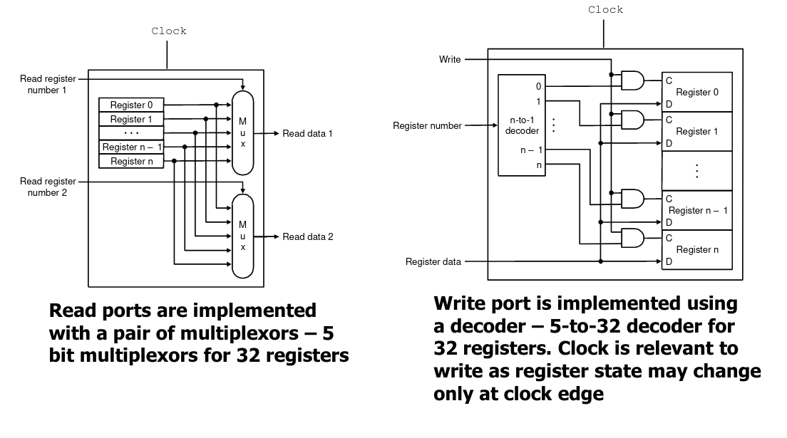

## Single Cycle Implementation

Every instruction will take a single cycle. They begin on a rising clock edge and end on a falling clock edge (or vice versa). This approach is not practical in real life situations since it is much slower than a multicycle implementation.

### Single Cycle Datapath

To implement instruction store/fetch and increment, we have a program counter register and some memory for instruction. We also have an adder to implement incrementation. The datapath looks something like the Figure 2.

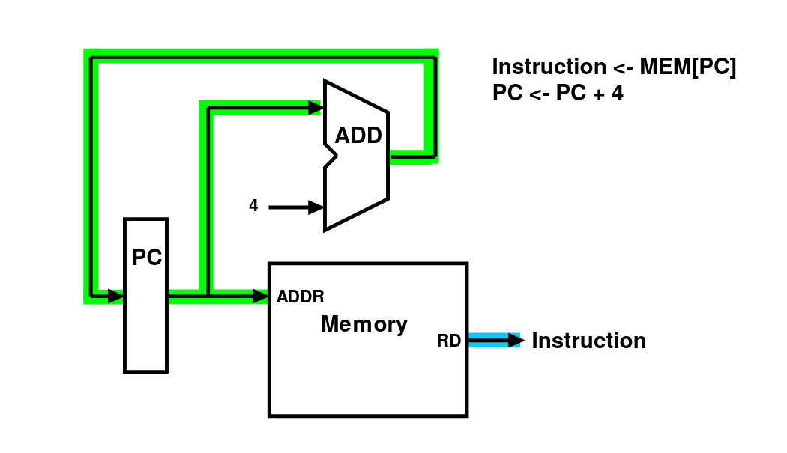{width=400px}

R-type instructions are implemented with an ALU. The ALU takes input from the register file as well as an opcode, and writes the result back into the register file. The output looks something like Figure 3.

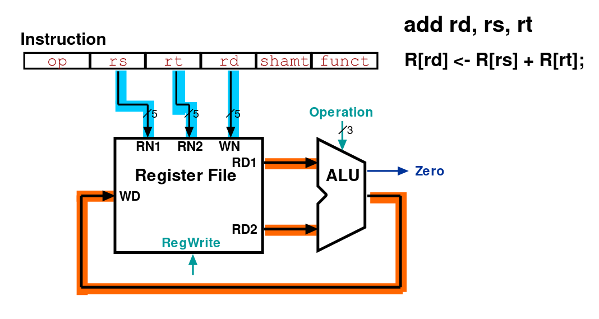{width=400px}

The R type instruction datapath is augmented with multiplexors and a memory controller to allow for `lw` and `sw` instructions as well, as in Figure 4.

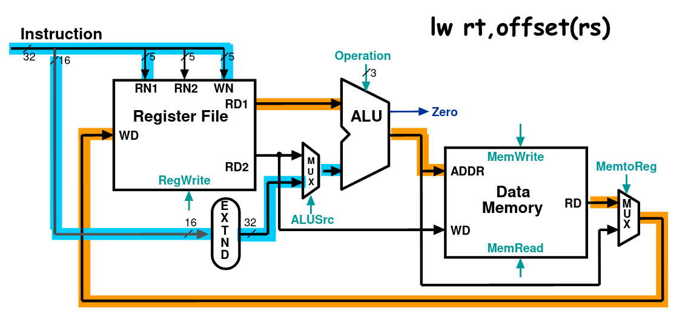{width=400px}

In figure 4, the path for `lw` is given. If this were instead an `add` instruction, the output of the ALU would go right to the `MemToReg` multiplexer and write into the register file. The `sw` instruction, on the other hand, would write directly to memory with the memory controller.

Putting all this together, and adding branch capability, we end up with Figure 5.

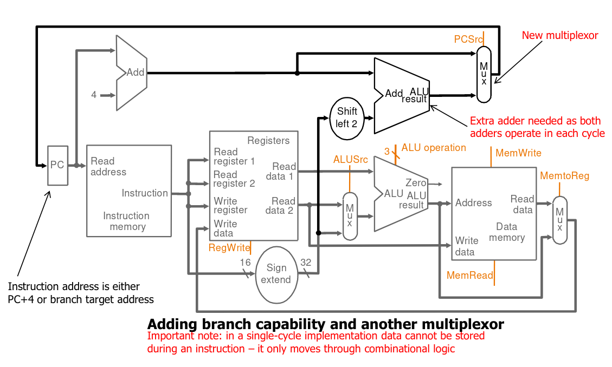{width=600px}

The program counter add, ALU, and the branch adder need to be different since all of this happens in one cycle.Figures 6 and 7 illustrate the working on different instructions.

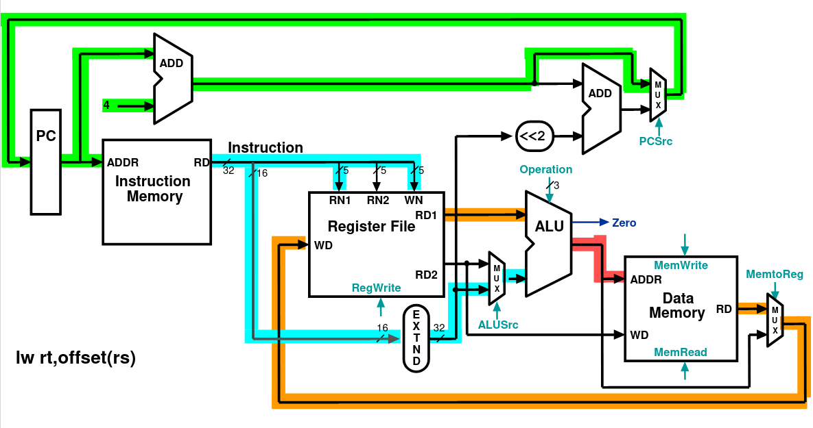{width=600px}

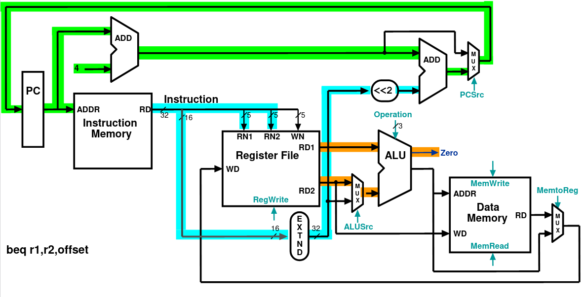{width=600px}

\pagebreak

### Single Cycle Control

The ALU control performs an operation based on a 2 bit `ALUOp` control field from the main control, and the `funct` field of the instruction. The ALU must perform `add` for load/stores, `sub` for branches, and all the R-type instructions. The truth table for ALU control bits is as follows:

|ALUOp1|ALUOp0|F5|F4|F3|F2|F1|F0|OP|Function|
|---|---|---|---|---|---|---|---|---|--|--|
|0|0|x|x|x|x|x|x|010|`lw`,`sw`|
|0|1|x|x|x|x|x|x|110|`beq`,`bne`|
|1|x|x|x|0|0|0|0|010|`add`|
|1|x|x|x|0|0|1|0|110|`sub`|
|1|x|x|x|0|1|0|0|000|`and`|
|1|x|x|x|0|1|0|1|001|`or`|
|1|x|x|x|1|0|1|0|111|`slt`|

`00` is for `lw` or `sw`, while `01` is for branch instructions. The mapping between the ALU control field and the operation is:

|Control Field|Function|
|---|---|
|000|and|
|001|or|
|010|add|
|110|sub|
|111|slt|

Now we can move on to designing the main control. Let us make the following observations about the MIPS instruction format:

* opcode is always in bits 31-26
* Two registers to be read are always `rs` (bits 25-21) and `rt` (bits 20-16)
* base register for load/stores is always `rs`
* 16 bit offset for `beq` and `lw`/`sw` is always 15-0
* destination register for loads is in bits `rt` while for R type instructions it is in `rd` (bits 15-11). This will need a multiplexor to select.

The control can select one of 7 control signals:

|Signal Name| Effect when deasserted | Effect when asserted|
|---|---|---|
| RegDst | The register destination number for the write register comes from `rt`|The register destination number for the write register comes from the `rd` field|
|RegWrite| None|The register on the "Write Register" input is written with the value on the "Write Data" input|
| ALUSrc| The second ALU operand comes from the second register file output | The second ALU operand is the sign extended lower 16 bits of the instructions|
|PCSrc| The PC is replaces by the output of the adder that computes the value of PC+4| The PC is replaced by the output of the adder that computes the branch target|
|MemRead|None| Data memory contents designated by the address input are replaced by the value of the "Read Data" input|
|MemWrite|None|Data memory contents designated by the address input are replaced by the value of the "Write Data" input|
|MemToReg| The value fed to the register's "Write Data" input comes from the ALU| The value fed to the register's "Write Data" input comes from the data memory|

The relevant control signals based on the instruction opcode are:

| |R-format|`lw`|`sw`|`beq`|
|--|--|--|--|--|
|RegDst|1|0|X|X|
|RegWrite|1|1|0|0|
|ALUSrc|0|1|1|0|
|MemToReg|0|1|X|X|
|MemRead|0|1|0|0|
|MemWrite|0|0|1|0|
|Branch|0|0|0|1|

PCSrc is given by ANDing "branch" with the zero out of the ALU. We also add an additional multiplexor to be able to allow `j` instructions.

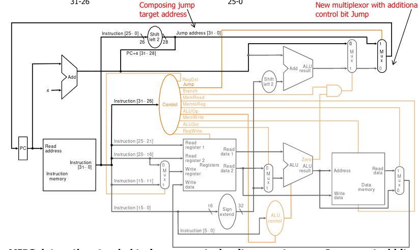{width=600px}

The circuit implementation of the ALU control can be seen in Figure 9.

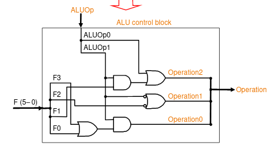{width=600px}

The circuit implementation of the main control block can be seen in Figure 10.

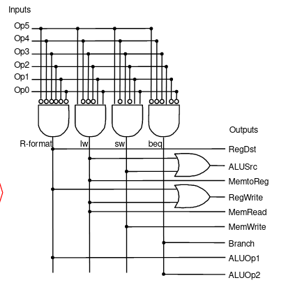{width=400px}


### Load instruction steps

1. Fetch instruction and increment program counter
2. Read base register from the register file, given by bits 25-21 of the instruction
3. ALU computes the sum of value read from the register file and the sign extended lower 16 bits (offset) of the instruction
4. The sum from the ALU is used as the address for the data memory
5. The data from the memory unit is written into the register file, given by bits 20-16 of the instruction

### Branch instruction steps

1. Fetch instruction and increment program counter
2. Read 2 register from the register file
3. ALU performs a subtract on the data values from the register file. The value of PC+4 is added to the sign extended lower 16 bits (offset) of the instruction shifted left by two to give the branch target address
4. The zero result from the ALU is used to decide which adder result (from 1 or 3) to store in the PC

### Issues

The CPI of every instruction is 1, but the cycle time is determined by the length of the longest instruction path, which is very slow.

## Multi Cycle Implementation

We break up instructions into steps. Each step takes a single clock cycle, and these steps are made so that the amount of work to be done in each cycle is balanced. The steps are also made to be restricted to use at most once, each functional unit. That way we can avoid replication. At the end of one cycle, we store the data to be used in the later cycles of the same instruction. This means we need to add some internal **programmer invisible** registers for this purpose. 

Every MIPS instruction is broken down into 5 different steps. Not all instructions require all the steps. They are:

1. Instruction fetch and PC increment (IF)
2. Instruction decode and register fetch (ID)
3. Execution, memory address computation or branch completion (EX)
4. Memory access or R-type instruction completion (MEM)
5. Write back (WB)

Each MIPS instruction takes 3-5 cycles. The multi cycle datapath looks like:

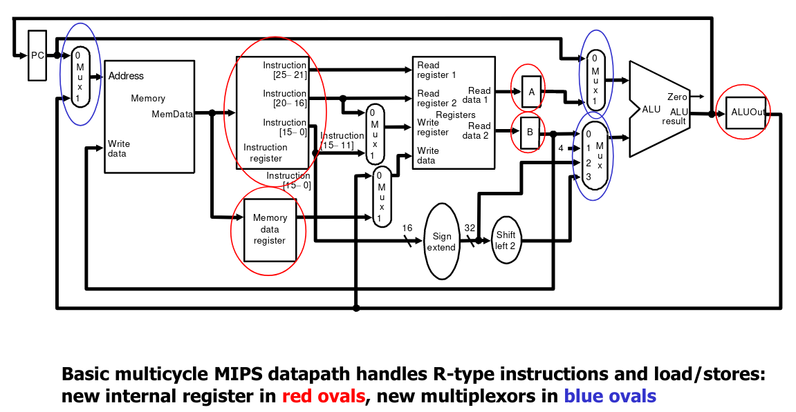

### Instruction Fetch

We use the PC to get the instruction and put it in the instruction register. Then, we increment PC by 4 and put it back in PC. In Register Transfer Language this looks like:

```
IR = Memory[PC]
PC += 4
```

### Instruction Decode and Register Fetch

We read registers `rs` and `rt` in case we need them. If the instruction is a branch, we compute the branch address. In RTL, this looks like:

```
A = Reg[IR[25-21]]
B = Reg[IR[20-16]];
ALUOut = PC + (sign-extend(IR[15-0]) << 2)
```

### Execution, Memory Address Computation or Branch Completion

The ALU performs one of 4 functions depending on the instruction type:

* Memory reference: `ALUOut = A + sign-extend(IR[15-0])`
* R-type: `ALUOut = A op B`
* Branch (instruction completes): `if (A==B) PC = ALUOut`
* Jump (instruction completes): `PC = PC[31-28] || (IR(25-0) << 2)`

### Memory Access or R-Type Instruction Completion

Depending on the instruction, we might:

* Load and store access memory: `MDR = Memory[ALUOut]; Memory[ALUOut] = B`
* R-Type instruction completes : `Reg[IR[15-11]] = ALUOut`

### Write Back

Depending on the instruction, we might have the load writing back and the instruction completing. The RTL looks like `Reg[IR[20-16]] = MDR`

We could technically eliminate this from out datapath entirely, by adding it to step 4. This is not done so that we can keep the steps balanced in length, by maintaining that each step contains at most 1 ALU operation, or 1 register access, or 1 memory access.

### Control

*The diagrams for control in Multicycle datapaths can be seen in the slides*

Control in multicycle datapaths is represented by Finite State Machines. In our case we will use a Moore Machine, so the output is only based on the current state.

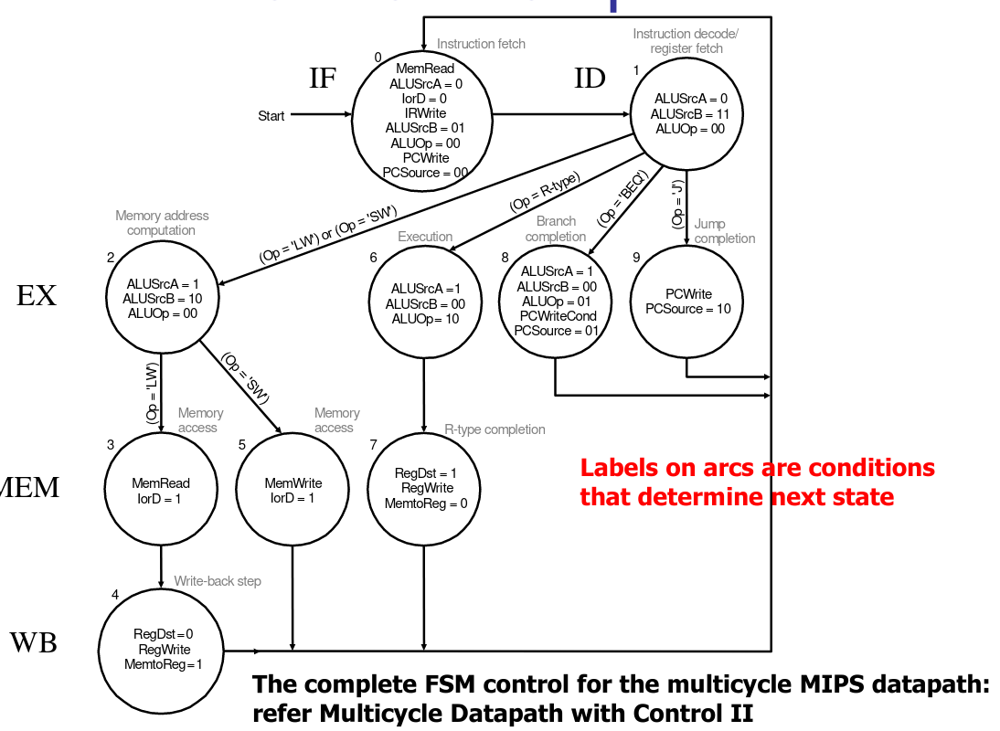{ width=600px }

Figure 12 shows an example FSM for multi-cycle control. The implementation itself would take inputs as the instruction opcode and the current state (4 bits), and output the next state as well as the levels of the outputs. There are 20 control outputs, including the 4 next states.

The IorD control signal uses the contents of the PC as address when deasserted, and the contents of ALUOut as address when asserted.

The ALUSrcA control chooses between the contents of the PC or the contents of the temporary register A as the first operand.

The ALUSrcB control chooses between the contents of temporary register B, the constant 4, the immediate field or the left shifted immediate field as the second operand.

We could hardcode this as an FSM in the case of RISC processors, but this becomes exceedinly difficult in the case of CISC processors. In these cases, we employ a ROM based approach. The ROM is used to implement a truth table, where the input acts as an address which holds a value denoting the outputs. This is called **microprogramming**. A microprogram is a sequence of microinstructions. Each microinstruction has eight fields:

* Label : used to control the microcode sequencing
* ALU control : specify operation to be done by ALU
* SRC1 : specify source for first ALU operand
* SRC2 : specify source for second ALU operand
* Register control : specify read/ write for register file
* Memory : specify read/write for memory
* PCWrite control : specify the writing of the PC
* Sequencing : Specifying choice of next microinstruction

The sequencing field determines the execution order of the microprogram:

* Value *seq* : Control passes to the sequentially next microinstruction
* Value *fetch* : Branch to the first microinstruction to begin the next MIPS instruction
* Value *Dispatch i* : branch to a microinstruction based on the control input and a dispatch table entry. This is known as dispatching. The dispatch table contains microinstruction labels indexed by control input. The value $i$ indicates that the $i^{th}$ dispatch table will be used.

The control microprogram now looks like:

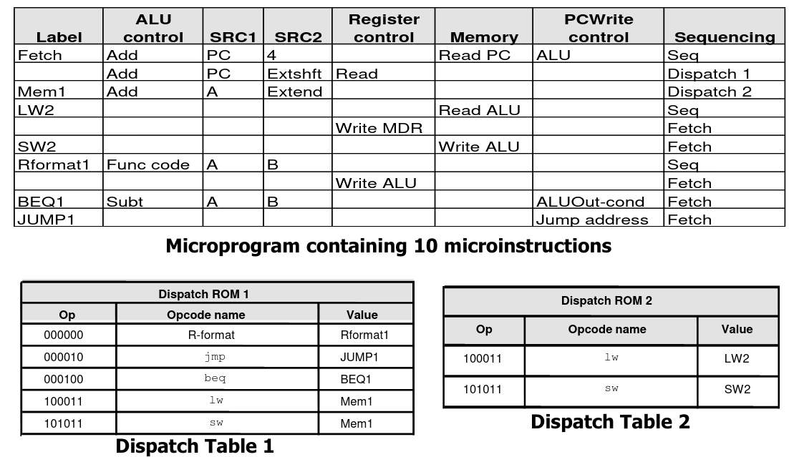{ width=600px }

For the different meanings of the values in the control microprogram see the slides.

How do we go about implementing the microprogram? It's basic diagram looks like Fig 14.

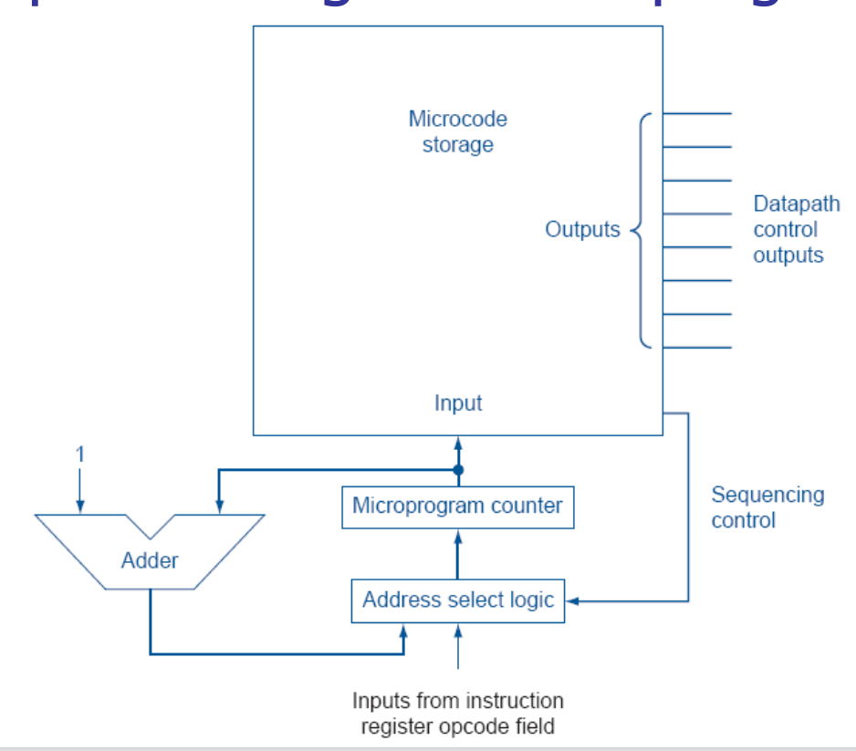{ width=300px }

The address select logic is implemented as in Fig 15.

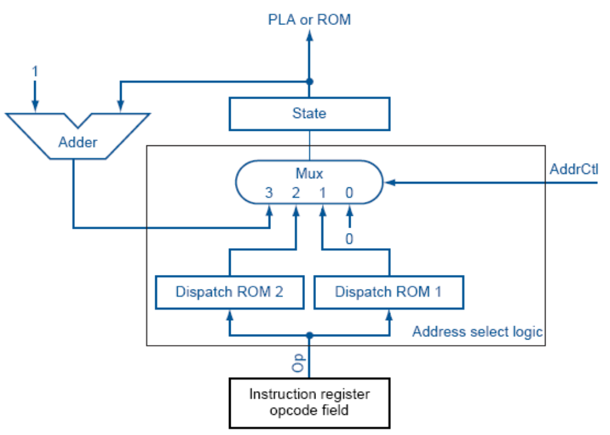{ width=300px }

Microprograms are easy to write and design, and it is also easy to change since the values are in memory. However, ROM is not fast and control is nowadays on the same chip as the processor, so it cannot easily be changed.

### Exception Handling

Exceptions can happen because of overflow, unrecognised opcode, etc. Handling this has been discussed before, but now we add a **cause register** which indicates the cause of the error, guiding the place to jump to in the ISR. This creates 2 new control signals - `intcause` and `causewrite`. `intcause` provides the reason for the error, and `causewrite` allows us to write to the cause register. Remember that we would find out that we have an unrecognised opcode by the second cycle, and that we have an overflow by the third cycle.

# Pipelining

The multiple-stage architecture of MIPS allows us to use **pipelining** to improve the performance of the processor. After one instruction finishes one stage, it no longer needs the hardware for it. So, in the next cycle, a different instruction can use that architecture for its own stage, while the first instruction could move on to the second stage. In this way, instructions partially overlap - never using the same hardware, but possibly executing at the same time.

For this section it will be assumed that memory operations take 2 ns, register operations take 1 ns, and ALU operations takes 2 ns.

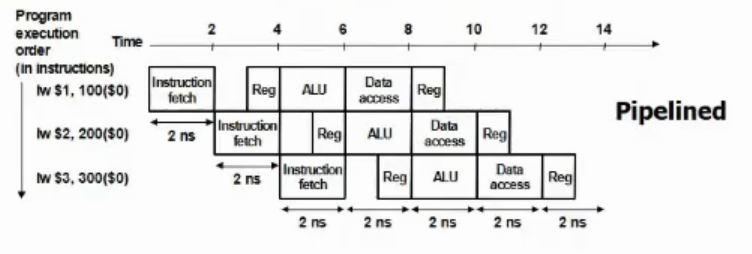{ width=500px }

To maintain the partial results of each stage, we have a register(s) for the output of each stage.

Pipelining does not reduce latency of a single task, it increases the throughput of the entire workload. The pipeline rate is limited by the longest stage. The greater the number of stages the more the speedup, but unbalanced lengths of pipe stages reduce it.

Pipelining is especially easy in MIPS because:

* All instructions are same length
* Few instruction formats
* Memory operands only in load/store
* Operands are aligned in memory

## Hazards

Obstacles to pipelining are called hazards

### Structural hazards

Structural hazards are created when different instructions in different stages of the pipeline seek to use the same hardware resource. This could happen when $I_1$ is lw and $I_2$ is add. Since R-type instructions take 4 cycles, the WB stage of the two instructions would overlap, resulting in a structural hazard! Problems like this are solved by increasing resources or access points. Another way is to make the R-type instructions also take 5 cycles, even though it does nothing in the M stage.

Structural hazards are normally fixed at design time. MIPS architecture makes this easy.

### Control hazards

Control hazards occur when we need to make a decision based on the result of a previous instruction still executing in the pipeline.

This could be "solved" by stalling the pipeline till our `beq` instruction completes and find out where to jump. This generally wastes 2 cycles. Another solution could be to possibly make hardware changes so that we are able to resolve our branch in the ID stage, reducing the penalty into one cycle. 

We could also perform **branch prediction** - we assume we would take a certain branch and start executing. If we are right, then we have saved time, but if we were wrong, we will need to pay a penalty. Usually this assumption is based on using previous information, especially when in loops.

We could use the help of the compiler. We can find instructions that execute regardless of the branch and execute those while waiting. This comes down to reordering insructions in a way that does not change program outcome.

### Data Hazards

A data hazard occurs when instruction needs data from the result of a previous instruction still executing in the pipeline.

An example is when $I_1$ is `add $1, $2, $3` and $I_2$ is `add $4,$1,$5`. `$1` is written to in the WB state of $I_1$, which occurs after the ID stage of $I_2$. We will have to wait for 3 cycles to get this information.

To mitigate this we need to reduce this wasted time. One way is to do the WB stage at the rising edge instead of the falling edge. This gives $I_2$ enough time (half a cycle, 1ns) to read the register. Now, we can get our information in 2 stages. From now on, we can assume that registers are written at the rising edge, and read at the falling edge.

Another solution is **data forwarding**. We are aware of the answer in the EX stage of $I_1$. So, we can forward the answer to the EX stage of $I_2$, instead of having it read it from the register. This can be done by having the result of an instruction fed to an input latch to the ALU, which would choose to either use this previous result or to use a new input through some control logic.

The compiler based solution is once again, instruction reordering. We use it along with data forwarding - whenever there are stalls, we try to put some new instructions in its place to "wait" till it is available.

When the data hazard is due to two R type instructions with a data dependency between them, we call it an **R-R type hazard**. If it involves a `lw` instruction, it is called a **load use hazard**

## Pipelined Datapath

First, we will look at the pipelined datapath in the case of a single-cycle datapath.

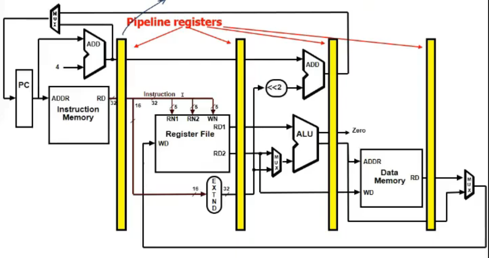{ width=500px }

The registers are named by the "sections" they cut. So, the first is called IF/ID, then ID/EX, then EX/MEM, then MEM/WB. IF/ID is 64 bits, ID/EX is 128 bits, EX/MEM is 97 bits and MEM/WB is 64 bits - they have to be wide enough to hold data coming in.

One issue with this is that RD changes during the course of the instruction since new instructions come in, changing that value. So, we have to keep track of it in the pipeline registers throughout the stages, so that we ensure we write back to the correct register.

Another issue is that data moving from right to left create hazards. The branching hardware could cause a control hazard, while the WB stage causes a structure hazard.

Now let us move on to control. We do not need any control signals for the IF stage or the ID stage since instructions and registers are read every cycle (or PCWrite and RegRead are always enabled). For the other stages, we need the same 9 control signals from the single cycle datapath:

1. EX: RegDst, ALUOp1, ALUOp0, ALUSrc
2. MEM : Branch, MemRead, MemWrite
3. WB: RegWrite, MemToReg

These 9 controls are generated during the ID stage, and passed forward through the pipeline registers.

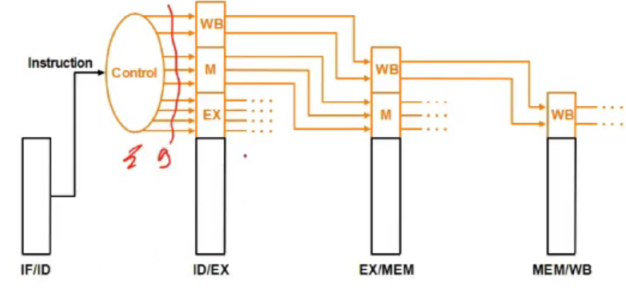{ width=500px }

The 6 bit opcode is can be extracted from the sign extended data which is used for branching.

### Handling Data Hazards

This datapath still does not handle data hazards. What if we get instructions in the order:

1. `add $1, $2, $3`
2. `or $4, $1, $5`
3. `sub $3, $1, $6`
4. `and $5, $1, $6`

There is obviously some dependency between 1-2 (called EX hazard) and 1-3 (called MEM hazard). 1-4 has no dependency because the write back will occur by the time instruction 4 needs `$1`. How do we fix this problem? The result from every operation is stored in the pipeline registers. So, we can pass the results from the EX/MEM and MEM/WB registers back to the ALU for reuse. A MUX will decide whether to use the output from one of these registers or to use the normal input. Fig 19 illustrates this:

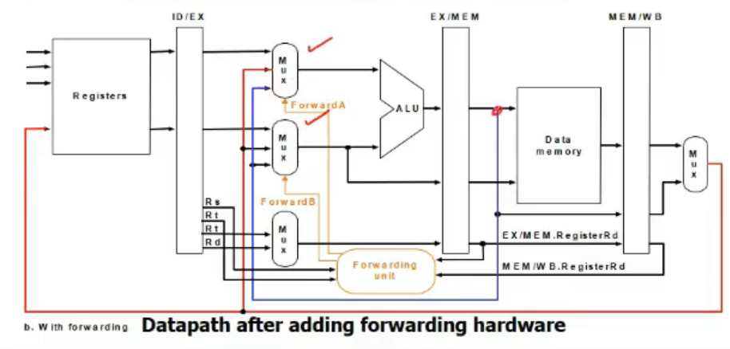{ width=500px }

The Forwarding Unit is responsible for detecting if there is a data dependency and acting accordingly. The forwarding unit checks whether either of the operands uses the same registers as the `rd` from previous instructions. To do this, we keep track of `rd` of previous instructions in the pipeline registers as well. If both positions have the same `rd`, we will use the most recent one. Of course, `rd` should not be `$0`, since that is hardcoded to 0.

The forwarding unit must also check if the instruction is actually writing to `rd` or not. For instance, with the `sw` instruction. So, we need to check whether this is the case - we use the `regwrite` control signal to do this.

This previous discussion only involves R-R type hazards. Now let us see how to handle load use hazards. It is impossible to pipeline these without at least 1 stall, since `lw` only knows the value after the MEM stage. So, when handling these, we stall dependent instructions until `lw` finishes it's MEM stage, storing the value in the MEM/WB pipeline register. Now, we are able to do normal data forwarding with only one stall.

To perform this stall, we need another Hazard Detection Unit. To do this, it checks it the instruction in the EX stage is a load (is `memread` control signal set?) and if the destination register matches either source register of the instruction in the ID stage.

To stall the pipeline, we disable PCWrite and IF/ID write signals. We also change all the EX,MEM and WB control fields in the ID/EX register to 0, so the instruction behind the load becomes a `nop`.

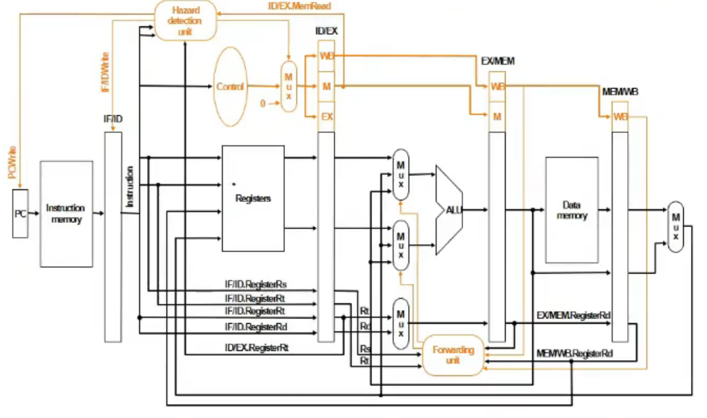{ width=500px }

### Handling Control Hazards

The issue with branching is that branch decisions are not made till the MEM stage. To mitigate this, we attempt to resolve the branching as soon as possible - in the ID stage. To do this, we make the following changes:

* Calculating the branch target address, involving moving the branch adder from the MEM stage to the ID stage. We can get the inputs from this immediately from the IF/ID pipeline register.

* Calculating the branch decision is efficiently done. For equality test, we XOR respective bits and then OR all the results and inverting. Using an ALU (by subtraction) would result in an unnecessary carry delay. This does not significantly lengthen this stage.

If we find that the branch is taken, we must 0 out the entire IF/ID pipeline register, so that we do not do the wrong instruction. This is called IF.Flush control signal.

Branches can also face data hazards. For instance, consider the following case:

1. `add $1, $2`
2. `add $4, $5, $6`
3. `...`
4. `beq $1, $4, target`

The first add instruction will be in it's WB stage, and the second will be in it's MEM stage, when instruction 4 is in it's ID stage. One important thing to keep in mind is that even though the register may be written to in the rising edge of the WB stage, a half cycle is not enough time to read from the register file and perform a comparison. So, we have to forward the results from the MEM/WB and the EX/MEM registers to the comparator.

Now let us consider the case:

1. `lw $1, addr`
2. `add $4, $5, $6`
3. `beq $1, $4, target`

This, as expected, must result in one stall. The result from `lw` is not known until it's WB stage. So, we would forward it from the MEM/WB pipeline register to the ID stage of the `beq` register for its use. By this time we can also forward the result of instruction 2 to the branch, so we do not need more stalls.

## Branch Prediction

Branch prediction could either be **static** or **dynamic**. When we do static prediction, we do not consider the run time history of the program - we have a deterministic decision we make, like always taking or always not taking.

The **branch prediction buffer** or **branch history table** is a cache indexed by a fixed lower portion of the address of the branch instruction. 

When we do **1 bit prediction**, for each index of the BHT we store one prediction bit that says if the branch was last taken or not. Our assumption is that the branch will do the same again. When taking a branch, we index into the BHT and use the prediction bit to predict branch behavior. It is possible the bit could have been set by a different branch instruction with the same lower address bits, but that does not matter, as it is simply a hint.

**2 bit prediction** is an extension of the 1 bit prediction concept. If a prediction is wrong twice it will be changed. When a branch is taken, we try to increment the counter (up to 3) and if the branch is not taken, we try to decrement the counter (down to 0). However, if we increment on 01, it will go to 11, and if we decrement on 10, it will go to 00. To check which branch to predict, we check the MSB of the counter.

The generalization of this concept is **n bit prediction**. There must be $2^{n-1}$ changes to change the prediction. However, studies show that there is no improvement after $n=2$, so generally 2 bit prediction is used.

Sometimes, branches could be correlated. That is, depending on the status of previous branches, we could predict the current branch. An example of this is the code:

```
if (d==0) // b1
d = 1;
if (d==1) { // b2

}
```

As we can see, if `b1` is taken, `b2` will definitely be taken. If we do not consider correlation, it is easy to see that this could result in 100% misprediction. To prevent this, we use a **correlating predictor**. It has two BHTs - one for if the last branch was taken, and the other for if the last branch was not taken.

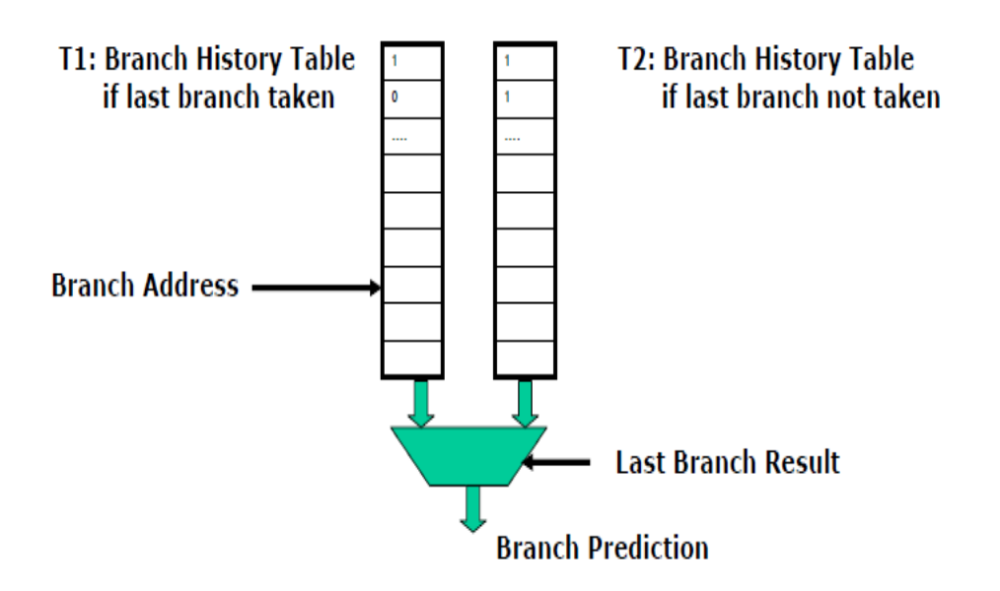{ width=300px }

This correlating predictor, which has one prediction bit and one correlating bit is called a (1,1) predictor. The generalization of this is called a $(m,n)$ predictor. It uses the behaviour of the last $m$ branches to choose from one of $2^m$ branch predictors, each of which is a $n$ bit predictor. The history of the most recent $m$ bit shift registed called the **global history register**. We shift in the behavior bit of the most recent branch and shift out the bit for the least recent branch. We index into the BHT by concatenating the lower bits of the branch instruction address with the $m$ bit global history to access an $n$ bit entry.

How do branch predictors know what the branch target should be? They do this by using a **branch target cache**. The branch target cache is addressed by the program counter of the branch instruction and provides the predicted branch target. In the IF stage, we check whether the PC is in the cache. If it is, we decide whether or not to go to the branch target based on our prediction in the IF stage itself. Otherwise, if we see it is a branch instruction in the ID stage, we put the branch target in the cache for later use.

# Caching

Caches are high speed memory situated between the main memory and the registers in the memory hierarchy. Unlike the main memory which uses DRAM, caches use SRAM. Though this makes them much faster, it also makes cache memory much more expensive.

The CPU tries to access words form the cache, while the cache will try to access blocks from the main memory.

## Mapping function

Let us assume we have a 64 KB cache (so address is 16 bits), where each block is 4 bytes (so block address is 14 bits, and last 2 bits choose the byte in the block). The main memory is 16 MB, with 24 bit address. It is obvious that multiple addresses in the main memory will map to the same address in the cache.

When a processor sends a 24 bit address, the last 16 bits form the address to index into the cache, while the first 8 bits form the **tag**. The currently used tags are present in the **tag RAM**. This address could also be used to index into the main memory. 

Let us say that our cache is entirely empty. Then, when we try to access a word, we would index into the main memory. The block accessed from the main memory is then put in the cache. To do this, the middle 14 bits index into a particular position in the tag RAM, where we will write our 8 bit tag. We will then write our block of data in the corresponding block in the cache. The next time the same address is accessed, we compare tags and if equal, access the desired word in memory. 

What if we have the same middle 14 bits, but a different tag? Then this will be a cache miss. We access this block from the main memory and overwrite it in the cache.

This scheme is called **direct mapping**. It is simple and inexpensive, but has a fixed location for a given block. So, if a program accesses 2 blocks that map to the same line repeatedly, cache misses become very high

Another scheme is **fully associative mapping**. Here, the whole first 22 bits become the tag, and the last 2 bits become the byte offset within the block. This way, the tag uniquely identifies the block of memory. While our miss rate decreases when we do this, cache searching becomes very expensive, and hit time increases.

Somewhere between these two mappings, we have **set associative mapping**. The cache is divided into a number of sets. Each set contains a number of lines. Let us say each set has 2 lines - this means we now have $2^{13}$ sets. So now, in the address, the first 9 bits form the tag, the next 13 bits form the set address, and the last 2 bits are the byte offset. When the processor sends the address, search only has to be done within the set, instead of over the entire cache. This gives us a good middle ground between the other 2 mappings to reap the benefits of both while reducing the effect of their issues.

## MIPS and Block Size

In MIPS, a direct mapped cache will have 1024 1-word blocks. The address is 32 bits. The 2 least significant bits form the byte offset, and the next 10 bits are used to index into the cache. The other 20 bits form the tag. This takes advantage of only **temporal locality**. We cannot take advantage of spatial locality because the block size is only one word.

To take advantage of spatial locality, we use larger blocks. The cache has 4K 4 word blocks. The least 2 significant bits form the byte offset, the next 2 bits form the block offset, and the next 12 bits are used to index into the cache. The other 16 bits form the tag. This way, we can take advantage of both temporal and spatial locality.

As we increase block size, the miss rate falls at first, but then starts climbing up again. This would happen because the number of blocks decreases resulting in a competition for blocks. Hence, blocks get ejected before most of their words are accessed. This is known as **thrashing**.
