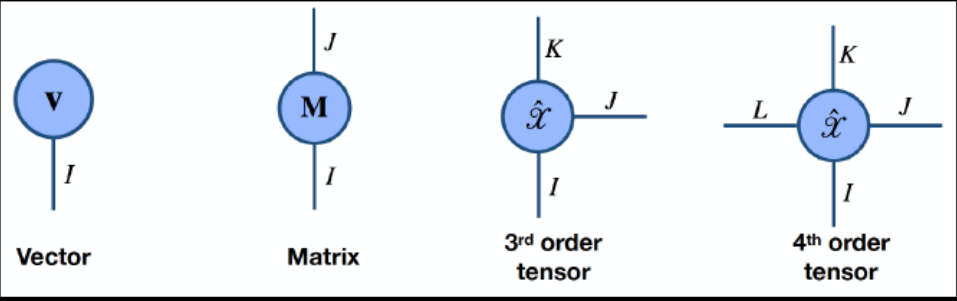

## Similarity of vectors

The similarity between vectors is measured by **cosine similarity**. Cosine similarity is defined as the angle between two non zero vectors, which can be found by normalizing the dot product between the vectors. Orthogonal vectors will have a similarity of 0, and parallel vectors will have a similarity of 1.

## Volume and surface area in high dimensional spaces

The surface area and volume of a d-dimensional unit sphere is given by $A(d)$ and $V(d)$

$$A(d) = \frac{2\pi^{\frac{d}{2}}}{\Gamma(\frac{d}{2})}  $$

$$V(d) = \frac{2\pi^{\frac{d}{2}}}{d\Gamma(\frac{d}{2})}  $$

where $\Gamma$ is the Gamma function.

Interestingly, as d tends to infinity, the volume tends to 0!

# Curse of dimensionality

## Sampling

As we increase the dimensionality of the data while keeping the number of points constant, the data becomes sparser and sparser. As data becomes sparser, some metrics like nearest neighbour become less and less useful. If 9 samples is enough in 1 dimension, we need $9^3$ samples to maintain the same density in 3 dimensions!

## Concentration effect of $L_p$ norms

If we define $Dmax_d$ is the distance to the farthest neighbour in d dimensions, and $Dmin_d$ as the distance to the nearest neighbour in d dimensions, then we see the ratio of $Dmax_d - Dmin_d$ to $Dmin_d$ tends to 1. So, distances to near and far neighbours become more and more similar. This is also a reason why nearest neighbour search becomes more and more meaningless

*To be discussed later*

# Big Data

Big Data isn't just about size. The 3 Vs of Big Data are as follows:

* Volume
* Velocity (Streams, Real Time, etc.)
* Variety (Structured, unstructured, etc.)

# Probability

## Frequentist Probability

Frequentism is an interpretation of probability, which defines the probabiity of an event as the limit of its relative frequency across many trials. In principle, probability can be found by repeating some objective process an infinite number of times.

This approach becomes unclear when such an event has never occurred. In a frequentist approach, the parameters are fixed, but the data is random.

## Bayesian Probability

Bayesian probability is an interpretation in which probability is interpreted as reasonable expectation, representing a state of knowledge or a quantification of personal belief.

A **prior probability distribution** of an uncertain quantity is the probability distribution that would express one's beliefs about this quantity before some evidence is taken into account. For a random event, this is the unconditional probability that is assigned before any relevant evidence is taken into account.

If we consider some data $E$ not used in finding the prior probability and any hypothesis $H$ affected by the evidence $E$, we define **likelihood** as $P(E|H)$, which is the probability of observing $E$ given $H$. With this same definition, we would obviously find the prior probability to be $P(H)$.

With Bayes' rule, we can find the **posterior probability**.

\begin{equation}
P(H|E) = \frac{P(E|H) \cdot P(H)}{P(E)}
\end{equation}

Here, $P(H|E)$ is the posterior probability of the hypotheses taking our data into account, and $P(E)$ is called the **marginal likelihood**.

Bayesian Inference is called the perfect inference engine, because while it is not guaranteed to find the correct answer, it is provable that it provides the best possible guess among any inference engines.

When we do Bayesian inference, we normally calculate the posterior probabilities with respect to a set of hypotheses $H_{1},H_{2}...H_{n}$. The hypothesis with the maximum posterior probability is called the **maximum a posteriori** (MAP) estimate of a phrase.

The MAP approach can't be used if the priors are unknown. What do we do then? We can use likelihood! Assume we have the information $P(E|H_{1}) = 0.6$ and $P(E|H_{2}) = 0.8$. According to the likelihood, $H_{2}$ is the most likely to match our data. So, relying on the likelihood, it would make sense to choose $H_{2}$. This is known as the **maximum likelihood estimation** (MLE) approach.

Sometimes when we don't have any information to decide priors, we use **non-informative priors**, where we assign equal probabilities to all the values of the parameter.

# Probability distributions

*See ASM*

## Beta distribution

The probability density function of the beta distribution is given by:

\begin{equation}
f(x;\alpha,\beta) = \frac{1}{B(\alpha,\beta)}x^{\alpha-1}(1-x)^{\beta-1}
\end{equation}

The shape of this curve depends on $\alpha$ and $\beta$ and $B(\alpha,\beta)$ is a normalization constant to keep the value between 0 and 1. The multidimensional equivalent of this is the **Dirichlet distribution**

## Lognormal Distribution

A lognormal distribution is a continuous probability distribution of a random variable whose logarithm is normally distributed. So, if X is log-normally distributed, Y=$\log{X}$ is normally distributed.

# Polynomial Curve Fitting

In polynomial curve fitting we try to model some data $D$ having $N$ observations $(y_i,x_i)$ using a polynomial curve, i.e.
$$f(x,\mathbf{w}) = \sum_{j=0}^M w_jx^j$$
$M$ is the order of the polynomial. The error of this curve is generally modelled by the **sum of squares error**, given by
$$E(\mathbf{w}) = \frac{1}{2} \sum_{n=1}^{N} (f(x_n,\mathbf{w}) - t_n)^2$$
Clearly, we want to choose the coefficients $\mathbf{w}$ to minimize the error. This can be done through the following steps:
$$\frac{\partial E}{ \partial w_i} = \sum_{n=1}^N (y(x_n,w) - t_n)x_n^{i} = \sum_{n=1}^N \left(\sum_{j=0}^M w_j x_n^j - t_n\right)x_n^i $$
Setting this to 0,
$$\sum_{n=1}^N \sum_{j=0}^M w_j x_n^{i+j} = \sum_{n=1}^N t_n x_n^i$$
This forms a set of $M+1$ equations (one for each $i$) that we can solve to find the optimal $\mathbf{w}$.

Choosing the order $M$ of the polynomial is an important choice. If it is too low, we will underfit, but if it is too large, we would overfit. To check this, we might divide our data into two parts - training and testing sets. We find $\mathbf{w}$ for the training set, but measure error for both the training and testing sets. Generally the metric used is the **Root Mean Square Error**, given by:
$$E_{RMS} = \sqrt{\frac{2E(\mathbf{w})}{N}}$$
If we plot the training and testing errors across many orders, we will see that for low orders, the training and testing errors are high (underfitting), while for high orders, the training error will be low but the testing error may be very high (overfitting). From this plot we could also find which orders are ideal, i.e. don't underfit or overfit.

There are many ways to prevent overfitting of the modelling function on the dataset. We could increase the size of the dataset (this will be infeasible after a point), or we could use Bayesian modelling instead. Another way is to use **regularization**. When we regularize, we add extra terms to our error function to penalize behaviour we dislike, like large fluctuations or large coefficient values. For the latter case, we may do something like this:
$$E(\mathbf{w}) = \frac{1}{2} \sum_{n=1}^N (f(x_n,\mathbf{w}) - t_n)^2 + \frac{\lambda}{2} ||w||^2$$
Here $\lambda$ determines the relative importance of the regularization term to the error term, i.e. it controls the amount of regularization.

# Basis Functions

Basis functions are elements of a particular basis of a function space. Any continuous function in the function space can be represented as a linear combination of basis functions, just as every vector in a vector space can be represented as a linear combination of basis vectors. So, if we have a system of $k$ basis functions $\psi_k(t)$, we can express $f(t)$ as:

$$f(t) = a_1\psi_1(t) + a_2\psi_2(t) + ... a_k\psi_k(t)$$

We want our basis functions to be:

* Able to be computed quickly
* Flexible enough to exhibit the required curvature whenever needed
* Allow fast computation of coefficients $a_k$
* Differentiable as required
* Constrained as required, allowing periodicity, positivity, monotonicity, etc.

For polynomials, the basis functions used are $1, t, t^2, ..., t^n$. In a Fourier series, we use $1, \sin{(\omega t)}, \cos{(\omega t)}, \sin{(2 \omega t)},...$ which can model periodic functions.

## Basis system construction

We first start with a prototype basis function, $\psi(t)$, which we call the **mother function**. We apply three operations to it:

* **Lateral Shift** $\psi(t+a)$ to focus fitting power near a position $a$
* **Scale change** $\psi(bt)$ to increase resolving power or the capacity for local curvature
* **Smoothing** to increase differentiability and smoothness

Consider the Fourier series. We choose the mother functions to be $\psi(t) = sin(\omega t)$ and $\psi(t) = 1$. Now, we perform the operations from before:

* Lateral Shift - $sin(\omega(t + \pi/2)) = cos(\omega t)$
* Scale Change - $sin(k\omega t), cos(k \omega t), k = 1,2,...$
* Smoothing - All the functions are infinitely differentiable

Fourier series is quick to compute coefficients due to orthogonality, but it is only natural if $f(t)$ is periodic with period $\omega$.

Next let us consider polynomials. The mother function is $\psi(t) = 1$. This time, we only apply smoothing - we multiply by $t$ to increase differentiability and curvature. However, we do not shift or scale since polynomials are invariant to these operations. This basis space is great for simple curves which are linear or have slight curvature but is not flexible enough for the general equation.

## Regression Problems

Let us consider a case where supervised learning problem where we have a dataset of training data $(x_i,t_i)$ where $x_i$ is the input vector of parameters and $t_i$ is the response. We want to predict $t$ from a given $x$ for some future test case. This data isn't simple enough for ordinary linear regression. How do we solve this?

What we could do is linear regression on a set of pre-decided basis functions. Assume, we used a polynomial basis. What we will see is that as we increase order, the regression gets increasingly complex and begins to overfit. But, with lower orders, the model is too simple to handle the nonlinearity of a generating function.
This is a problem because polynomials form **global basis functions** - a change in any of them results in changes across the whole input space. In many cases, we desire local basis functions.

One possibility for local basis function is **Gaussian basis functions**, which are of the form:

$$\phi_j(x) = \exp{(-(x-\mu_j)^2 / 2s^2)}$$

This is capable of modelling nonlinear functions more accurately.

## Spline Basis Functions

Spline functions are formed by joining polynomials together at fixed points called **knots**. We divide the interval extending from lower limit $t_L$ to upper limit $t_U$ over which we wish to approximate a curve into $L+1$ subintervals separated by $L$ interior boundaries $\xi_l$.

Consider the simplest case in which a single breakpoint divides interval $[t_L:t_U]$ into two subintervals. The spline function is, within each interval, a polynomial of specified degree. If the degree of the polynomials is $m$, then the order of the polynomial is $m+1$.

Mathematically, we can define it as follows. Suppose you specify knots $k_1 < k_2 < .. < k_n$. Then, a spline of degree $d \geq 0$ is a function $S(x)$ with $d-1$ continuous derivatives such that:

$$S(x) = \begin{cases}
P_0(x) & x < k_1 \\
P_i(x) & k_i \leq x < k_{i+1}:i = 1,2,...n-1 \\
P_n(x) & x \geq k_n
\end{cases}$$

where each $P_i(x)$ has a degree $d$. To satisfy the constraint that it should have $d-1$ continuous derivatives, we need to make sure it matches at each knot. A spline of degree $d$ will have $(n+1)(d+1)$ parameters, meaning that its vector space would have $n+d+1$ dimensions. So, if we have $n+d+1$ basis vectors, we can fit a curve to the regression data.

The most common type of spline is the cubic spline, in which each polynomial is cubic, or order = 4. This is like a piecewise cubic function. Since the function is two times differentiable, the curve looks very smooth and matches at breakpoints.

We could also have repeated knots, where knots can be defined at the same $x$ value. If a spline of degree $d$ has a repeated knot of $m$ multiplicity, the piecewise polynomials that join such a knot are only required to have $d-m$ matching derivatives. The number of free parameters increases by $m-1$, but the number of knots decreases by $m-1$. So, the dimension of the vector space would still be $n+d+1$, if any repeated knot has a multiplicity less than $d$

# Principal Component Analysis

**Principal Components** of a collection of points in vector space $R^p$ is a sequence of $p$ direction vectors, where the $i^{th}$ vector is the direction of a line that best fits the data, while being orthogonal to the first $i-1$ vectors. These hence form an orthonormal basis wherein different individual dimensions are linearly uncorrelated. With PCA, we compute these principal components and transform the basis of the data, sometimes using only the first few principal components and ignoring the rest. Through this, we could perform dimensionality reduction. PCA will also preserve the largest variances in the data. PCA is an unsupervised algorithm.

## Background

### Orthonormality

Two vectors are orthogonal if their dot product is 0. A normal vector is a vector whose length is 1. A set of vectors are orthonormal if they are both of unit length and are orthogonal to one another.

We can make a set of vectors orthonormal by the means of the **Gram-Schmidt Process**. Given a set of linearly independent vectors $\{v_1, \cdots v_k\}$, the process will generate orthonormal vectors $\{e_1,e_2, \cdots, e_k\}$ that span the same subspace as the input.

Let us define the projection of $v$ on $u$ $proj_u(v)$ as
$$proj_u(v) = \frac{u \cdot v}{||u||^2} u$$
Then, the process works as follow:
$$u_1 = v_1$$
$$u_2 = v_2 - proj_{u_1}(v_2)$$
$$u_3 = v_3 - proj_{u_1}(v_3) - proj_{u_2}(v_3)$$
generalizing, 
$$u_i = v_i - \sum_{j < i} proj_{u_j}(v_i)$$
The set of vectors $u$ form an orthogonal set. We can get an orthonormal set $\{e_i\}$ where
$$e_i = \frac{u_i}{||u_i||}$$

_Note: Technically, this works in any inner product space_

### Covariance Matrix

Let $X$ and $Y$ be random vectors, where $X_i$ and $Y_i$ are random variables.

The covariance matrix $K_{XX}$ is the matrix whose $(i,j)$ entry is the covariance:

\begin{equation}
K_{{X_i}{X_j}} = cov[X_i,X_j] = E[(X_i-E[X_i])(X_j-E[X_j])]
\end{equation}

This is generalized to the cross-covariance matrix between two vectors, if we take two different vectors. Another way to show this, in terms of expectations on vectors is:

\begin{equation}
K_{XY} = E[(X-E[X])(Y-E[Y])^T]
\end{equation}

Remember, the expectation of a vector $X$ is a vector of the expectations of its constituents, $(E[X_1],E[X_2]...)^T$

### Eigendecomposition

A non zero vector $v$ of dimension $N$ is an **eigenvector** of a square $N \times N$ matrix $A$ if it satisfies the equation:

$$Av=\lambda v$$

$\lambda$ is a scalar, termed the **eigenvalue** corresponding to $v$. We can look at it as $A$ being a linear transformation that merely elongates or shrinks $v$, by a factor of $\lambda$. The eigenvalues are the roots of the **characteristic equation**:

$$p(\lambda) = det(A-\lambda I)$$

The eigendecomposition of a matrix is given by:

$$A=Q\Lambda Q^{-1}$$

where $Q$ is a square matrix where the $i^{th}$ column is an eigenvector $q_i$ of $A$ and $\Lambda$ is the diagonal matrix where $A_{i,i}$ is the eigenvalue of $q_i$.

A matrix where all the eigenvalues are positive is a **positive definite matrix**, while a matrix where all the eigenvalues are non-negative is **positive semidefinite**.

## The Algorithm

1. Before PCA, we shift the mean to the origin, by subtracting the sample mean from the data. Let this new matrix be $Z$.

2. Calculate the covariance matrix. This is done by $C=Z^TZ$. This matrix is symmetric, so the resulting eigenvectors will be orthogonal.

3. Calculate the eigenvectors and eigenvalues of the covariance matrix. This is done by eigendecomposition.

4. Sort the eigenvectors with respect to their eigenvalues. Let this be the matrix $Q^*$. It goes without saying they are all independent of one another.

5. Calculate $Z^* = ZQ^*$. This new matrix is a centered, standardized version with the eigenvector basis.

## Dimensionality Reduction

How do we choose which dimensions to drop? One thing to understand is, PCA preserves the total variance, which would be the sum along the primary diagonal of a covariance matrix. So, now if we calculate the covariance matrix with $Z^*$, we would see that all non-diagonal elements are 0, while diagonal elements sum up to the same total variance. We can also see, these values are in *decreasing order*, so the *proportion of variance explained* by a given direction decreases with each dimension. When we drop dimensions, we always try to remove those with the minimum proportion of variance explained.

Another way this is done is with a **scree test**. It is a line plot of the eigenvalues of principal components in analysis. The plot is always a downward curve, and the point after which the eigenvalues seem to level off is found. All the points to the left of this point are retained, while the rest are dropped.

## Some issues

PCA finds the most accurate data representation in a lower dimensional space, but it may be useless for classification.

# Singular Value Decomposition

Let us consider the matrix $A$. It is important to remember some properties about the matrix $AA^T$ and $A^TA$:

* Symmetric
* Square
* Positive semidefinite (at least)
* Both have the same positive eigenvalues
* Both have the same rank $r$ as $A$

Let the eigenvectors of $AA^T$ be $u_i$ and $A^TA$ be $v_i$. $u$ and $v$ are called the **singular vectors** of $A$. Both matrices will have the same positive eigenvalues, and the square roots of these eigenvalues are called **singular values**. $U$ is the matrix where each column is $u_i$ and $V$ is the matrix where each column is $v_i$. These matrices are orthonormal (through Gram-Schmidt), so we can prove that:
$$U^TU=I$$
$$V^TV=I$$

SVD says that any matrix $A$ can be factorized as:
$$A=USV^T$$
where $U$ and $V$ are orthogonal matrices with orthonormal eigenvectors and $S$ is a diagonal matrix with elements equal to the root of the positive eigenvalues of $AA^T$ or $A^TA$.

If $A$ is a $m \times n$ matrix, $U$ is a $m \times m$ matrix, $S$ is a $m \times n$ matrix and $V^T$ is a $n \times n$ matrix.

We can order eigenvectors in different orders to produce $U$ and $V$. We order the eigenvectors in a decreasing order of eigenvalues.

# Discriminant Functions

A **discriminant** is a function that takes an input vector $\mathbf{x}$ and assigns it to one of $K$ classes. Examples of this include SVD and perceptrons. It is called a discriminative approach since it does not explicitly estimate either the posterior probabilities of classes or the class-conditional distributions.

In this course, we generally cover linear discriminants, which take the form of hyperplanes in vector space. Consider a $K$ class discriminant function comprising $K$ linear functions of the form:
$$y_k(x) = w_k^Tx + w_{k0}$$
We assign a point $x$ to the class $C_k$ if $y_k(x) > y_j(x) \forall j \neq k$. Hence, the decision boundary between any two classes $C_k$ and $C_j$ is given by $y_k(x) = y_j(x)$, corresponding to the hyperplane:
$$(w_k-w_j)^T x + (w_{k0} - w_{j0}) = 0$$
Since these decision boundaries are hyperplanes, they create regions that are singly connected and convex.

The parameters $w_k, w_{k0} \forall k$ can be learned through regression algorithms like logistic regression, or by using the method of least squares. We should be careful when using least squares, since it is very sensitive to outliers and may not always give the best approach.

# Fischer's Linear Discriminant

Fischer's Linear Discriminant (FLD) is a form of Linear Discriminant Analysis. Given a vector $\mathbf{w}$, the **projection** of a vector $\mathbf{x}$ on $\mathbf{w}$ is given by a real number $\mathbf{w} \cdot \mathbf{x} = \mathbf{w}^T \mathbf{x}$. FLD seeks to find a vector $\mathbf{w}$ such that the separations between the projections of the class means is large, while the amount of overlap between the projections of the classes is small. FLD does this by maximizing the ratio of **between-class variance** to **within-class variance**.

Let us formalize this within the framework of a 2-class problem. We have $N_1$ points in class $C_1$ and $N_2$ points in class $C_2$. The class mean vectors are:
$$m_1 = \frac{1}{N_1}\sum_{x \in C_1} x$$
$$m_2 = \frac{1}{N_2}\sum_{x \in C_2} x$$
We seek to find the vector $\mathbf{w}$ such that we maximize $w^T(m_2-m_1)$. Since we can make this arbitrarily large by increasing $||w||$, we enforce $||w|| = 1$.

Let $y_n = w^T x_n$. The within-class variance is given by
$$s_i^2 = \sum_{n \in C_i} (y_n - w^Tm_i)^2$$
The total within class variance is $s_1^2 + s_2^2$. Then, the **Fisher Criterion** is given by:
$$J(w) = \frac{\sigma_{between}}{\sigma_{within}} = \frac{||m_2 - m_1||^2}{s_1^2 + s_2^2}$$
We can also rewrite this as
$$J(w) = \frac{w^T S_B w}{w^T S_W w}$$
where
$$S_B = (m_2-m_1)(m_2-m_1)^T$$
$$S_W = \sum_{x \in C_1} (x-m_1)(x-m_1)^T + \sum_{x \in C_2} (x-m_2)(x-m_2)^T$$
If we differentiate w.r.t. $w$, we find that $J(w)$ is maximized when:
$$(w^T S_B w)S_W w = (w^T S_W w)S_B w$$
Dividing both sides by $w^T S_W w$ (a scalar), 
$$\frac{(w^T S_B w)}{(w^T S_W w)} S_W w  = S_B w$$
$$\lambda S_W w = S_B w$$
Hence, finding $w$ comes down to solving the generalized eigenvalue problem:
$$S_B w = \lambda S_w w$$
$S_B x$, for any vector $x$, points in the direction of $m_2 - m_1$:
$$(m_2 - m_1)(m_2 - m_1)^T x = \alpha (m_2 - m_1)$$
Hence, we can directly get $w$ from the equation:
$$w = S_w^{-1} (m_2 - m_1)$$

This idea can be generalized to $C$ classes, though we will not get such a pretty formula out of it. If we look at our discussion so far as dimensionality reduction, where the discriminant reduces the dimensions from $R^k$ to $R$, then we will see that in the case of $C$ classes, the dimension will get reduces to $C-1$.

_TODO : Formulas for multi-class, though it hasn't been covered in the slides._

# Support Vector Machines

Support Vector Machines are supervised learning models used for classification and regression analysis. SVMs find a hyperplane in N-dimensional space that distinctly classifies data points. This hyperplane can be given by:

$$\vec{w} \cdot \vec{x} + b = 0$$

Where $\vec{w}$ is the normal vector to the hyperplane. It is not necessarily normalized. Out of the set of possible hyperplanes, SVM aims to choose the one with the maximum **margin**. The margin is the shortest distance between the **convex hull** of the two classes. The convex hull is defined as the smallest convex set that contains the points. This margin comes out to be $\frac{2}{||\vec{w}||}$. The equation by which we choose the class can be given by:

$$f(\vec{x}) = \begin{cases}
  1 & \text{if } \vec{w} \cdot \vec{x} + b \geq 1 \\
  -1 & \text{if } \vec{w} \cdot \vec{x} + b \leq -1
\end{cases}$$

Armed with this knowledge, we are able to formulate this as a constrained optimization problem:

$$
\text{Minimize } L(w) = \frac{||w||^2}{2}, \text{subject to the constraint } f(x)
$$

This is a **convex optimization problem** and can be solved using Lagrangian multipliers. This could also be coded as a dual problem, where we find the best plane that bisects the distance between two convex hulls. This is why SVMs are said to possess **duality**. This approach has many solutions, including one using quadratic programming.

It is obvious that this only works if out data is linearly separable, which may not always be the case. In the case it is not, we need to redefine our problem and include **slack variables**, which will loosen some constraints. For each datapoint $i$, we define $\xi_i$, it's associated slack variable. It defines the degree to which the constraint on datapoint $i$ can be violated. We also add this to our cost function to minimize their use. This results in the redefinition as:

$$\text{Minimize } L(w) = \frac{||w||^2}{2} + c \left( \sum_{i=1}^{N} \xi_i^k \right), \text{subject to}$$
$$f(x_i) = \begin{cases}
1 & \text{if } \vec{w} \cdot \vec{x_i} + b \geq 1- \xi_i \\
-1 & \text{if } \vec{w} \cdot \vec{x_i} + b \leq -1+ \xi_i \\
\end{cases}
$$
This method is known as **soft margin SVM**. Soft margin SVMs give larger margins but may result in underfitting, while hard margin SVMs give smaller margins possibly resulting in overfitting. Hence when making a decision, we need to consider the trade-off of the width of the margin vs the no. of training errors committed by the linear decision boundary.

Another possibility is that the decision boundary is nonlinear. In these cases, we transform data into a higher dimensional space using some mapping function $\Phi(x)$ to make it linear separable. Now, we end up with a new SVM formulation:

$$\text{Minimize } L(w) = \frac{||w||^2}{2} + C \sum_{i} \xi_i, \text{such that}$$
$$y_i (w \cdot \Phi(x) + b) \geq 1-\xi_i, \forall x_i,\xi_i \geq 0$$

We can also formulate the dual of this problem to be:

$$\text{Minimize } \frac{1}{2} \sum_{i,j} \alpha_i \alpha_j y_i y_j (\Phi(x_i) \cdot \Phi(x_j)) - \sum_{i} \alpha_i, \text{ such that}$$
$$C \geq \alpha_i \geq 0, \sum_{i} \alpha_iy_i = 0$$

Here, we can see that the data only appears as $\Phi(x_i) \cdot \Phi(x_j)$, the inner product of the two vectors. Let this be $K(x_i \cdot x_j)$ called the **kernel**. Now, we do not need to explicitly map the data into high dimensional space, we can just use the kernel! To do this, we try to find a solution to:

$$sgn(wx+b) = sgn \left( \sum \alpha_i y_i K(x_i,x) + b \right)$$
$$\text{where } b \text{ solves } \alpha_j(y_j \sum \alpha_i y_i K(x_i,x_j) + b-1) = 0$$
$$ \text{for any } j \text{ with } \alpha_j \neq 0$$

A **Polynomial kernel** uses the mapping $K(x \cdot z) = (x \cdot z + 1)^p$. It is said do have degree $p$. A **Gaussian kernel** uses the mapping $K(x \cdot z) = \exp{(-||x-z||^2/2\sigma^2)}$

There is not always a mapping $\Phi(x)$ for any symmetric kernel $K(x,z)$. If we define the **Gram Matrix** $G$ to be $G_{ij} = K(x_i,x_j)$, the **Mercer condition** states that there is a feature space $\Phi(x)$ when the kernel is such that $G$ is always positive semi-definite.

Here are some properties of SVMs:

* They always find a global solution
* The decision hyperplanes found are the same as those found by neural network classifiers
* SVM with Gaussian Radial Basis Function gives the same hyperplane as a RBF network
* SVM with sigmoidal kernel is the same as a 2 layer neural network

SVMs can even be used for feature selection! We do this by repetitively training a linear SVM and removing the variables with lowest weights.

## Structural Risk Minimization

Structural risk minimization provides a probabilistic upper bound for generalization error of a classifier. It is given by:

$$R \leq R_e + \psi \left( \frac{h}{N}, \frac{\log \eta}{N} \right)$$

where

$R$ is the generalization error

$R_e$ is the training error

$h$ is the capacity

$N$ is the number of samples

$\eta$ is the level of confidence

$\psi$ is some monotonically increasing function

Since $R_e$ is fixed, we aim to minimize the second term of the our expression. This depends on $h$. Hence, our goal is to minimize $h$. Mathematically we would find $h \propto \frac{1}{\text{margin}}$.

In accordance with **Occam's Razor**, if two models have comparable errors, we would choose the one which is simpler. How do we see which model is simpler? This is measured by capacity, which could be thought to be a measure of the number of parameters. The model with lower number of parameters has a lower capacity. However, this comes at a cost of flexibility - the model with a larger number of parameters (higher capacity) will be more flexible.

# Perceptron Learning

The perceptron learning algorithm is a linear classifier. Formally, it is given by:

$$d(n) = \begin{cases}
+1 & \text{if } x(n) \in A \\
-1 & \text{if } x(n) \in B \\
\end{cases}$$

Here, $d(i)$ is 1 if $\sum w_i \cdot x_i \geq \theta$ and -1 otherwise.

To train this, we select a random sample form the training set as input. If classification is correct, we do nothing. If it incorrect, we modify the weight vector $w$ using the equation:

$$w_i = w_i + \eta d(n) x_i(n)$$

where $\eta$ is the learning rate.

Perceptrons, by themselves, are not very useful. They are unable to even emulate an XOR gate. This is because if we only have an input layer and an output layer of perceptrons, it acts as a linear classifier. However, if we add intermediate "hidden" layers, we can imitate non-linear functions.

A multilayer perceptron or MLP is the same as an artificial neural network. Every node in a layer calculates the dot product of the weights of the connections and the output of the previous layer, i.e. $\sum_i w_ih_i$ and then adds a bias term $b$. Hence,
$$z = \sum w_i h_i + b$$
The output of the node is then given by $y = f(z)$, where $f$ is an **activation function**. Most activation functions attempt to clamp the outputs down to some range. One way of doing so is a step function - it is 1 if positive but 0 if negative. The issue with this is that some tiny change in weights could lead to large changes in output. However, we want the weights to produce gradual changes in output.

Instead, we might want to use a **sigmoid function**. The curve crosses 0.5 at $z=0$, and unlike the step function it is differentiable and smooth. This also creates non-linearity, which is useful for creating non-linear decision boundaries. With this, we can finally solve XOR.

Good activation functions could also be linear. In this case, the output is the linear combination of lines (which is again a line). One example of this is **Rectified Linear Units** or ReLU.

In **supervised learning**, the network is provided with a correct answer for every input pattern. Weights are determined to allow the network to produce answers as close as possible to the known correct algorithm.

In **unsupervised learning**, the network does not need the correct answer associated with each input pattern in the training set. It explores the underlying structure in the data and organizes the patterns into categories from these correlations.

**Hebb's Rule** states that the changes in the strength of synaptic connections is proportional to the correlation of firing to connecting neurons. If two neurons consistently fire simultaneously, then any connection between them will become stronger. If they never do, the connection eventually dies.

## Backpropogation

Keep in mind the chain rule for differentiation.

$$\frac{d}{dx}f(g(x)) = \frac{d}{dg}f(g(x)) \cdot \frac{d}{dx} g(x)$$

Also, the derivative of a sigmoid function $\sigma(x)$ is $\sigma(x) (1-\sigma(x))$

The backpropogation algorithm consists of two passes - a forward pass and a backward pass. The forward pass is the calculation of the outputs of each node, getting the final output. The error of this is given by the sum of squares error:

$$E_{total} = \sum \frac{1}{2}(target - output)^2$$

Now consider some weight $w_i$. We want to know how much a change in $w_i$ affects the total error $\frac{d E_{total}}{d w_i}$. By applying the chain rule we know that:

$$\frac{dE_{total}}{dw_i} = \frac{dE_{total}}{d o} \cdot \frac{do}{di} \cdot \frac{di}{dw_i}$$

Here $o$ is the output of the output node, and $i$ is its input. The more layers, the more intermediary terms we would add.

This way, we can easily get the gradients with respect to each of our weights, and use them to update it.

# Decision Trees

Decision trees are a classification scheme that encode a set of rules in the form of a rooted tree. Classification is done by starting at the root node, and recursively picking an action based on the conditions on each of the edges. Every internal node is hence a test on one attribute, and the leaf node is a class label.

For a given dataset, there are exponentially many decision trees that can be constructed from a given set of attributes. Finding the most optimal tree, i.e. the tree which needs the minimum number of tests to classify an object, is NP-Hard.

Decision tree generation consists of two parts - construction, where we create the decision tree, and pruning, where we remove unnecessary branches that reflect noise or outliers.

## Hunt's Algorithm

Hunt's algorithm is an algorithm to construct a decision tree. Let $D_t$ be the set of training records that reach a node $t$, and $\{y_1, \cdots, y_c\}$ be the class labels. Then, we perform the following steps:

- If $D_t$ contains records that belong to the same class $y_t$, then $t$ is a leaf node labeled as $y_t$. If $D_t$ is empty, then we can have a leaf node labelled by the default class $y_d$.
- If $D_t$ contains records that belong to more than one class, use an attribute test to split the data into smaller subsets. Recursively apply the procedure to each child node.

To determine the best split, we use a greedy approach, where we prefer that the data is split into nodes with more homogenous class distribution, i.e. more of it is the same class. To formally state the "amount of homogeneity", we need a measure of **node impurity**. The higher the node impurity, the less homogenous the node. Some measures are listed below:

- **Gini Index**, given by:
$$GINI(t) = 1 - \sum_j p(j|t)^2$$
Gini is at least 0 (when all records are in the same class) and at most $1 - 1/n_c$ when the records are equally distributed among all the classes.
- **Entropy**, given by:
    $$Entropy(t) = - \sum_j p(j | t) \log p(j|t)$$
- **Misclassification Error**, given by:
    $$Error(t) = 1 - \max_j p(j|t)$$

Here $p(j|t)$ is the fraction of records associated with node $t$ belonging to class $j$.

The **gain** of a test condition compares the impurity of the parent node with the impurity of the child nodes:
$$\Delta = I(parent) - \sum_{j=1}^k \frac{N(v_j)}{N} I(v_j)$$
Here $I$ is the impurity measure, $N$ is the number of records at the parent node, $N(v_j)$ is the number of records at the child node, and $K$ is the number of attribute values. When $I$ is the entropy, this is termed the **information gain**. We always choose the split that **maximizes** the gain.

Another way to find the best split is to define the quality of a split by:
$$GINI_{split} = \sum_{i=1}^k \frac{n_i}{n} GINI(i)$$
where $n_i$ is the number of records at child $i$ and $n$ is the number of records at the parent. We aim to **minimize** the GINI split. GINI generally favours multi-way splitting.

When we are trying to split on a continuous attribute, we generally split based on one value, i.e. "is $x$ greater than $v$". $v$ can be any number in the data. To efficiently find the GINI value for every split, we can sort the possible values of $v$, and keep track of the count of elements greater and less than it as we iterate over the possible values of $v$.

We could also split based on information gain, which finds the reduction in entropy by a given split, and we always pick the split that maximizes this reduction. The issue is that this splitting criteria tends to prefer splits that result in a large number of partitions that are small but very pure, which does not generalize well. Instead, we can define another metric:
$$SPLITINFO = - \sum_{i=1}^k \frac{n_i}{n} \log \frac{n_i}{n}$$
$$GAINRATIO = \frac{GAIN_{split}}{SPLITINFO}$$
The gain ratio adjusts the information gain by the entropy of the partitioning and penalizes the behaviour of large number of small partitions.

## Overfitting

Decision trees can overfit, either due to noise in the data, or due to a lack of data points (see the slides for examples).

To address this issue, we generally prune the tree. We can do this while constructing the tree through **pre-pruning**, which employs some sort of stopping rule to prevent the subtree from being constructed in it's entirety. For example, 

- Stop if the number of instances is under some threshold
- Stop if the class distribution of instances are independent of the available features
- Sstop if expanding the current node does not reduce the impurity measures

We can also prune the tree after it's construction, by doing some operations like:

- Replacing the subtree with a single leaf node
- Moving a subtree to a higher level in the decision tree, subsuming it's parent

How do we know whether to prune a certain subtree or not? One possibility is to use a **Cost Complexity Pruning Algorithm**, where the pruning operation is performed if it does not increase the estimated error rate. However, training error isn't really a useful estimator of "goodness", and generally this results in almost no pruning. Another possibility is to use a **Minimum Description Length Algorithm**, which states that the best tree is the one that can be encoded using the fewest number of bits. As such, our pruning algorithm will attempt to find the subtree that can be encoded with the least number of bits.

## Performance Evaluation

Binary predictions can be classified into 4 types:

- **True Positive:** The ground truth is "Yes", model classified it as a "Yes"
- **False Positive:** The ground truth is "No", model classified it as a "Yes"
- **True Negative:** The ground truth is "No", model classified it as a "No"
- **False Negative:** The ground truth is "Yes", model classified it as a "No"

A **confusion matrix** is one that contains these values - the rows contain the ground truth and the columns contain the model predictions.

Based on this, we can define the following metrics:
$$Accuracy = \frac{TP+TN}{TP+FP+TN+FN}$$
$$Precision = \frac{TP}{TP+FP}$$
$$Recall = \frac{TP}{TP+FN}$$
$$F = 2\frac{Precision \cdot Recall}{Precision + Recall}$$

## Decision Boundary

The resultant decision boundary of the decision tree generally consist of axis-parallel lines, forming cubic regions in space. They are axis parallel since the test condition generally exists of one comparison, e.g. $y > 0.5$. An **oblique** decision tree is one that can create other decision boundaries by having test conditions that consider multiple attributes at once.

# VC Dimensions

A **learning machine** $f$ is a black box that takes an input $x$ and transforms it, somehow using weights $\alpha$, into a predicted output $y^{est} = \pm 1$.

The **capacity** of a model characterizes its complexity. More capacity means that we can model more complex classifiers, but it might overfit. Less capacity means that it is not going to overfit but it is restricted in what it can model.

The **test error** of some $\alpha$, denoted by $R(\alpha)$, is the probability of misclassification. It is given by the formula:

$$R(\alpha) = E\left[\frac{1}{2} |y - f(x,\alpha)| \right]$$

The **training error** given some $\alpha$, denoted by $R^{emp}(\alpha)$ is the fraction of the training set that is misclassified. We assume that the training points are chosen i.i.d. from some distribution, and that the test points were also drawn from the same distribution. It is given by:

$$R^{emp}(\alpha) = \frac{1}{R} \sum_{k=1}^{R} \frac{1}{2} |y_k-f(x_k,\alpha)|$$

The **Vapnik-Chervonekis dimension** or VC dimension is a measure of the capacity of $f$. If the VC dimension of $f$ is given by $h$, then Vapnik shows that with probability $\geq 1-\delta$:

$$R(\alpha) \leq R^{emp}(\alpha) + \sqrt{\frac{h(\ln{(2R/h)}+1)-\ln{(\delta/4)}}{R}} $$

A machine is said to **shatter** a configuration of points if, for every possible assignment of positive and negative for the points, it is able to perfectly partition the space such that positive points are separated from negative points. Formally, a machine can shatter a set of points $x_1,x_2,..x_r$ if and only if for every possibly training set of the form $(x_1,y_1),(x_2,y_2),...(x_r,y_r)$ there exists some value of $\alpha$ that gets zero training error. There are, of course, $2^r$ such training sets ($y_i = \pm 1$)

For any given machine $f$, the VC dimension $h$ is the maximum number of points such that $f$ shatters some arrangement of $h$ points. The VC dimension of a linear classifier is exactly 3.

# Kernel Methods

Kernel methods or KMs are a class of algorithms for pattern analysis, whose best known element is the support vector machine (SVM).

Kernels are non-linear generalizations of inner products. A function $K : \chi \times \chi \rightarrow R$ is called a kernel over $\chi$. For any two points, $x,x' \in \chi, K(x,x') = (\phi(x) \cdot \phi(x'))$ for some mapping $\phi : \chi \rightarrow H$ where $H$ is called the feature space. The best part is that it can be calculated in $O(N)$, which is faster than $O(dim(H))$ if calculating $\phi$ explicitly.

**Mercer's condition** states that any kernel function $K$ can be expressed as $K(x,x') = \phi(x) \cdot \phi(x')$ if and only if for any function $g(x)$ such that $\int g(x)^2 dx$ is finite, $\int K(x,x') g(x) g(x') dxdx' \geq 0$. If a kernel satisfies the Mercer's condition, it is called a positive definite kernel. Kernel functions which are symmetric and positive definite allows us to implicitly define inner products in high dimensional spaces. This way, we can immediately extend algorithms like SVM to linear separation in high dimensional spaces.

Kernel methods consist of two modules - the kernel, and the kernel algorithm. The choice of the former is non-trivial, but luckily algorithms are modular! We can use any kernel with any kernel algorithm.

Kernel learning, unfortunately, is prone to overfitting. Moreover, all information must go through the kernel-bottleneck.

# Ensemble Learning

Ensemble methods use multiple classifiers together to obtain better predictive performance than could be obtained from any of the constituent classifiers alone. For instance, suppose that we have 25 "base classifiers", each of which have an error rate $e$ of 0.35. The ensemble classifier will classify based on the majority decision of the base classifiers. Hence, the probability of the ensemble classifier making a wrong prediction will follow a binomial distribution:
$$\sum_{i = 13}^{25} {{25}\choose{i}} e^i (1-e)^{25-i} = 0.06$$

Ensemble methods work best with "unstable classifiers", which are sensitive to small perturbations in the training set like decision trees.

There are some general methods for constructing an ensemble classifier:

- **Manipulating training set:** We can create multiple training sets by sampling the data according to some sampling distribution. Each classifier is built from each training set using some learning algorithm. This is what is done in bagging and boosting.
- **Manipulating input features:** A subset of the input features is chosen to form each training set and fed to different classifiers. This is useful for data with many redundant features. Random Forests use this approach, with Decision Trees as their base classifiers.
- **Manipulating class labels:** Here the training data is transformed into a binary class problem by randomly partitioning the class labels into 2 disjoint subsets. The relabelled examples are then used to train a base classifier. By doing this $O(\log n)$ times, we can complete the classification. This is especially useful when we have a large number of classes.
- **Manipulating the learning algorithm:** Learning algorithms can be manipulated in such a way that applying the algorithm several times on the same training data may result in different models. For example, ANNs can produce different models with different network topologies. Unlike the other approaches, this is not generic and depends on which classifier we use.

## Bagging

Bagging is a short form for bootstrap aggregation. Given a training set $D$ of size $n$, bagging generates $m$ new training sets $D_i$ each of size $n'$ by sampling from $D$ uniformly with replacement. The samples so created are called **bootstrap samples**. Since we sample with replacement, each $D_i$ is independent from the others. Then, $m$ models are fitted with the bootstrap samples and combined (**aggregated**) by any heuristic, like averaging the output or voting.

Since we sample with replacement, we can expect some observations to be repeated in each $D_i$. If $n' = n$, then the set $D_i$ is expected to have $1 - e^{-1} \approx 63.2\%$ unique examples from $D$. As such, the remaining 36.8% form the test set. This means the accuracy of bagging is given by:
$$Acc(M) = \sum_{i=1}^k 0.632 \times Acc(M_i)_{test\_set} + 0.368 \times Acc(M_i)_{train\_set}$$

Bagging works well when the data size is small and the base classifiers are unstable. It reduces the variance of each individual classifier, and does not focus on particular instances of the training data, resulting in a lower likelihood of overfitting.

## Boosting

Boosting is an iterative procedure to adaptively change the distribution of training data by focusing more on previously misclassified records. Initially, all $n$ records are assigned equal probabilities of being chosen. At the end of each boosting round, depending on whether or not the record was misclassified, the probabilities are adjusted. Correctly classified records have their probabilities decreased, while incorrectly classified records have their probabilities increased.
Each classifier hence receives a training dataset $D_i$ chosen from a different distribution and they are no longer independent. The final boosted classifier combines the votes of each individual classifier, weighted by their accuracy.

A popular example of boosting is the **AdaBoost algorithm**. Assume we have a dataset $D$ of $d$ tuples $(x_i, y_i)$ where $y_i$ is the class. Initially, a probability $1/d$ is assigned to every tuple. To generate $k$ base classifiers, we go through $k$ rounds of boosting. In each round, we do the following:

1. The base classifier $M_i$ is trained on $D_i$, and it's error is tested. Say this error is $E(M_i)$.
2. If a tuple is correctly classified, it's probability is multiplied by 
$$\frac{E(M_i)}{1-E(M_i)}$$
3. The probabilities are normalized.
4. The weight of classifier $M_i$, $\w_i$ is given by:
$$\frac{1}{2}\log{\frac{E(M_i)}{1-E(M_i)}}$$

To classify a tuple, for each class $c$, we sum the weights of each classifier that assigned class $c$ to that tuple. The class with the highest sum is the winner.

__Note: Check formulae, they are inconsistent. In fact the entire explanation seems so__

## Random Forest

Random forests use unpruned decision trees as their base classifiers. The trees themselves are trained on bootstrap samples of the training data created by bagging. When creating the trees, the best split is chosen by considering a random sample of variables instead of all of the variables.

The error rate of the random forest rate depends on two things:

- The **correlation** between any two trees in the forest. Increasing the correlation will increase the forest error rate.
- The **strength** of each individual tree, where a **strong classifier** is characterizes with a lower rate. Increasing the strength of the individual trees decreases the forest error rate.

# Optimization

## Constrained optimization

The constrained optimization problem involves minimizing or maximizing some cost function in the presence of some given constraints. The form in which we first express the problem (say, as a maximization problem) is called the **primal** and if we express it in the opposite form (minimization) we call it the **dual**. Sometimes, we may want to solve the dual problem instead of the primal because it is simpler.

### Lagrange Multipliers

Lagrange multipliers are used to find the local maxima or minima of a function subject to equality constraints.

Let us consider a situation where we have only one equality constraint, $g(x,y) = c$. Let us define the Lagrangian $L(x,y,\lambda) = f(x,y) - \lambda g(x,y)$. Now, the solution is given by $\triangledown L(x,y,\lambda) = 0$. This gives us a system of equations:

$$\triangledown f(x,y) = \lambda \triangledown g(x,y)$$
$$g(x,y) = k$$

To illustrate this, let us use the example of maximizing $f = xyz$ given $xy+yz+zx = 32$. This means $g = xy+yz+zx$. From this, we get four equations we need to solve.

$$yz = \lambda(y+z) \text{ since } (f_x = \lambda g_x)$$
$$xz = \lambda(x+z) \text{ since } (f_y = \lambda g_y)$$
$$xy = \lambda(x+y) \text{ since } (f_z = \lambda g_z)$$
$$xy+yz+zx = 32 \text{ since } (g(x,y,z) = 32)$$

### Karush-Kuhn-Tucker Approach

The KKT approach is used for constrained optimization in the case of inequality and equality constraints.

Let us consider the problem of optimizing $f(x)$ given $g_i(x) \leq 0$ and $h_j(x) = 0$. Corresponding to this, we can form the Lagrangian $L(x,\mu,\lambda) = f(x) + \mu^Tg(x) + \lambda^Th(x)$ where $g(x)$ and $h(x)$ are vectors of the constraints. The KKT theorem states that if $(x,\mu)$ is a saddle point of this function for $\mu > 0$, then it is the optimal vector. There are many KKT conditions, which would best be checked on Wikipedia.

## Hessian Matrix

The Hessian Matrix is given by

$$H_{ij} = \frac{\partial^2 f}{\partial x_i \partial x_j} \forall i,j$$

We can use this to perform unconstrained optimization. At a given point $(x,y)$ if:

* $H$ is positive definite, this point is a local minima
* $H$ is negative definite, the point is a local maxima
* $H$ is indefinite, the point is a saddle point

To check if $H$ is positive definite, we have a simple test. $H$ will be positive definite if $x^{T}Hx > 0$ for any non zero vector $x$. We would normally check this with the vector $(x,y)$.

## Golden Search

Given a single variable function $f(x)$ and an interval $(a,b)$, the golden search method iteratively finds a smaller interval $(c,d)$ such that $(a,c,d)$ and $(c,d,b)$ have equal width, or expressed mathematically, $c-a = b-d = \alpha(b-a)$ and $d-c = \beta(b-a)$. Solving these two equations, we realize that $\beta = 1 - 2 \alpha$

Expressed mathematically, we are given the conditions:

$$c-a = b-d = \alpha(b-a)$$
$$d-c = \beta(b-a)$$
$$\frac{d-c}{b-c} = \frac{c-a}{b-a}$$

From this, we can surmise that:
$$\alpha < 1$$
$$\beta = 1-2 \alpha$$
$$\frac{\beta}{1-\alpha} = \alpha$$

Solving this, we find that $\beta = 0.236$ and $\alpha = 0.382$.

The idea behind golden search is that we are already aware of function evaluations at $a,b,c$. Now, with the aforementioned conditions, we choose a probe position $d$, and evaluate it. Using that evaluation, we can decide which triplets of points to choose for the next iteration.

## Newton's method

Using the Taylor series, we can approximate a function as:

$$f(x) = f(x_0) + f'(x_0)(x-x_0) + \frac{f''(x_0)}{2!}(x-x_0)^2$$

Taking its derivative and equating it to 0, we get:

$$x = x_0 - \frac{f'(x_0)}{f''(x_0)}$$

If we keep making these updates, we will iteratively come closer to the minima. We continually do this while $|x-x_0| > \epsilon$

Extending this to multiple dimensions, we will need to change the first derivative to $g$ (the gradient) and the second derivative to $H$ (the Hessian matrix). Now, the new update formula is:

$x = x_0 - H^{-1}g$

## Gradient Descent

Gradient descent is an iterative algorithm capable of finding the local minimum in a differentiable function. The idea is that if a multi-variable function is defined and differentiable in a neighbourhood of point $\bf a$, then the function $F(x)$ decreases fastest if one moves in the direction of the negative gradient of $F$ at $\bf a$. So, we get the formula:

$$\bf{a}_{n+1} = \bf{a}_n - \alpha \triangledown F(\bf{a}_n)$$

Through this update procedure, it is guaranteed we reach a local minima. This is not good in functions which have multiple local minima and a single, much deeper global minima, because we always descend on the gradient, but do not climb it. How do we still reach good solutions, and not get stuck in a local minima? One thing we can do is calculate a **momentum** in a direction, enabling the numbers to move up the hill as well. Another thing is **random restarts**, which allows the algorithm to start from a different point, possible reaching a better minima.

The **learning rate** $\alpha$ is an important hyper parameter in gradient descent. If it is too small, convergence is very slow. If it is too large, the value may never converge, and instead oscillate about some minima. Hence, it is important to choose the right learning rate when performing gradient descent.

One issue with gradient descent is that when we have large datasets, we have to make huge calculations when measuring the cost function. This becomes excessively costly. This type of gradient descent is called **Batch Gradient Descent**. To alleviate this, we divide out data into **mini batches** and work on them separately. This is empirically found to have good results, and is used often in real life. Another option is **Stochastic Gradient Descent** (SGD), which performs updates based on a single point! This may not necessarily decrease in the short run, but it will decrease with fluctuations in the long run.

# Time Series

## Distance Metrics

Given two time series $Q = q_1, q_2, ... q_n$ and $C=c_1,...c_n$ their Euclidean distance is given by:

$$D(Q,C) = \sqrt{\sum_{i=1}^{n} (q_i - c_i)^2}$$

In general, the distance between two same-length sequences can be denoted by their $L_p$ norm.

Let us say we have two different length sequences $x = x_1, x_2, ... x_m$ and $y = y_1, y_2, ... y_n$. We seek to find an alignment path $P = \{(p_1,q_1),(p_2,q_2),...(p_k,q_k)\}$, such that the distance along the path is minimized:

$$dist(x,y) = min_{P} \sum_{i=1}^{k}(x_{p_i} - y_{q_i})^2$$

with the boundary conditions:

$$(p_1,q_1) = (1,1)$$
$$(p_k,q_k) = (m,n)$$

Let us assume that $p_1 < p_2 <...< p_k$ and $q_1 < q_2 < ... < q_k$. We assume one to one mapping, and that we can skip at most one time point in the long sequence. This means in the long sequence, if we choose $x_i$ then we can skip $x_{i+1}$ but not $x_{i+2}$ as well. Of course, this would result in some length constraints as well.

This version of the problem is easily solved with Dynamic Programming:

$$D(i,j) = |x_i - y_j| + min(D(i-1,j-2),D(i-1,j-1),D(i-2,j-1))$$

Here, $D(i,j)$ is the optimal distance which ends at elements $i$ and $j$. This is known as **Type 1 Dynamic Time Warping**. The local paths it creates are known as 27-45-63 local paths, based on their angles. However, 45 degree paths are generally avoided since we want to minimize the total distance. To fix this, we generally add a penalty $\eta$ for paths that deviate from 45 degrees.

In **Type 2 Dynamic Time Warping**, we relax the constraints. We allow one to one mapping, many to one mapping or one to many mapping. However, we do not allow any skips.

This is once again solvable by dynamic programming:

$$D(i,j) = |x_i - y_j| + min(D(i-1,j), D(i-1,j-1),D(i,j-1))$$

The local paths this creates are called 0-45-90 paths. Here, 45 degree paths are more likely to be taken. So, we add $\eta$ penalty to 45 degree paths.

Type 1 DTW is generally more efficient than Type 2 DTW.

# Tensors

A **tensor** is a multidimensional array of scalars. These scalars can come from any **field**. A field is a mathematical collection of numbers where 0,1,addition,multiplication and division are defined.

Every tensor is characterized by an **order**. A zero order tensor is a scalar, a first order tensor is a vector, a second order tensor looks like a (say) $3 \times 3$ matrix, etc. In general, an $n^{th}$ order tensor has $3^n$ components(*check*). Generally, if unspecified, a tensor is a second order tensor.

A tensor could also be called an $n$ way array. For instance, a matrix is a 2 way array.

We generally use the **Gibbs Notation** for tensors:

* Scalars are italic Roman letters, e.g. $f$
* Vectors are boldface Roman letters, e.g. $\mathbf{v}$
* Tensors are boldface Greek letters, e.g. $\pmb{\tau}$
* Magnitudes of vectors/tensors are represented by their corresponding italic letter.
* The unit vectors of the corresponding coordinate systems are given by $\mathbf{e_i}$

There is also a diagrammatic representation for tensors. Here, the tensors form vertices, with a degree equal to the order. Each edge has a number on it, specifying it's size in that dimension.

{ width=400px }

**Fibers** are generalizations of rows in tensors. These are obtained by fixing all indices but one. Depending on the index we fix, we have a **mode**. For instance, mode-0 fibers would be columns, denoted by $A_{:jk}$ in a 3 way tensor, since we do not fix the $0^{th}$ index.

**Slices** are obtained by fixing all indices but two. These are useful when trying to extract matrices from a tensor.

## Multidimensional Database

A multidimensional database (MDDB) is a compouter softwaer system designed to allow for the efficient and convenient storage and retrieval of large volumes of data that are intimately related and stored, viewed and analyzed from different perspectives. These perspectives are called **dimensions**. Essentially, it is a multidimensional form of a relational database where each dimension is a column in the relational database.

MDDBs are appropriate when we have highly interrelated dataset types. If this is not the case, the MDDB can be very sparse, making it inappropiate for this application.

MDDBs can be rotated to yield a different slice or 2 dimensional table of data. This is called **data slicing**.

The end user could also perform ranging, where they select desired positons along each dimension. Thinks of this as choosnig a subset of key values. This data is scoped down to a subset grouping. This is also referred to as **data dicing**.

## Operations on Tensors

The dyadic product of two vectors $\mathbf{v}$ and $\mathbf{u}$ is a second order tensor such that:

$$A_{i,j} = v_iw_j$$

It's properties are:

*TODO*

