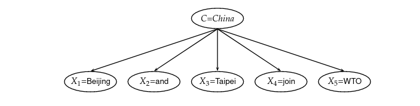
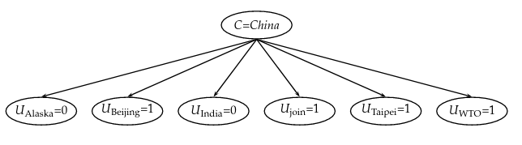
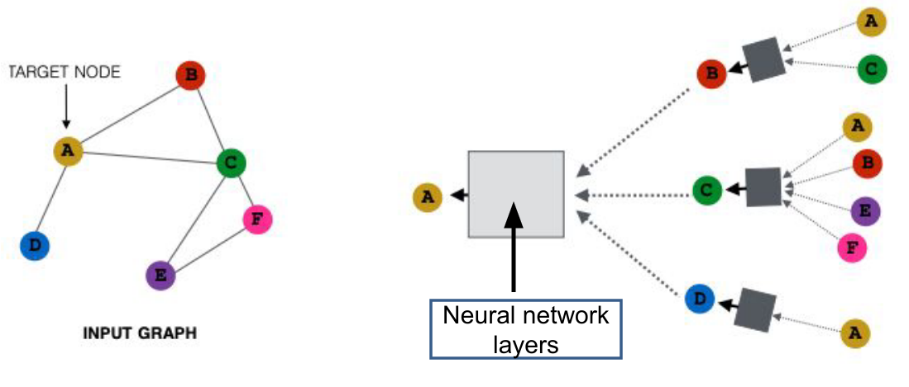
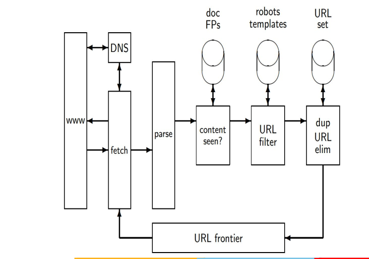

# Terminology

**Document** A unit that we have decided to build a retrieval system for, e.g. books, web pages, etc.

**Corpus** Also called a collection, it is a group of documents over which we perform retrieval

**Information Need** This is the topic about which the user wants to know more

**Query** Some words or phrases that the user writes in the computer in an attempt to communicate the information need

# Boolean Retrieval Model

A Boolean Retrieval Model is an IR model in which the user can pose queries as boolean expressions.

## Retrieval

### Linear Scan
A naive solution to the problem of retrieving documents could be a simple **linear scan**. This works without using any additional storage structures. However, this is an $O(N)$ problem and does not scale well into billions of words. So, we generally need some intermediate data structure to retrieve documents quicker.

### Incidence Matrix

An incidence matrix is a matrix where the columns are the set of documents $D$ and the rows are the set of words $W$. If a word $w$ is present in a document $D_{i}$, then that cell in the matrix will be set to 1.

The advantage of this approach means we only need to check a small set of rows, reducing the complexity greatly. However, the matrix size is gigantic for general corpus. Moreover, we realize that many words will only appear in very few documents, so the matrix is very sparse.

### Inverted Index

Here, for each word, we store a list of the documents that occur in it, called a **posting list**. It is something like an adjacency list or a direct addressing hash table, with collisions solved by linked lists. This means that to resolve a query, we are only looking for intersections of the query words' respective lists. This can be done in $O(N)$ if these two lists are sorted!

Though the complexity is asymptotically the same as that of an incidence matrix, we find that in practice it is faster (since not every query has posting list size of N). Moreover, it does not waste memory like the sparse incidence matrix.

Further speedup can be gotten by the means of **query optimization**. For instance let us assume three posting lists for $w_{1}$, $w_{2}$ and $w_{3}$ whose lists are of size 100, 50 and 10 respectively. The order in which we process a query matters! For instance, $w_{1} \wedge (w_{2} \wedge w_{3})$ is faster than other orders, since number of comparisons is minimized. In general the heuristic is that we should AND in the increasing order of sizes.

We should also actually do this for OR. This problem boils down to merging $N$ sets (posting lists), which can be done in $O(N\log{N})$ by merging from smaller to larger. This is because every element changes sets at most $O(\log{N})$ times.

To build the inverted index, we follow the following steps:

1. *See slides*

2. Tokenize the documents into a list of tokens. A token could be a single word or punctuation.

3. Preprocess the tokens (techniques discussed later)

4. Build the inverted index considering the tokens as dictionary items

We can speed up finding posting list intersection by means of **skip pointers**. This is a heuristic based method, where some members of the posting list have a pointer to another member multiple steps forward called a skip pointer. So, when we use the $O(N)$ approach, we can sometimes jump forward and skip some values. Say, on comparison, we find that $a_{1}$ is less than $b_{1}$. Normally, we would jump to $a_{2}$. But now, we also check $a_{1}$'s skip pointer, which points to (say) $a_{5}$. If $a_{5}$ is also less than $b_{1}$, then hurray! We can skip forward to $a_{5}$ and be rest assured that there are no intersecting elements before it.

This is great! But where do we place skip pointers? There is an associated trade-off with this problem. If we place too many, we would make shorter jumps (skip span) and have more comparisons. If we have too few, we can have a longer skip span, but often the algorithm degrades into a linear search. In practice, we usually use a factor of square root.

The limitations of this are:

* Difficult to maintain when the index keeps changing
* Memory requirements increase. IO cost of large posting size is more than the benefits of speed.

Skip pointers are also useless for OR queries.

### Biword Indexes

**Biword indices** consider every pair of consecutive terms in a document as a phrase. Using this, we can answer two word phrasal queries.

But, how do we answer longer queries? We can split it into biword phrases and use an AND operation to find the phrases in the document. However, this does not always work! It does not consider the locality of the long phrase - in the long phrase, all the biword phrases should occur together, but the AND operation will consider them anywhere in the document. So, this does not always lead to precise answers.

To approach this problem, **extended biword index** was created. Consider the phrase "renegotiation of the constitution". There are some function words separating the two important nouns/noun phrases ("of" and "the"). Using Part-Of-Speech tagging, we can consider this multi-word phrase as a biword, as long as it is of the form $N X^{*} N$ where $N$ is a noun and $X$ is some other function word.

However, even this approaches has its limitations:

* We cannot answer single word queries anymore
* Index size becomes huge, since the vocabulary of biwords is also massive.
* It still does not always return the correct answers for large queries

**Collocations** are series of words or terms that co-occur more often than would be expected by chance. To find this, we could find the frequency of each biword along with Part-Of-Speech tagging. This is a simple approach, but these may be random and it only works for fixed length phrases. Normally, while creating biword indices, we only look at these!

### Positional Indexes

While indexing the term, we also store the position where the term occurs in a document. We usually do this within a positing list. This makes it possible to accurately answer long queries, since we can use the positions of the words in the query to see if they are one after another, though this is complicated to implement.

Positional indices are used for proximity searches. So, if we ask to find documents where the words "red" and "house" are spaced by 4 tokens, we can easily find this.

### Combination schemes

Normally, multiple indices are combined together. For example, we might index frequent biwords and other phrases using positional indexes.

## Extraction

Converting to an index usually requires extracting data from encoded documents present in the unstructured corpus

### Character encoding

There are multiple types of encoding:

* ASCII (7 bits)

* UTF-8

* ISO-8859

* Extended ASCII

UTF-8 is compatible with ASCII code, besides encoding 1,112,604 other valid characters, including emojis and other languages. Because of this, it has become the most popular character encoding scheme

How do we know which text encoding is used? This is usually found in the files metadata, and can also be manually checked with some heuristics.

### Document Unit

Usually, we would assume that documents are fixed units for the purpose of indexing. However, this may not be true. For instance, multiple .tex files can be used to generate a single document. As a converse example, we have multiple mails existing in a single mbox file. So, a document unit could be a part of a file or be a group of files.

### Indexing granularity

The length of a document should neither be too long nor too short. A long document may lead to the retrieval of non-relevant documents, but a short document can lead to non-retrieval of relevant documents. So, how we divide a document can create large changes in the performance of our IR system.

In more technical terms, long documents results in high recall but low precision, while short documents result in low recall but high precision.

## Preprocessing

### Tokenization

A **token** is an instance of a sequence of characters in some particular document that are grouped together as a useful semantic unit of processing.

For example, in a sentence "Friends, Romans, Countrymen..." the word "Friends" is a token. Even the punctuation "," has its own meaning, and is as such a token. However, in the context of IR, we ignore punctuations as they are unimportant.

A **type** is a class of all tokens containing the same character sequence. For instance, in the sentence "to sleep, perchance to dream", there are two tokens "to", but they represent the same type.

A **term** is any type included in an IR system's dictionary. We may omit some types form the index, if they are unimportant.

One common issue with tokenization is being able to tell whether a given sequence of characters is a useful semantic unit. An example is the name "O'Neill" - how do we tokenize this? Should we ignore the apostrophe? What about emails, dates and hyphens?

### Stop words

**Stop words** are extremely common words that would appear to be of little value. We must decide whether or not to include these words, since they provide no semantic value in document retrieval. Normally, they are omitted in Boolean IR. However, when we have phrasal searches like "flights to London", removing a stop word like "to" can degrade system performance.

### Normalization

Sometimes, tokens in document and queries may mean the same thing. An example of this is "U.S.A" and "USA" - they are different tokens, but have the same meaning.

**Token normalization** is the process of canonicalizing so that matches occur despite superficial differences in the character sequences of the tokens.

There are several approaches:

* **Equivalence classes:** This is a simple heuristic based method, where we remove dots and hyphens from queries. While this is simple to use, a problem is that it is symmetric. Doing this can change meaning like in a query having the token "C.A.T" - changing this can change the meaning entirely. Also, asymmetric expansion is important when it comes to queries like "Windows" (possibly the OS) vs "window" (most probably the physical window). This is why having asymmetric rules is important.

* **relations between unnormalized tokens:** We maintain lists of synonyms, and expand queries on receiving them. For instance, on receiving the query "car", we might convert it into "car OR automobile"

* **Accents and diacritics:** In the English word, diacritics on characters have a fairly marginal status and can be removed. However this isn't true of every language, like in Spanish.

### Stemming and Lemmatization

Often, documents use different forms of the same word. For example, we use car's, cars, etc. as variations on the base word car.

**Stemming** is a crude heuristic process that chops off the end of the word.

**Lemmatization** uses language vocabulary and morphological analysis of words in order to retrieve the base form of the word.

## Issues

Some issues with Boolean Retrieval Model are:

* Documents either match or they don't. So, Boolean queries either returns in too few or too many documents. This is called the feast or famine problem
* Most users are incapable of writing Boolean queries
* Most users do not want to wads through 1000s of results.

# Tolerant Retrieval

The objective of tolerant retrieval is to develop techniques that are robust to typographical errors in query, as well as alternate spellings. This is useful when a user is not sure how to spell a query, or mistypes it.

A **dictionary** is a data structure that is used to store key-value pairs. When performing term lookup in dictionaries, we could use a hash table based method, or a tree based method.

## Hashes

Every key will be hashed to an integer. At query time, we find hashes of every term and fetch the corresponding data (posting lists, etc.). The benefit of this is that lookup time is usually constant. However, we cannot distinguish between minor variants (the spellings of naive), there is no prefix search and we need to periodically rehash the table, if the vocabulary keeps on growing.

## Trees

A tree based dictionary solves prefix search, and we can do an efficient search in $O(\log{M})$. However, this only holds in balanced trees, which can be expensive to maintain. This can be done with:

* Tries
* Binary Trees
* B-Trees

## Wildcard Queries

Wildcard queries are queries where we are unsure of the entire query, like in "automat\*" or "\*er". One use case of this is when we are not aware of the exact spelling, the word is foreign, or we want to make regex searches

For example, we can make prefix searches easily with Tries or B-Trees, and return the entire set of terms that satisfy the wildcard. We can do suffix searches this way, by storing a reverse B-tree or a suffix trie. However, what if we are searching things in the middle?

### Permuterm Indices

A permuterm index or a permuterm tree. We add some special character like '\$' to a term like 'hello' and then add every cyclic shift to the index - "\$hello", "o\$hell", etc. These are called **permuterms**. In our permuterm tree, all these permuterms will point to the term "hello". We now do this for every term in the corpus

Now, say we get a query like "m\*n". First, let us add a \$ in the end, and then cyclic shift the query such that \* appears at the end. After rotation, we get "n\$m\*" converting this to a prefix query! Now we can lookup this query in the permuterm index.

What about the query "fi\*mo\*er"? We can add a boundary, rotate, and try to search for the longest prefixes or suffixes. Then we first do a lookup for "er\$fi\*" in the permuterm index. Then, we go over the entire result exhaustively to check if it contains "mo". Through this, we are able to answer any general wildcard query.

### K-gram indexes

A *gram* refers to a character. So, "he" is a 2 gram and "ell" is a 3 gram. Before and after every word, we add a \$, and then split them into k-grams. "Hello" would create the following 2-grams - "\$h", "he", "el", etc. Now, we add these to a new inverted index where each k-gram points to words which contain that k-gram.

Assume a query "red*". So, we add a dollar at the start (not the end, since it is the wildcard). The, we can split it into 3-grams "\$re" and "red". Then, use the boolean query `$re AND red` on the 3 gram index. Unfortunately this does not yield accurate results - we would get the word "retired". So, we must do a filtering step to remove all the bad results.

This approach is much more space efficient than permuterms.

### Problems with wildcard queries

In Boolean Retrieval models, this is a very expensive query to execute. Moreover, it makes users lazy.

# Spelling Correction

There are two basic principles underlying most spelling correction algorithms. They are:

* Of various alternate spelling, we choose the "nearest" one
* When there are multiple correctly spelled queries with the same proximity score, select the one that is the most common one

When we have a misspelled query, we retrieve documents with the original query as well as the spell-corrected query. 

We have two types of correction:

* Isolated Term correction: Here, we correct every query, even if it is in a long phrase. This can result in changing the meaning.

* Context-sensitive correction: We consider context while correcting.

## Edit distance

The edit distance is the number of basic operations that convert $s_1$ to $s_2$

For the Levenshtein distance, we consider only the basic operations - add, delete, replace. We are able to compute this easily with DP.

The problem is that this works in the order of $n^2$, so for large queries this is expensive. To reduce the candidate of potential correct spellings, we often use some heuristics, like only considering those terms with have the same starting character.

## K-gram distance

The idea is that for a given query, like "bord", we split it into k-grams and try to find terms with same k-grams. However, can this really be a good metric?

To match k-grams, we can use heuristics like:

* At least $n$ k-grams should match
* The query term and the correct spelling can only differ by at most $n$ k-grams
* We can find the set overlap using the **Jaccard Coefficient**, given by $\frac{|A \cap B|}{|A \cup B|}$

## Context specific spelling correction

The **hit-based idea** for this is to blindly enumerate every correction for each query term, and then try different combinations. The one with the most hits is considered correct. A more efficient version of this is to check the collection of queries for hits and not documents.

# Index Construction

The limitation of normal inverted index construction is that all of the data needs be fit in memory (RAM). But if we have millions of documents, we cannot do this. One thing we could do is use an **external sorting** algorithm.

## Blocked Sort-Based Indexing

BSBI assumes we already have a dictionary mapping a term to it's unique term ID. The algorithm follows the following steps:

1. Segment the collection into blocks of equal size
2. Parse the documents in a block into termID-docID-pairs
3. Invert the found pairs, by first sorting and then collecting pairs with the same termID into a posting list
4. Store intermediate sorted results on the disk
5. Merge all intermediate results into the final index.

The issue with this is the aforementioned assumed dictionary may not fit into memory. Moreover, we can only use relatively small blocks since we need to sort in memory.

## Single Pass in Memory Indexing

Instead of using term IDs we directly use terms, and use a different dictionary for each block. We process each token one by one, adding them to the dictionary if not seen before and building the posting list. We grow these posting lists dynamically, allowing for better overall memory utilization. When memory has been exhausted, we write the index of the block (consisting of the dictionary and the posting lists) to disk. We have to sort the terms before doing this, so that we can merge the blocks in a simple linear scan (*Note - It is unclear to me why this is considered a linear time algorithm, considering the book claims it involves sorting.*)

## Distributed Indexing

This applies when we scale to billions of documents. The data is distributed across thousands of servers across the world.

### MapReduce

We have a master node known as the **name node** and many slave nodes called the **data node**. The master node only controls and assigns tasks to all the slave nodes - it does not contain any data by itself.

MapReduce is a 4-stage process:

* Input Splits: The input data is divided into fixed size pieces called input splits. In the terms of a database, these would be shards, where sets of rows of tables would be spread.

* Mapping: In this phase, data in each split is passed to a mapping function to produce output values. In the case of finding word frequency, we would count the number of occurrences in each input split during the mapping process.

* Shuffling: This phase consolidates all the relevant records from the Mapping phase. In our example, this would be clubbing the same words together along with their respective frequency

* Reducing: Now, the output values from the Shuffling phase are aggregated and returned as a final output value. In this case, it would find the total frequency of each word.

## Dynamic Indexing

The corpus is not always static. We must be able to update and delete documents, and update the underlying index accordingly.

We maintain a big main index on the disk. New documents go to a small auxiliary index in the main memory (RAM). For every query, we search over both the index and aggregate results. For deletion, we use bit vectors to filter out the deleted documents. We periodically merge the auxiliary index to the main index.

The issue with the above approach is that we merge very frequently, during which performance degrades. Even while merging, it is most efficient to have posting lists in different files. However, the OS will have trouble handling all these files.

We can decrease the number of merges by employing logarithmic merges. Let us assume the size of the main memory is $n$. Whenever the index size crosses $n$, we dump it to disk and call it $L_0$. The next time this happens, we will merge the main memory and $L_0$ and create $L_1$ of size $2n$. We keep doing this, as if we were incrementing in binary, creating another $L_1$ and merging into $L_2$ and so on. The number of indices are bounded by $O(\log{T})$ where $T$ is the number of postings. The time complexity of index construction will be $O(T\log{T})$, since each posting is merged in $O(\log{T})$ time.

In large search engines, new indices are sometimes reconstructed from scratch. This takes a long time, and sometimes the indices are switched out.

# Index Compression

In an inverted index, we aim to make it so that the dictionary can be kept in main memory, and small enough to keep some posting lists in memory as well.

Compression could be lossy or lossless. Lossy decomposition may discard information, so we usually aim to have lossless compression.

In our posting list, we normally have docIDs stored in increasing order. So, we could just store the gaps between successive docIDs. This allows us to use smaller number of bytes to store the IDs for more frequent terms. This is called **gap encoding** .

## Variable Length Encoding

**Variable length encoding** allows us to use fewer bits for the small gaps and about 20 bits for large gaps. How do we implement this?

### Variable Byte Code

Out of a single byte, we dedicate 1 bit to be a "continuation bit" $c$. If $c=1$, that means that is the last byte of whatever value we are trying to store. The other 7 bits contain a value.

We could also use a different unit of alignment - 32 bits, 16 bits, 4 bits, etc. The byte alignment we use depends entirely on our use case.

### Gamma Code

In gamma code, we represent a gap $G$ is represented as a pair of length and offset. Offset is the gap in binary, with the MSB chopped off. For example, 13 -> 1101 -> 101. The length is the length of the offset (in this case). The length is encoded in unary code. Unary code for a number $n$ is $n$ 1s followed by a 0.

So, for our example of 13, the $\gamma$ code would be `1110,101`. It is obvious that the length of $\gamma$ code will be $2 \times \log_2{G} + 1$ bits. As we can see, they are always of odd length.

Some properties of Gamma code are:

* Gamma code (as well as VB code) is prefix free - a valid code word is not a prefix of any other valid code
* Encoding is optimal within a factor of 3
* Gamma code is universal, and can be used for any distribution

The largest issue with gamma code is alignment. Machines normally have word boundaries, so compressing and manipulating at the granularity of bits is slow. VB code is aligned and has more potential to be efficient. Regardless of efficiency, variable byte is conceptually simpler at little additional space cost.

# Ranked Retrieval

In ranked retrieval, we rank the retrieved documents in the order of their relevance to the query. The retrieved documents are now considered as an ordered list instead of a set.

**Free text queries** are queries written in natural language, instead of a boolean language of operators and expressions. Normally, we use ranked retrieval and free text queries together.

## Boolean Ranked Retrieval

This arises when we use Boolean retrieval with ranking. A **parametric index** is an index for each field in the metadata, like the language, genre, etc. Zones are similar to fields, but the content of the zone can be any free text. For instance, titles and abstracts are considered zones. When we index on these, we create a **zone index**. This could be used to find the answer to queries like "find documents with merchant in the title and william as an author".

Zone indexes could be implemented as set of posting lists for each term - one for each zone. For "william", we could have "william.abstract", "william.text", etc. More simply, we could just have a single posting list where every posting list member is marked with data about the zone(s) it is in, for a particular document.

To rank documents, we could use **weighted zone scoring**. We assign a (query,document) pair a score in the interval [0,1], by computing a linear combination of zone scores. For example, let there be three zones - title, abstract and body, with weights 0.45, 0.3, 0.25 respectively. If all zones had the query term, the score would be 1. But, if only the abstract and body had the query term, the score would be 0.55.

## Scoring

Scoring is the basis behind rank retrieval. It gives a value to order our query results on.

### Jaccard Coefficient

The Jaccard coefficient is one way to score queries. It is essentially the Intersection Over Union. Let us consider the following example. We have a query, "ides of march", which gives us two documents - "caesar died in march" and "the long march". The value for the first document would be 1/6, and for the second document would be 1/5.

The issues with this method are:

* The match score decreases as document length grows
* It doesn't consider term frequency
* Rare terms in a collection are more informative than frequent terms, but Jaccard does not consider this

### Bag of Words Model

The term frequency $tf_{t,d}$ of term $t$ in document $d$ is the number of times that $t$ occurs in $d$. We use this metric to score query-document matches. 

One way to do this is with **log frequency matching**. This is defined as

$$
w_{t,d} = \begin{cases}
1 + \log_{10}{tf_{t,d}} & \text{if } tf_{t,d} > 0 \\
0 & \text{otherwise}
\end{cases}
$$

The score of a document query pair would be the sum over the terms $t$ which are in both $q$ and $d$ (the intersection). So,

$$score(q,d) = \sum_{t \in q \cap d} (1 + \log_{10}{tf_{t,d}})$$

The issue with this is once again, all the terms in a query are considered equally. We have no extra weighting based on how often they occur.

We can help with this by considering **document frequency** instead. With this, we can find rare terms, which are more informative than frequent terms. We define document frequency $df_t$ to be the number of documents $t$ occurs in. Let us also identify the **inverse document frequency**, given by:

$${idf}_t = log_{10}{\frac{N}{{df}_t}}$$

where N is the number of documents.

The **collection frequency** of $t$ is the number of occurrences of $t$ in the collection counting multiple occurrences in the same document.

These definitions let us define **TF-IDF weighting**. The TF-IDF weight of a term is the product of its TF weight and its IDF weight. So, it is given by:

$$w_{t,d} = (1+\log_{10}{tf_{t,d}}) \times \log_{10}{\frac{N}{df_t}}$$

It increases with the rarity of the term, and with the number of occurrences within a document. Once again, the score is the sum of weights over all terms $t$ present in both the query and the document.

### Vector Space Model

Here, documents and queries are both represented by vectors. The dimensionality is the number of unique terms in the vocabulary. Queries and documents are represented by a real valued vector, where each element is the TF-IDF weight of the term.

So now, how do we measure the similarity of two vectors? We cannot do this by simple subtraction, since two documents may have similar content but large vector differences (think of a document which is a double copy of another document). Instead we use **cosine similarity**. This is given by:

$$\cos(\vec{q},\vec{d}) = \frac{\vec{q} \cdot \vec{d}}{|\vec{q}||\vec{d}|}$$

With this, we can score the vector and find the top K scores to use.

Something to remember is that there are many variations of TF-IDF. Some search engines may use different weightings for queries and for documents. A standard scheme for this is lnc.ltc, where the document has **l**ogarithmic TF, **n**o IDF, and **c**osine normalization, while the query does have IDF

### Latency

Score computation takes a large amount of CPU work on a query and results in a higher latency. We can help this by avoiding scoring docs that cannot make it to the top K. We can also use non-safe ranking  - here, we do not guarantee that the top K documents returned are the absolute highest scoring documents (unlike in safe ranking). This is fine because the ranking function is just a proxy for user happiness. Now, instead we can prune the non-contenders from the corpus into a smaller set.

To implement this, we have many schemes of so called **index elimination**. We try to only consider high IDF query terms, and docs containing many query terms. The benefit of doing the former is that posting lists of low-IDF terms are normally very large, so we prune the search space by quite a bit.

We may also use a **champion list**. For every term $t$, we store a list of $r$ documents that have the highest score for term $t$. This is done at index creation time. The set of $r$ documents is known as the champion list of $t$. Now for a query we can create a set of all documents from the champion lists of all the terms in the queries.

Another scheme is **Static Quality Scores**. Each document is assigned a score $g(d)$ which is independent of the query. This is a measure of the "authority" or "importance" of the document. Now, the net score of the document will be the $g(d)$ and the query dependent portion. By ordering the documents by $g(d)$, the top scoring documents are more likely to appear earlier in postings traversal. We could also stop postings traversal much earlier. By merging this with the champion list strategy, we can reduce latency by a whole lot.

**Impact Ordering** is when we order the posting list of terms by document impact for that term. While computing cosine similarity, we could now only use the first $x$ elements of the posting list, and traverse terms in decreasing order of IDF. Once we have very small increases in overall score, we could terminate.

**Cluster Pruning** is when we cluster documents and assign  a leader to each cluster. When we get a query, we find the best matching leader and compute scores with all the followers of that leader.

**Tiered indices** is when we break posting lists up into a hierarchy of lists, from most important to least important, perhaps by $g(d)$. Now at query time, we could use only the top tier (unless it fails to yield $K$ docs, in which case we go to lower tiers).

### Query term proximity

Ideally, documents who have query terms in close proximity to one another should have a higher score. Let us define $w$ as the smallest window in a doc containing all the query terms. The scoring function should take this into account, perhaps by adding $C/w$.

### Query Parser

A free text query from the user may spawn one or more queries to the indexes. For instance, the query "rising interest rates" may give less than $k$ docs, so we then run two more queries - "rising interest" and "interest rates" and so on and so forth. The way in which we do this is decided by the query parser.

# Evaluation of IR Systems

IR systems are evaluated by "user happiness". What do we mean by this? We mean relevance of our search results to the **information need**. Importantly, we do not consider the relevance to the query itself! A document which contains all the query terms need not be useful to the user's need. This is tough to quantify through some formulae. Instead, we have public benchmarking datasets like the TREC benchmarks to measure the relevance of our results.

## Evaluations in Unranked Retrieval

In unranked retrieval, we have two different measures - **precision** and **recall**. Precision is the fraction of retrieved documents that are relevant. Recall is the fraction of relevant documents that are retrieved.

$$\text{Precision} = \frac{\text{No. of Relevant Items Retrieved}}{\text{No. of Retrieved Items}}$$

$$\text{Recall} = \frac{\text{No. of Relevant Items Retrieved}}{\text{No. of Relevant Items}}$$

We can also look at this from the perspective of positives and negatives.

||Relevant|Non-relevant|
|---|---|---|
|Retrieved|True Positives| False Positives|
|Not Retrieved| False Negatives | True Negatives|

So, now we have:

$$P = \frac{TP}{TP+FP}$$
$$R = \frac{TP}{TP+FN}$$

There is a trade-off between precision and recall. We could always return every document to get a high recall, but then we would reduce precision. The vice versa is also true. As a balance measure, we define the $F_1$ score as:

$$ F_1 = 2 \cdot \frac{P \cdot R}{P+R} = \frac{2}{P^{-1} + R^{-1}}$$

Another measure to use is **accuracy**.

$$\text{Accuracy} = \frac{TP+TN}{TP+FP+TN+FN}$$

This is a faulty metric, because we can make it arbitrarily large by decreasing the number of results!

## Evaluations in Ranked Retrieval

Here, we have an extra parameter - $K$. We define the precision at a particular $K$ by computing the number of relevant documents in the top $K$ and ignoring documents ranked lower than $K$. Recall can also be computed the same way.

By varying $K$ we end up with a curve called the **precision-recall curve**.

Now, let us consider the rank position of each relevant document in a query result. Let it be $K_1, K_2, .. K_R$. Next, we compute the precision at each of these $K$ values - the mean of all of these precisions is called the **average precision**.  The mean of average precisions over multiple queries/rankings is known as **Mean Average Precision**. MAP is the most popular metric for IR systems today.

One issue of these metrics is that there is a large variance in precision between queries - there are some hard information needs and some easy ones. Another is MAP assumes the user is interested in finding many relevant documents for each query.

## Discounted Cumulative Gain

This is a popular measure for evaluating web search and related tasks. We make two assumptions:

* Highly relevant documents are more useful than marginally relevant documents
* The lower the ranked position of a relevant document, the less useful it is for the user, since it is less likely to be examined.

The gain is accumulated staring from the top of the ranking and is discounted as we move down the ranks. A typical discount is $1/\log(rank)$. So, the total gain accumulated at rank $p$ is given by:

$$DCG_p = rel_1 + \sum_{i=2}^{p} \frac{rel_i}{\log_2{i}}$$

We can extend this same concept to **Normalized Discounted Cumulative Gain** or NDCG. We normalize the DCG at rank $n$ with the ideal DCG at rank $n$. The ideal ranking has the documents sorted in decreasing order of relevance. NDCG is now quite popular in evaluating web searches.

## Mean Reciprocal Rank

This is used in cases where there is only one relevant document, like say fact searching. Consider the rank position $K$ of the first relevant doc. The reciprocal rank score would be $1/K$. Mean Reciprocal Rank is the mean RR across multiple queries.

## Large Search Engines

Large search engines are evaluated by test collections of queries and hand ranked results. These search engines also use non-relevance based metrics, like A/B testing and clickthrough

A/B testing is when we divert a small proportion of traffic to the new system which includes the innovation. Now, by evaluation with some immediate metric like clickthrough, we can directly see if the changes affect user happiness.

# Probabilistic Information Retrieval

The Probabilistic Information Retrieval Model is an improvement over both the Ranked Retrieval Model and the Boolean Retrieval Model. Unlike Boolean retrieval, PIR is able to rank documents. It's benefit over the vector space model is that it is more capable of ranking documents according to information need, instead of simple similarity which may or may not give us relevant results.

PIR attacks the document ranking problem in a completely new way. It ranks documents by the probability of relevance of the document with respect to information need. This is given by $P(R=1|\text{document, query})$. This is effective because of the **Probability Ranking Principle**. It states that if the retrieved documents are ranked in this way, then the effectiveness of the system is the best that is obtainable.

## Binary Independence Model

Documents and queries are represented as binary term incidence vectors, so if $x_t=1$, that word exists in that document (or query). We also make the assumption that the terms are independent - this is not true, but it works well in practice.

We model the probability $P(R=1|d,q)$ as $P(R=1|\vec{x},\vec{q})$. So, we end up with the following expressions from Bayes' Rule:

$$P(R=1|\vec{x},\vec{q}) = \frac{P(\vec{x}|R=1,q) \cdot P(R=1|q)}{P(\vec{x}|\vec{q})}$$

$$P(R=0|\vec{x},\vec{q}) = \frac{P(\vec{x}|R=0,q) \cdot P(R=0|q)}{P(\vec{x}|\vec{q})}$$

$P(\vec{x}|R=1,\vec{q})$ and $P(\vec{x}|R=0,\vec{q})$ is the probability that if a relevant or non-relevant document is retrieved then that document's representation is $\vec{x}$.

$P(R=1|\vec{q})$ and $P(R=0|\vec{q})$ is the prior probability of retrieving a relevant or non-relevant document for a query $\vec{q}$. We estimate this from the percentage of relevant documents in the collection. Since a document is either relevant or non-relevant, these are exhaustive events and must sum up to 1.

We could use this information and rank document by the odds of their relevance. This would be given by:

$$O(R|\vec{x},\vec{q}) = \frac{P(R=1|\vec{x},\vec{q})}{P(R=0|\vec{x},\vec{q})}$$

Or, more simply:

$$O(R|\vec{x},\vec{q}) = \frac{P(R=1|\vec{q})}{P(R=0|\vec{q})} \cdot \frac{P(\vec{x}|R=1,\vec{q})}{P(\vec{x}|R=0,\vec{q})}$$

The first part of this is constant for a given query, so we can ignore it while ranking documents. Moreover, by the assumption that the presence or absence of a word in a document is independent of other terms' presence or absence, we get the following expression:

$$O(R|\vec{x},\vec{q}) = O(R|\vec{q}) \cdot \prod_{t=1}^{M} \frac{P(x_t|R=1,\vec{q})}{P(x_t|R=0,\vec{q})}$$

Since $x_t$ is either 0 or 1, we can split the terms.

$$O(R|\vec{x},\vec{q}) = O(R|\vec{q}) \cdot \prod_{t=1}^{M} \frac{P(x_t=1|R=1,\vec{q})}{P(x_t=1|R=0,\vec{q})} \cdot \prod_{t=1}^{M} \frac{P(x_t=0|R=1,\vec{q})}{P(x_t=0|R=0,\vec{q})}$$

Let $p_t = P(x_t=1|R=1,\vec{q})$ be the probability of a term appearing in a relevant document, and $u_t = P(x_t=1|R=0,\vec{q})$ be the probability of a term appearing in a non-relevant document. This can be expressed in the form of the following contingency table:

||Document|R=1|R=0|
|---|---|---|---|
|Term Present | $x_t=1$ | $p_t$ | $u_t$|
|Term Absent | $x_t=0$ | $1-p_t$ | $1-u_t$|

We make another assumption - terms not occurring in the query are equally likely to occur in relevant and non-relevant documents. This means that if $q_t=0$, then $p_t=u_t$. Now we need only to consider the terms in the products that appear in the query:

$$O(R|\vec{x},\vec{q}) = O(R|\vec{q}) \cdot \prod_{t:x_t=q_t=1} \frac{p_t}{u_t} \cdot \prod_{t:x_t=0,q_t=1} \frac{1-p_t}{1-u_t}$$

The left product is over query terms in the document, while the right product is over query terms not in the document. Including the query terms found in the document into the right product, but dividing by them in the left product, we get:

$$O(R|\vec{x},\vec{q}) = O(R|\vec{q}) \cdot \prod_{t:x_t=q_t=1} \frac{p_t(1-u_t)}{u_t(1-p_t)} \cdot \prod_{t:q_t=1} \frac{1-p_t}{1-u_t}$$

Now, the right term is constant since it is over all query terms. The only quantity that needs to be estimated to rank documents with respect to a query is the left product. Hence, the **Retrieval Status Value** is:

$$RSV_d = \log{\prod_{t:x_t=q_t=1}\frac{p_t(1-u_t)}{u_t(1-p_t)}} = \sum_{t:x_t=q_t=1} \log{\frac{p_t(1-u_t)}{u_t(1-p_t)}}$$

The terms we are adding are called the **log odds ratios**, given by $c_t$. If $c_t$ is zero, the term has equal odds of appearing in relevant and non-relevant documents. If $c_t > 0$ it has higher odds of appearing in relevant documents, while it will have higher odds of appearing in non-relevant documents if it is negative.

If we think about it, this is basically like the vector space model, but with weights being $c_t$!

So, how do we compute $p_t$ and $u_t$? We use a corpus, where queries and relevance judgements is already known. We define $S$ as the number of relevant documents, $s$ is the number of relevant documents where the term $x_t$ is present, and the number of documents where $x_t$ is present is $df_t$. With this information, we can create a contingency table for each term:

||Document|R=1|R=0|Total|
|---|---|---|---|---|
|Term Present | $x_t=1$ | $s$ | $df_t-s$| $df_t$ |
|Term Absent | $x_t=0$ | $S-s$ | $(N-df_t)-(S-s)$| $N-df_t$|
|-------|-------|------|------|------|
||Total|S|N-S|N|

$$p_t = s/S$$
$$u_t = (df_t-s)/(N-S)$$
$$c_t = K(N,df_t,S,s) = \log \frac{s/(S-s)}{(df_t-s)/((N-df_t)-(S-s))}$$

This is a **Maximum Likelihood Estimate** of $p_t$ and $u_t$.

If any of the counts is a zero, then the term weight is not well defined. So, MLE does not work for rare events. To avoid zeros, we could add 0.5 to each count, giving us:

$$p_t = \frac{s+0.5}{S+1}$$
$$u_t = \frac{df_t-s + 0.5}{N-S+1}$$

Let us add another assumption - relevant documents are a very small percentage of the collection. This allows us to approximate statistics for non-relevant documents with those from the entire corpus. So, $u_t = df_t/N$. This becomes equivalent to TF-IDF!

## Okapi BM25

Okapi BM25 is a probabilistic model that incorporates term frequency and length normalization.

We create a new scoring based on TF-IDF:

$$RSV_d = \sum_{t \in q} \log{\frac{N}{df_t}} \cdot \frac{(k_1+1)tf_{td}}{k_1((1-b) + b \times (L_d/L_{ave})) + tf_{td}}$$

Here, we have the following terms:

* $tf_{td}$ is the term frequency in document $d$
* $L_d$ is the length of document $d$ and $L_{ave}$ is the average document length
* $k_1$ is a tuning parameter controlling the document term frequency scaling
* $b$ is a tuning parameter controlling the scaling by document length

In BM25, the score plateaus faster in a short document than in a long document, since you can be more confident of its relevance. It also plateaus faster with higher term frequencies than with lower term frequencies.

For longer queries, we add a new parameter $k_3$ that controls the query term frequency scaling and get the equation:

$$RSV_d = \sum_{t \in q} \log{\frac{N}{df_t}} \cdot \frac{(k_1+1)tf_{td}}{k_1((1-b) + b \times (L_d/L_{ave})) + tf_{td}} \cdot \frac{(k_3+1)tf_{tq}}{k_3 + tf_{tq}}$$

# Text Classification

In this problem, we are given a corpus of documents as input, and we want to classify them into some pre-defined categories

*Get terminology from slides*

## Naive Bayes Classifier

In this algorithm, we are looking to compute P(class|document) or $P(c|d)$. We do this with Bayes' Rule. This would give us:

$$P(c|d) = \frac{P(d|c) \cdot P(c)}{P(d)}$$

From this we understand $P(c|d) \propto P(d|c)\cdot P(c)$.

To do Naive Bayes' Classification, we make the following assumptions:

* Occurrence of any term in a document is independent of occurrence of any other term
* A term can be present in any position $i$ independently.

We represent $d$ as $[t_1,t_2,...t_{nd}]$, which is a sequence of terms. Using the above assumptions, we can get the formula:

$$P(d|c) = \prod_{1 \leq k \leq n_d} P(t_k|c)$$

Now we have a new proportionality, $P(c|d) \propto P(c) \cdot \prod_{1 \leq k \leq n_d} P(t_k | c)$.

$P(t_k|c)$ is a measure of how much evidence $t_k$ contributes that $c$ is the correct class. $P(c)$ is our prior probability.

In NBC, we say the best class is $c_{map}$ which is the **maximum a posteriori class**, given by:

$$c_{map} = arg\,max_{c \in C} \hat{P}(c|d)$$

In practice, multiplying a lot of small probabilities to calculate $P(c|d)$ can result in floating point underflow. So, we decide to take a logarithm to find the best class, ending up with the equation:

$$c_{map} = arg\,max_{c \in C}[\log{\hat{P}(c)} + \sum_{1 \leq k \leq n_d}\log{\hat{P}(t_k|c)}]$$

We interpret $\log{\hat{P}(c)}$ as a weight that indicates the relative frequency of $c$, and $\log{\hat{P}(t_k|c)}$ to be a weight that indicates how food an indicator $t_k$ is for $c$

So, our next problem arises. How do we estimate these probabilities? We can use a maximum likelihood estimate. In Maximum Likelihood Estimate, we use the formulations below:

$$\hat{P}(c) = \frac{N_c}{N}$$

$N_c$ is the number of docs in class $c$ and $N$ is the total number of docs

$$\hat{P}(t|c) = \frac{T_{ct}}{\sum_{t' \in V} T_{ct'}}$$

$T_{ct}$ is the number of tokens $t$ in training documents from class $c$, including multiple occurences.

One issue with MLE is that we might end up with some probabilities being zero, like if a term never occurs in a certain class in the testing set. This means that any document with that term will have probability zero! To avoid this, we use **add-one smoothing**. This means we add one to each count to avoid zeros, giving us the formula:

$$\hat{P}(t|c) = \frac{T_{ct}+1}{\sum_{t' \in V} T_{ct'} + B}$$

Here, $B$ is the number of bins, which is in this case the size of the vocabulary. With this, we never get a probability of zero.

### Bernoulli Model

The model we have discussed till now is a **multinomial model**, where we represent the document as an ordered sequence of terms.

The **Bernoulli Model** is more analogous to the Binary Independence Model, where a document is a binary term incidence vector. While these models have the same time complexity, there is a difference in interpretation and classification rules. The Bernoulli model estimates $\hat{P}(t|c)$ as the fraction of *documents* of class $c$ that contain term $t$, as opposed to the Multinomial model estimating it as the fraction of *tokens* in documents of class $c$ that contain $t$.

Since the Bernoulli model ignores the number of occurrences, it typically makes mistakes in longer documents. Terms which do not occur in a class do not affect the decision in multinomial models, but the Bernoulli model estimates the probability of non-occurrence as well, while finding $P(c|d)$.

### Properties

Both the Bernoulli model and the Multinomial model act as **Generative Models**. Consider our MLE equation:

$$c_{map} = arg\,max_{c \in C} P(d|c)P(c)$$

So, we can interpreting this as choosing a class $c$ with probability $P(c)$, and generating a document $d$ given $c$. These models both differ in the generative step, since the Bernoulli model encodes the document as an incidence vector, while the Multinomial model encodes it as a term sequence. We can see the differences in generative models in Figures 1 and 2.

Naive Bayes Classifiers make two assumptions - conditional independence, and positional independence. However, these assumptions don't really hold true for natural language. For instance, would there not be a conditional dependence between the words "President" and "Trump"? As well as a positional independence between "United" and "States"? How does NBC still work?

As it turns out, NBC is terrible for correct estimation, but accurate at class prediction. In real world scenarios, it often outperforms many other classification methods. In practice, it turns out to be:

* More robust to non relevant features
* More robust to concept drift (changing of definition of class over time)
* Better than decision trees when features are equally important
* Optimal if the independence assumptions hold
* Very Fast

In training, the time complexity of NBC is $\Theta(|\mathbb{D}|L_{ave} + |\mathbb{C}||V|)$. In testing, the time complexity is $\Theta(|\mathbb{C}|M_a)$. Here, $\mathbb{D}$ is the training set, $V$ is the vocabulary, $\mathbb{C}$ is the set of classes, $L_a$ is the length of a test document, and $L_{ave}$ is the average length of a training document. As we can see, the test time is linear in the length of the test document.

## Vector Space Classification

We make the following assumptions about our data:

* Documents in the same class form a contiguous region
* Documents from different classes don't overlap.

The classifier, when given a document, finds what region it lies in and claims the class it belongs to based on that. So the main question of this classification is trying to demarcate the regions for classification based on training data.

### Rocchio Classification

In this scheme, we compute a centroid for every class, which is the average over all the documents in that class. So, we have:

$$\vec{\mu}(c) = \frac{1}{|D_c|}\sum_{d \in D_c} \vec{v}(d)$$

When we classify, we give the query document the class based on which centroid is closest to it.

Rocchio is unable to handle non-convex, multimodal classes. It also cannot guarantee that the results are consistent within the training dataset.

### k Nearest Neighbours Classification

kNN classification is very simple and easy to implement. It often yields better results than Naive Bayes and Rocchio classification. 

If $k=1$, we assign each test document to the class of its nearest neighbour in the training set. However, this is not very robust, since one document can be mislabelled or atypical. Normally, we use $k>1$, where we assign each test document to the majority class of its $k$ nearest neighbours in the training set.

The idea behind kNN is based on the contiguity hypothesis - we expect a test document $d$ to have the same label as the training documents located in the local region surrounding $d$.

kNN is very accurate if the training set is large, and scales well with large number of classes. However, it is inaccurate if our training set is small, and is computationally expensive.

## Evaluating classifiers

Evaluation is done on test data that is disjoint from the training data. In practice, about 10-20% of the training data is used for validation and hyper-parameter tuning, and the rest is for actual model training. As before, evaluation is done with Precision, Recall and F1 score of the classifier.

Now, we have an evaluation measure for a single class. To get an aggregate score over all classes, we can use either **macro averaging** or **micro averaging**.

In macro averaging, we compute the F1 score for every class, and average them all. In micro averaging, we compute the TP, FP and FN for all the classes and use the aggregates to get a final score.

## Feature selection

Representing documents as vectors results in very large vectors, in the size of the vocabulary. This is often in the order of millions. Many dimensions will correspond to rare words, which can mislead a classifier. These misleading terms are known as **noise features**. An example of a noise feature, is if the word "arachnocentric" was present only in the class "China". The classifier might be led to believe it contains important information about China. This incorrect generalization is a kind of **overfitting**.

**Feature Selection** is a selection of a subset of relevant features, resulting in reducing training time, making runtime models smaller and faster and improving generalization. Generally, feature selection methods rank words by measuring their utility, and choosing the top $K$ features out of them all. Feature selection methods usually are defined by their feature utility measure.

The feature utility should be a measure of:

* Frequency
* Mutual information

The **Mutual Information** of two random variables is a measure of the mutual dependence between two variables. It quantifies the amount of information in "shannons" or "bits" obtained about one random variable through observing the other random variable. It is given by:

$$I(U,C) = \sum_{e_t \in \{1,0\}} \sum_{e_c \in \{1,0\}} P(U = e_t, C=e_c) \log_2{\frac{P(U=e_t,C=e_c)}{P(U=e_t)P(C=e_c)}}$$

## Linear Classifier

A **linear classifier** computes a linear combination or weighted sum $\sum_{i}w_ix_i$ of the feature values. In the case of a binary classifier, we just check if this value is greater than some $\theta$. This corresponds to some hyperplane in feature space.

This hyperplane can be defined by multiple classifiers. For instance, the Rocchio classifier is a linear classifier defined by:

$$\sum_{i=1}^{M} w_id_i = \vec{w}\vec{d} = 0$$

where $w$ is the normal vector $\vec{\mu}(c_1) - \vec{\mu}(c_2)$ and $\theta = 0.5 * (|\vec{\mu}(c_1)|^2 - |\vec{\mu}(c_2)|^2)$

Multinomial NBC is also a linear classifier in log space. Here we have:

$$\sum_{i=1}^{M}w_id_i = \theta$$

where $w_i = \log{[\hat{P}(t_i|c)/\hat{P}(t_i|\overline{c})]}$, $d_i$ is the number of occurrences of $t_i$ in $d$, and $\theta = -\log{[\hat{P}(c)/\hat{P}(\overline{c})]}$

kNN is not a linear classifier.

### Bias Variance Tradeoff

This is a somewhat unrelated topic. The **bias error** is error from erroneous assumptions in the learning algorithm. High bias can cause an algorithm to miss the relevant relations between features and target outputs (underfitting).

The **variance** is an error from sensitivity to small fluctuations in the training set. High variance can cause an algorithm to model the random noise in the training data, resulting in overfitting.

There is a tradeoff between these two. It is not possible to minimize both. Because of this, we cannot have a learning method that is ideal for all classification problems.

# Text Clustering

Cluster analysis is the process of finding groups of objects such that the objects in a group will be similiar to one another and different from the objects in other groups. A set of clusters is called a **clustering**. Clustering can either be partitional or hierarchical.

**Partitional clustering** is when a data object belongs to exactly one subset. In **hierarchical clustering**, we seek to build a hierarchy of clusters, either through division or agglomeration.

Clustering could also be classified based on whether points can belong to multiple clusters (exclusive or non exclusive). Clustering could also be fuzzy, where a point belongs to all clusters with some weight between 0 and 1, such that the sum of weights is 1.

The **cluster hypothesis** states that all documents in the same cluster behave similiarly with respect to relevance to information needs. This is the basis of all clustering in IR.

Clustering has many applications. One example is **search result clustering**, where the documents returned from a query are clustered into groups, making it easier to understand. For instance, the word "Jaguar" could refer to the club, the car, or the animal. Through search result clustering, we are able to break it into groups based on the meaning. This is further generalized into **Scatter Gather**, where a user iteratively chooses clusters, which are then expanded (scattered) and reclustered.

## Types of clustering

**Well separated clusters** are clusters such that any point is closer to every other point in the cluster than to any point not in the cluster.

**Center based clusters** are those such that an object is closer to the "center" of a cluster than the center of any other cluster. This center could be the mean, the median, or any other metric.

**Contiguous clusters** are those such that a point in a cluster is closer to one or more other points in the cluster than to any point not in the cluster.

**Density based clusters** are dense regions of points, separated by low density regions from other clusters. This is often used when there is noise in the data, or the clusters are irregular.

## K means clustering

K means clustering follows a partitional clustering approach. Documents are represented as in the vector space model. Each point is assigned to the cluster with the closest centroid, after which the centroid is recomputed. The "closeness" is measured with Euclidean distance, not cosine similiarity.

## Hierarchical Clustering

There are two ways to create out hierarchy. We may do it bottom up, or top down. Bottom up clustering is done with **Hierarchical agglomerative clustering** or HAC.

HAC creates a hierarchy in the form of a binary tree. THe basic algorithm is as follows:

* Start with each document in a separate cluster
* Repeatedly merge the most similar clusters, till there is only one cluster. The history of this merge is the final hierarchy.

The hierarchy is usually represented in the form of a **dendogram**. Something important to realize is that the similarities of the clusters being merged is non-increasing over time! Otherwise it would violate our condition of taking the best.

The inter-cluster similarity could be defined in many ways:

* Minimum similarity of points
* Maximum similarity of points
* Group average of similarities
* Distance between the centroids

When we use maximum similarity as the metric, this is called **single link clustering**. The merge criterion here is local, as we pay attention solely to the area where the 2 clusters come closest to each other, and not to the overall structure.

Using minimum similarity as the metric is called **complete link clustering**. The merge is non-local, as the entire structure of clustering can influence merge decisions. This results in a preference for compact clusters with small diameters, but also causes sensitivity to outliers. The existence of an outlier can completely change the clustering.

# Web Search

Web search is the backbone of the entire internet. Without web search, the internet would not exist! It allows the aggregation of interest.

Web search is paid for by advertising. These ad spots could be priced by Cost per click (CPC) or Cost Per Mile (CPM). Advertisers bid for keywords in an open auction to decide the ranking of these ad spots. The way that the auction determines an ad's rank and price is the subject of a lot of research, as it could profit or lose millions for the company!

One way is ranking ads according to bid price. However, this is open to abuse. One could bid to ensure something obscene ranks highly. To prevent this, we could rank based on the bid price and relevance. Relevance could be measured by the clickthrough rate (number of clicks per impression). This could also be influenced by the global region, time of day, loading speed, etc.

Google's Second Rank Auction calculates the ad rank by multiplying the bid and the clickthrough rate. The amount paid could be less than the bid, in case the number of clicks itself is lesser. The highest bidder pays the price bid by the second highest bidder.

One issue of this model is that the search engine constantly has to fight against ad spammers. Moreover, competitors could even buy the keywords of other companies with malicious intent! 

One way spammers work is by adding excessive repetition or misleading meta tags. They could even hide extra text through CSS tricks. Most search engines catch these easily. Another technique is to have doorway and lander pages. Doorway pages optimize for a single keyword, redirecting to the real target page. The lander page is optimized for a single keyword or a misspelled domain name, designed to attract surfers who will then click on the ads.

Many spammers simply duplicate content from elsewhere, to parasite off their search results. Especially smart spammers may use a technique called **cloaking**, which serves fake content to the web crawlers. This could also be used for legitimate purposes, like serving different content based on region.

**Link Spam** creates lots of links pointing to the page you want to promote, putting them on high ranking pages. This could be done newly created domains (domain flooding) or have a set of pages pointing to each other to boost each other (mutual admiration society.)

Promoting a business is not always spam. If it is a legitimate business, it is called **Search Engine Optimization**, where companies restructure content for easy indexing, advertise more, etc.

A web search engine needs to deal with duplicates of the same document on the web. Some of these might be legitimate copies for redundancy ant access reliability, but others could be considered spam. The simplest way to do this is via fingerprinting, using hashing techniques. However this fails to detect near duplicates. To detect those, we could use some edit-distance measure and use some similarity threshold to make the call if it is duplicate or not.

How big can a search engine's index get? One approximation for a lower bound could be to take an OR query of the frequent words in a number of languages. This is tough to do, since the page counts shown on say, Google, is itself an approximation. Another way is to estimate the index size by document frequency extrapolation on an external corpus. We see the document frequency in our desired index (say Google's) and in our own representative index (here on DMOZ) and extrapolate over many words to see what the mean size is.

Here is a better defined question - given two search engines, what are the relative sizes of the indexes? This is also imprecise since there are many differences between the indexes of the different search engines. Nevertheless, one way to do this is with the **capture-recapture method**. We assume there is a finite set of the Web, from which the search engine chooses an independent, uniformly chosen subset. We continuously sample pages from one search engine and see if it is present in the other, and vice-versa. If $x$ of pages in $E_1$ is in $E_2$, while $y$ of $E_2$ is in $E_1$, then we have:

$$\frac{E_1}{E_2} = \frac{y}{x}$$

# Recommender Systems

Recommender systems may work with several paradigms:

1. Personal recommendations : The recommender systems use the user profile and some contextual parameters to give out a recommendation list. A utility function measures the usefulness of a recommendation to the user, and is used to rank the recommendations
2. Collaborative : This also uses community data to find out "what is popular among my peers"
3. Content-based : This uses some more user data to answer "Show me more of what I've liked"
4. Knowledge Based : This uses knowledge models to answer "Tell me what fits based on my needs"
5. Hybrid : Mix of many of the above paradigms

## Collaborative Filtering

Collaborative Filtering uses the "wisdom of the crowd" to recommend items. Users (implicitly or explicitly) give ratings to catalog items, and we assume customers who had similar tastes in the past will have similar tastes in the future. In pure CF approaches, the input is a matrix of user-item ratings. CF would give a prediction indicating to what degree the current user will like or dislike certain items, and a top N list of recommended items.

### Nearest Neighbour Based

We are given an active user Alice, and an item $I$ not yet seen by Alice. The goal is to estimate Alice's rating for this item, e.g. by:

* Finding a set of users who liked the same items as Alice in the past and who have rated item $I$
* Using the average of their ratings to predict if Alice will like item I
* Doing this for all items Alice has not seen and recommend the best rated.

How do we measure the similarity of users to Alice? A popular similarity measure in user based CF is the **Pearson correlation coefficient**. Given that $a$ and $b$ are the users, $r_{a,p}$ is the rating of user $a$ for item $p$, $P$ is the set of all items, similarity if given by:

$$sim(a,b) = \frac{\sum_{p \in P} (r_{a,p}-\overline{r}_a)(r_{b,p} - \overline{r}_b)}{\sqrt{\sum_{p \in P} (r_{a,p} - \overline{r}_1)^2} \sqrt{\sum_{p \in P} (r_{b,p} - \overline{r}_b)^2}}$$

Predictions are commonly done using the Resnick Prediction function, given by:

$$pred(a,p) = \overline{r}_a + \frac{\sum_{b \in N} sim(a,b)* (r_{b,p} - \overline{r}_{b})}{\sum_{b \in N} sim(a,b)}$$

There are some heuristics we can use to improve results:

* Not all neighbour ratings are equally valuable. Agreeing on commonly liked items is less informative than agreement on controversial items. So, we should try to give more weight to those items.
* Give more weights to very similar neighbours
* Use similarity threshold or a fixed number of neighbours

### Item Based Collaborative Filtering

Now we use the similarity between items to make predictions, not the users. In item to item filtering, cosine similarity produces better results. Ratings are a vector in $n$ dimensional space. Similarity is calculated based on the angle between the vectors. Some schemes make use of **adjusted cosine similarity**, by taking the average user ratings into account:

$$sim(a,b) = \frac{\sum_{u \in U} (r_{u,a}-\overline{r}_u)(r_{u,b} - \overline{r}_u)}{\sqrt{\sum_{u \in U} (r_{u,a} - \overline{r}_u)^2} \sqrt{\sum_{u \in U} (r_{u,b} - \overline{r}_u)^2}}$$

The most common prediction function is:

$$pred(u,p) = \frac{\sum_{i \in ratedItems(u)} sim(i,p) r_{u,i}}{\sum_{i \in ratedItems(a)}sim(i,p)}$$

This is not generally scalable by itself. In preprecessing, all pairwise item similarities are calculated in advance. The neighborhood to be used at runtime is typically rather small since only items which the user has rated are taken into account. This should theoretically take $O(N^2)$ memory, but in practice takes significantly less since some items have no co-ratings.

### Data Sparsity

What should we do when not much data is available? What should be recommended to new users? One thing we could do is recommend based on region, or give non-personalized recommendations. Instead we could use some better algorithms, beyond nearest neighbour approaches.

One example of this is **recursive CF**. We assume there is a very close neighbour $n$ of $u$ who has not rated item $i$ yet. Apply CF method recursively and predict a rating for $i$ for the neighbour.

There is also a graph based method called **spreading activation**. It creates a bipartite graph of users mapped to items. It the uses paths of length > 3 to recommend items. Since the data is sparse, this graph will not be too dense.

### Association rule mining

This is commonly used in shopping behavior analysis. It aims at detection of rules like - "If a customer purchases baby food then the customer also buys diapers in 70% of the cases".

Formally, association rule mining algorithms can detect rules of the form $A \rightarrow B$ from a set of sales transactions $D=\{t_1,t_2,...,t_n\}$. It uses two measures of quality - **support** and **confidence**. Let X be a set of items, and $C(X)$ denote the number of transactions in which $X$ is present. Then,

$$Support = \frac{C(X \cup Y)}{|D|}$$
$$Confidence = \frac{C(X \cup Y)}{C(X)}$$

Support is an indication of how frequently the itemset $X$ appears in the dataset. Confidence is an indication of how often the rule is found to be true.

To make recommendations, we determine the relevant rules based on a user's transactions, using which we can determine items not already bought by Alice that we can recommend. We can then sort the items based on the rules' confidence values.

### Issues

CF is well understood and works well in many domains. Unfortunately, it has issues with sparsity and requires a user community. It also allows no integration with other knowledge sources.

## Latent Factor Methods

Latent factor methods assume that both the users and items live in some low-dimensional space describing their properties, and recommend a movie based on its proximity to the user in the latent space.

The rating matrix of $M$ users $\times$ $N$ items, $R$, can be decomposed into latent factors of users and items. The dimension of latent vectors $K$ is much less than the number of users and items. The decomposition is given by the equation:

$$R = P Q^T$$

$P$ is the latent user matrix while $Q$ is the latent item matrix.

**Latent Factors** are numeric characteristics of users and items. For instance in the case of movies, a watcher may enjoy certain genres like horror more than others, like drama. Movies also have the same latent factors corresponding to genres. The idea of Latent factor methods is that given the matrices $P$ and $Q$ it is possible to find the rating graph $R$.

### Matrix Factorization

In Matrix Factorization, we are given user vectors $w_u$, item vectors $h_i$. The rating prediction $v_{ui}$ is given by $w_u^Th_i$.

We aim to optimize the following objective function:

$$argmin_{w,h} \sum_{(u,i) \in Z} (v_{ui} - w_u^T h_i)^2$$

The regularized objective is given by:

$$argmin_{w,h} \sum_{(u,i) \in Z} (v_{ui} - w_u^T h_i)^2 + \lambda(\sum_i ||w_i||^2 + \sum_u ||h_u||^2)$$

This can be optimized through SGD.

### Neural Graph Collaborative Filtering

*This part is pretty poorly explained, I read the stuff online*

Let us look at the data as a bipartite graph, where the two sets are the users and the items. An edge exists between a user and an item if the user prefers that item. We call this the **User Item Interaction Graph**.

The **higher order connectivity** for a given node $u$ is the set of paths to nodes that are reachable from $u$, with levels depending on the distance from $u$. This higher order connectivity is related to the collaborative signal - if an item lies in the higher order connectivity of $u$, then we can say that $u$ is likely to have a preference for that item.

We generally try to generate this collaborative signal through Graph Neural Networks, specifically Graph Convolutional Networks (GCN). Graph Neural Networks generally aggregate information from their neighbours, in a step called **neighborhood aggregation**. We choose a target node (called the ego node) and aggregate information from its neighbours using neural network layers. We could also aggregate this information from higher order neighbours, in a layered approach as seen in Fig 3.

{ width=400px }

In GCNs, we view aggregation as **neighbourhood convolutions**, where the filter parameters are shared across all nodes. So, we express it as:

$$H^{(l+1)} = g(H^{(l)},A) = \sigma(AH^{(l)}W^{(l)} + b^{(l)})$$

where $W^l$ and $b^l$ are weight and bias matrices, and $A$ is the adjacency matrix. $\sigma$ is a non-linear activation function. For the input layer, $l=0$, $H^{(0)} = X$ and the output from the last layer $l=L$, we have $H^{(L)} = Z$. $X$ is the initial feature matrix, and $H$ is the embeddings matrix.

After the $k^{th}$ layer, we get embeddings for every node in output matrix $Z$, based on information aggregated from the $k^{th}$ order neighbours. All nodes embeddings are fed into the MSE loss function and run SGD to train the aggregation parameters.

## Evaluation

To evaluate the recommender system, we split the data into two sets - training and test. We build a model on the training data, and then compare the predicted rating on each test item with the true rating from the test set. We also compare the recommendations with the really good recommendations, and the ranking with the correct ranking.

To measure how closer the predicted ratings are to the true ratings, we could use many metrics. **Mean Absolute Error** is given by:

$$MAE = \frac{1}{n}\sum |p_i - r_i|$$

The **Root Mean Square Error** is given by:

$$RMSE = \sqrt{\frac{1}{n} \sum (p_i-r_i)^2}$$

To compare recommentations, we again use precision and recall. We view recommendation as an information retrieval task where we retrieve all the items which are predicted to be "good". So:

$$\text{Precision} = \frac{\text{good movies recommended}}{\text{all recommendations}}$$
$$\text{Recall} = \frac{\text{good movies recommended}}{\text{all good movies}}$$

The ranking can be evaluated through NDCG.

# Web Crawling

A **web crawler** is an internet bot that systematically browses the World Wide Web for the purpose of indexing. It is something like an automatic browser.

**Scraping** is the extraction of data from web pages.

A web crawler must be robust to traps, large pages, duplicates, dynamic pages, etc. It must also not hit a site too often. A robots.txt file tells the crawler which pages or files can or cannot be requested from a site. A crawler must also be scalable, distributed, extensible, and biased towards fresh and quality pages.

The basic architecture of a crawler is given in Fig 3.

{ width=350px }

The **URL Frontier** is a data structure holding URLs we've seen but have not been crawled yet. It is tasked with keeping all crawling threads busy, without fetching too many pages from a single host.

Some URLs extracted from a document are relative, or may not be in the right format. During parsing, they are normalized or expanded (adding a backslash, converting hex escapes to characters, etc.). This is known as **URL normalization**.

While crawling, we must check if the content is already in the index. This could be done via document fingerprinting or shingles.

A well known bottleneck in web crawling is **DNS Resolution**. Due to distributed nature of DNS, a single DNS resolution may entail multiple requests and round trips across the internet. To prevent this, it is imperative crawlers implement DNS caching.

## URL Frontier

URL Frontier has 2 main considerations:

* Politeness : Don't hit a web server too frequently.
* Freshness : Crawl some pages more often than others.

These goals may conflict with one another, so we cannot use a simple priority queue. The Altavista crawler circumvents it by using two sets of queues - back queues implementing politeness, and front queues implementing prioritization.

The prioritizer assigns to each URL an integer priority between 1 and $K$, and appends it to a front queue. These priorities could be assigned based on refresh rate (samples from previous crawls) or could be application specific.

When a back queue requests a URL, it picks a front queue from which to pull a URL. This choice can be round robin biased to queues of higher priority. Each back queue is kept non-empty while crawling is in progress. Each back queue has URLs from a single host.

We also have a back queue heap, which has one entry for each back queue. The value is the earliest time at which the host corresponding to the back queue can be hit again. This earliest time is determined from last access to that host. 

A crawler thread will extract the root of the heap, and fetches the URL at head of corresponding back queue of q. If the queue is now empty, we pull a URL from one of the front queries. We have enough back queues to keep threads busy while respecting politeness. 

## Distributed Indexing

Distributed indexing requires high cooperation between crawlers and indexers. It can be of two types - term partitioning or document partitioning.

### Term partitioning

We have global index organization. The dictionary of index items is partitioned into subsets, with each subset residing at a node. This provides great concurrency but it is non-trivial, due to the cost of merging posting lists from different nodes. Moreover, it is not efficient for multi-term queries.

### Document partitioning

Here we have local index organization. Each node contains the index for a subset of all documents. The benefits of this is more local disk seeks than inter-node communication, but the cons are that there is difficulty in computing global index measures like IDF.

# PageRank

PageRank is a way of measuring the importance of website pages. We can look at the Web as a graph, where each page has links to another page, resulting in a directed edge. Assume a web crawler does a random walk on this graph. In the steady state, each page would have a long term visit rate - this is the PageRank.

Let us put the same idea formally. A **Markov Chain** consists of $N$ states, plus an $n \times n$ transition probability matrix. Each state corresponds to a page. The long term visit rate corresponds to the probability that a web surfer is at page $d$ at a given point of time.

The web graph must be **ergodic** and must not contain any dead ends. To remove dead ends, we could have them jump to a random web page with probability $1/n$. Moreover, at non-dead ends, we still have a probability of 10% of jumping to a random page. This is called **teleportation**, and 10% is the **teleportation rate**.

A Markov Chain is ergodic if it is **irreducible** and **aperiodic**. A Markov chain is irreducible if there is a path from one page to any other page. It is aperiodic if the pages cannot be partitioned such that the random walker visits partitions sequentially. For any ergodic Markov chain, there is a unique long-term visit rate for each state. This is the steady state probability distribution.

The position of a random walk is given by a probability vector $\vec{x} = (x_1,...x_n)$. The random walk is on page $i$ with probability $x_i$. The next state is given by $\vec{x} P$ where $P$ is the transition probability matrix.

We can derive this transition probability matrix, given the adjacency matrix $A$, from the following steps:

1. If a row of $A$ has no 1s, replace each element with $1/N$. For all other rows, proceed as follows
2. Divide each 1 in $A$ by the number of 1s in its row. Thus, if there is a row with three 1s, then each of them is replaced by 1/3.
3. Multiplying the resulting matrix by $1-\alpha$, where $\alpha$ is the probability of teleportation
4. Add $\alpha/N$ to every entry of the resulting matrix, to obtain $P$.

Now we can define the **power method** of computing PageRank. We start with some distribution $\vec{x}$. We multiply it by increasing powers of $P$ until it converges. This is called the **power method**.

The steady state is given by a vector $\vec{\pi}$. $\pi_i$ is the long term visit rate of a page. One property of this vector is $\vec{\pi}P = \vec{\pi}$. So, $\vec{\pi}$ is an eigenvector of $P$. We can now calculate $\pi$ as the eigenvector for $\lambda = 1$.

This does not scale well to large graphs. Power method is easier to scale, where we use binary exponentiation to find the power in log time. We would also use distributed frameworks like MapReduce for fast matrix multiplication.

# HITS

Pages could be authoritative pages or hub pages. Authoritative pages are those that contain valuable information on the subject. Hub pages don't have any specific topic information, but contain a list of topic specific web pages. A good hub page links to many good authority pages for that topic, while a good authority page links to many good hub pages.

The most relevant pages to the search are found, and create the **root set**. A **base set** is generated by augmenting the root set with all the web pages that are linked from it and some of the pages that link to it.

For each page $d$ in the base set, we have a  hub score $h(d)$ and authority score $a(d)$. For all $d$, $h(d) = a(d) = 1$. We then iteratively update them with the equations:

$$h(d) = \sum_{d \rightarrow y} a(y)$$

$$a(d) = \sum_{y \rightarrow d} h(y)$$

We iterate these steps until convergence. Now, we can output two ranked lists of hubs and authorities.

To encode the iterative update as a matrix multiplication, we have $\vec{h}$, vector of hub scores and $\vec{a}$, vector of authority scores. So, every update, $\vec{h} = A\vec{a}$ and $\vec{a} = A^T\vec{h}$.
By substitution, we get that $\vec{h} = AA^T\vec{h}$ and similiarly for $\vec{a}$. So, $\vec{h}$ is an eigenvector for $AA^T$ and $\vec{a}$ is an eigenvector for $A^TA$.

# Cross Lingual Information Retrieval

## Definitions and Working

Cross Lingual Information Retrieval (CLIR) refers to the retrieval of documents in a language different from that of a query. So, the query is in language $X$ and the documents are in language $Y$.

Multi Lingual Information Retriebal (MLIR) refers to the retrieval of documents where the query can be in any language and the document can be in any language.

This is necessary since among the top 10 million websites, only 59% of them are in English.

The difference between CLIR and the monolingual information retrieval discussed so far is the need for a translation module. Both the query and the document will go through this translation module before we calculate their vectors or any other representation. There are three ways to go about this:

* Query translation: We map the query representation into the document representation. The pros of this is its more flexible and allows more interaction with the user. However, the translation ambiguity can compound the problem of lack of context in a query.

* Document translation: We map the document representation into the query representation. The pro of this is that we have more context, but one has to determine in advance to which language each document should be translated, all the translated versions need to be stored.

* Inter-lingual translation: Both the document and the query are mapped to a different language. This is useful when there is no resource for direct translation but results in a much worse performance.

The most used approach in CLIR is query translation.

## Machine Translation

Machine translation itself suffers from many issues:

* **Lexical Ambiguity**: Some words have different translations depending on their context. For instance, the word "book" would be translated differently in these two sentences - "book the flight" and "read that book"

* **Different word orders**: Different languages use different word orders. For instance, English uses subject-verb-object ordering, while Japanese uses subject-object-verb order.

* **Syntactic Ambiguity**

Machine translation can be done by either dictionary based methods or statistical methods.

### Dictionary Based Machine Translation

In dictionary based query translation, we try to identify and select the possible translations of each source word form a bilingual dictionary. For each word, there are several candidates. Thus, for multi-word query there are several possible sequences. The set of translation words chosen are the ones that produce the greatest **cohesion**. Cohesion between two words is measures as the frequency of the two words together, probably from a document collection or the Web.

### Statistical Machine Translation

In statistical machine translation, we use a parallel corpus of several language pairs as a training set of translation examples.

One example of a statistical translation model is the **Noisy Channel Model**. The model predicts $P(t|s)$, the conditional probability of any target language sentence $t$ given the source language $s$. It does this using two components - the **language model**, given by $P(t)$ and the **translation model**, given by $P(s|t)$. Using these two, we can estimate the goal with:

$$P(t|s) = argmax_t P(t)P(s|t)$$

First, let us look at building our language model. Consider a finite vocabulary $V$ which is a set of words in the language. A sentence is a sequence of words $X=x_1x_2...x_n$. We assume that $x_n$ is some special symbol called STOP, which is not in $V$. Let $V^+$ be the set of all such sentences. The language model consists of $V$ and the function $p(x_1,x_2,...x_n) > 0$ which forms a probability distribution over $V^+$.

A naive example of this would be to have a training corpus of sentences, and find $c(X)$, the count of a sentence $X$ and $N$, the total number of sentences. We can then estimate the probability as:

$$p(X) = \frac{c(X)}{N}$$

However, this will assign probability to any sentence not seen in the training corpus, so it will fail to generalize on new sentences.

A better way to do this would be with Markov Models. Let us say all of our sentences are of fixed length $n$. So now, we aim to model the probability $P(X_1=x_1,X_2=x_2...X_n=x_n)$. In a **first order Markov process**, we simplify the model as follows:

$$P(X_1=x_1,X_2=x_2,...,X_n=x_n)$$
$$=P(X_1=x_1)\prod_{i=2}^n P(X_i=x_i|X_1=x_1,...,X_{i-1}=x_{i-1})$$
$$=P(X_1=x_1)\prod_{i=2}^n P(X_i=x_i|X_{i-1}=x_{i-1})$$

The first step is simply an application of the chain rule of probabilities. The second step involves a first-order Markov assumption - the identity of the $i^{th}$ word only depends on the identity of the previous word.

We could also have a second order Markov Process, where each word depends on the previous two words in the sequence. Here, we could write the probability of an entire sequence as:

$$\prod_{i=1}^{n} P(X_i=x_i | X_{i-2}=x_{i-2},X_{i-1}=x_{i-1})$$

$x_0$ and $x_{-1}$ are assumed to be some special start symbol $*$.

We can easily extend this to variable length sequences - we just have $x_n$ always be STOP.

This brings us to **trigram language models**. A trigram language model consists of a finite set $V$ and a parameter $q(w|u,v)$ for each trigram $(u,v,w)$ such that $w \in V \cup \text{STOP}$ and $u,v \in V \cup *$.
For any sentence $x_1...x_n$ where $x_n$ is STOP, the probability of the sentence in the trigram model is:

$$p(x_1..x_n) = \prod_{i=1}^n q(x_i|x_{i-2},x_{i-1})$$

where $x_0 = *$ and $x_{-1} = *$. For any $(u,v)$,

$$\sum_{w \in V \cup \text{STOP}} q(w|u,v) = 1$$

To estimate $q$, we could use Maximum Likelihood Estimation. Let $c(u,v,w)$ be the number of times the trigram $(u,v,w)$ is seen in the training corpus. $c(u,v)$ represents the same, but for the bigram $(u,v)$. Then,

$$q(w|u,v) = \frac{c(u,v,w)}{c(u,v)}$$

This seems very natural, but due to sparseness many of the estimates $q(w|u,v)$ could be 0, leading to many trigram probabilities being systematically underestimated. There could also be cases where $c(u,v)$ is equal to 0, resulting in estimates being undefined. This calculation is also $O(N^3)$.

Instead, we could use **smoothed estimation methods**. One of these methods is **linear interpolation**. We define the trigram, bigram and unigram maximum likelihood estimates as:

$$q_{ML}(w|u,v) = \frac{c(u,v,w)}{c(u,v)}$$
$$q_{ML}(w|v) = \frac{c(v,w)}{c(v)}$$
$$q_{ML}(w) = \frac{c(w)}{c()}$$

$c()$ is the total number of words seen in the training corpus.

The unigram estimate will always be defined and non zero, but it does not consider context. The bigram estimate falls between the two extremes of the unigram and trigram estimate. So, we define $q$ as:

$$q(w|u,v) = \lambda_1 q_{ML}(w|u,v) + \lambda_2 q_{ML}(w|v) + \lambda_3 q_{ML}(w)$$

such that $\lambda_1,\lambda_2,\lambda_2 \geq 0$ and $\lambda_1 + \lambda_2 + \lambda_3 = 1$.

Now, let us look at the translation model. Any translation model involves two choices, depending on the source sentence $s$. One is the choice of the length $m$ of the translated sentence, and the second is the choice of the $m$ words $t_1,t_2,...t_m$. We assume that we have the probability $P(m|l)$, which is the conditional probability that the length of the translated sentence $m$ given the length of the source sentence, $l$. We seek to compute $P(t_1,t_2,...t_m|s_1,s_2,...s_l,m)$.

The direct estimation of this probability is difficult. The IBM model attempts to do this using the concept of **alignment**. We introduce $m$ alignment variables - $a_1,a_2,...a_m$. Each alignment variable takes a value $[0,l]$. This describes the alignment of each word of the translated sentence to the source sentence. Now, we try to define the conditional distribution $p(t_1,t_2,...t_m,a_1,a_2,...a_m|s_1,s_2,...s_l,m)$. If we can do this, we can find our goal using the formula:

$$P(t_1..t_m|s_1...s_l) = \sum_{a_1=0}^l ... \sum_{a_m=0}^l P(t_1..t_m,a_1...a_m|s_1...s_l)$$

We know that the alignment variable establishes a relation between the translated word and the source word - in fact it means that the latter generates the former. We define $s_0$ as a special NULL word, for when a translated word is not generated by any word in the source sentence. Some key points to remember are that this alignment is many to one, and is hence asymmetric - any translated word is aligned to one source word, but not vice versa.

The aforementioned distribution containing the alignment variables can be estimated by **IBM Model 2** or IBM-M2 for short. It consists of a finite set $E$ of (say)English words, a set $F$ of (say)French Words and integers $M$ and $L$ of French and English words respectively. The parameters of the model are:

* $t(f|e)$ for any $f \in F$, $e \in E \cup \{\text{NULL}\}$. The parameter $t(f|e)$ can be interpreted as the conditional probability of generating French word $f$ from English word $e$.

* $q(j|i,l,m)$ for any $l \in \{1..L\}$, $m \in \{1..M\}$, $i \in \{1..m\}$, $j \in \{1..l\}$. The parameter $q(j|i,l,m)$ can be interpreted as the probability of alignment variable $a_i$ taking the value $j$, conditioned on lengths $l$ and $m$.

Given these, we can define the conditional probability as:

$$p(f_1...f_m,a_1...a_m|e_1...e_l,m) = \prod_{i=1}^m q(a_i | i,l,m) t(f_i|e_{a_i})$$

In this formulation we assume that:

1. $q(a_i|i,l,m)$ does not depend on any English words or any other alignment values
2. In $t(f_i|e_{a_i})$, $f_i$ only depends on the English word it aligns to

