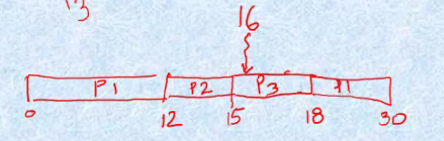

# Multiprogramming

In this environment, we are able to keep multiple programs in memory, and one program is executed at a time. Whenever one program terminates or makes an IO request, another program starts executing. This improves throughput and CPU utilization, by using the CPU during times when it would normally be idle.

This is done by means of a **program queue** which is loaded into memory. Once a program that is currently executing makes an IO request, it is moved to the IO device, and the front of the CPU queue is then taken for execution.

## Time sharing

A time shared OS allows many users to share the computer simultaneously. It uses multiprogramming and CPU scheduling to provide each user with a small portion of time shared computer, giving the illusion that each user has his own machine.

A time shared system needs to keep track of time and also needs dynamic resource allocation. To manage memory, processes can be swapped out to a memory store. The system uses a hardware timer to keep track of time, and sends interrupts to the system on expiry of a time slice. Of course, the user should not be allowed to disable interrupt signals.

## Dual - Mode Operation

To prevent users from sending "bad" instructions, an OS has two modes:

* User Mode - execution done on behalf of user
* Monitor Mode - execution done on behalf of operating system

The current mode is decided by a **mode bit** on the processor. If it is 0, we are in monitor mode, and in user mode if mode bit is 1.

When an interrupt is sent, the processor is switched into monitor mode to allow the job-switching.

# Desktop Systems

These provide interaction to the user. The main concern is minimizing response time to provide a smooth time for the user. Originally, they were single user single task systems, but now they support resource allocation, multiprogramming, etc.

# Parallel & Distributed System

The OS could support parallel processing to improve performance. We could do this in multiple ways:

* Pipelining
* Multiplicity of components (Multiprocessing)
* Multiplicity of Systems (HPCs, Grids)

Multiprocessor systems offer increased reliability and throughput. This could be symmetric or asymmetric. These are tightly coupled systems.

Distributed systems, on the other hand, are loosely coupled systems. Each processor has local memory, and they communicate via some links. They usually adhere to two architectures - **Client-server** or **peer-to-peer**

Clusters are distributed systems that provide high availability. They could be symmetric or asymmetric. In asymmetric systems, a system stands on **hot standby** monitoring the active system, and takes over in case of a failure.

*See clusters and multiprocessing from ParaCom notes*

# Real Time Systems

Real Time systems are those which are constrained by some timing constraints or by some deadlines. There are two types of real time systems, **hard real time systems** and **soft real time systems**. Hard real time systems are those where the deadline is strict and cannot be missed. Soft real time systems are more relaxed - they allow some leeway in completion with the deadline.

# Computer System Operation

* IO devices and CPU can execute concurrently
* Each device controller is responsible for one type of device
* Each device controller has a local buffer
* CPU moves data from/to main memory to/from local buffers
* IO is from the device to the buffer
* The controller informs CPU that it has finished operation by causing an interrupt

An operating system is interrupt driven. Interrupts work by transferring control to the interrupt service routine (ISR) that is found by referencing the Interrupt Vector Table (IVT).

How are the interrupts handled? The OS preserves the CPU state by storing the registers and the program counter, so that it may return back to its original state after completing the ISR.

*See Interrupts from Microprocessing course*

## I/O structure

IO may be **synchronous** or **asynchronous**. In synchronous IO, after IO starts control returns to user program only upon IO completion. So, the read is blocking the execution of the program. In the case of asynchronous IO, there is no blocking - it continues the user program without waiting for completion. This is often done in the case of writes.

A **device status table** contains entries for each IO device's type, address and state. So, an OS checks the table to see the status of the IO device and modifies the table entry to include the interrupt.

### Direct Memory Access Structure

This is used for high speed IO devices, and is able to transmit info at close to memory speeds. The device controller transfers blocks of data from buffer storage directly to main memory without CPU intervention. Moreover, instead of one interrupt being generated for a byte, one interrupt is generated for one block.

## Storage structure

**Main memory** is the large storage media that the CPU can access directly

**Secondary storage** is an extension of the main memory providing large nonvolatile storage capacity

**Magnetic disks** are metal or glass platters covered with magnetic recording material, used in hard disks.

### Storage Heirarchy

We have covered this in at least 3 courses before this, read those notes.

# Hardware Protection

Sharing system resources requires the OS to ensure that an incorrect program cannot cause other program to execute incorrectly. We have already covered dual-mode operation, but there are other ways to do this.

## IO Protection

All IO instructions are privileged instructions. So, we must ensure that a user program cannot gain control while in monitor mode. Given these IO instructions are privileged, how does the user program perform IO? This is done via a **system call**. It usually takes the form of a trap to a specific location in the interrupt vector. The ISR sets the mode bit to monitor mode, verifies the parameters are legal and executes the request.

## Memory Protection

We must provide memory protection at least for the IVT and the associated ISRs. This is done by providing two extra registers, a base and a limit register to determine the range of legal addresses.

## Hardware Address Protection

Here, we add two extra registers - a base register and a limit register. These provide the lower bounds and the size  of the range if acceptable addresses. If it is within the range described by this, the access will be valid. When in user mode, memory accesses outside the defined range generates a trap to error. The load instructions for these two registers is also a privileged instruction - we can only do this when in monitor mode.

## CPU Protection

We must protect the CPU from being monopolized by a given program. We have a timer that decrements every clock tick, and when it expires generate an interrupt that transfers control to the OS. Of course, loading the timer is also a privileged instruction, only executable in monitor mode.

# Process

A process is an instance of executing a program. It's main function is to execute instructions in the main memory. The process is characterized by its code, data, stack, and set of registers. These form the **context** of the process.

A process can be created because:

* In response to submission of new job
* When a new user attempts to login
* Created by OS to provide a service
* Spawned by existing process

Whenever a new job is created:

1. The OS creates a data structure for holding the context of the process
2. Loads the job in memory (there could be multiple jobs in memory)
3. Once a running job terminates, or its time slice expires, OS process called the **dispatcher** dispatches ready to execute processes for execution.

So, the execution order follows some order like "D,P1,D,P2,D,P3,D,P1,..." where D is the dispatcher. It usually takes the minimum amount of time.

## Two state process model

A process has any one of 2 states - running, or not running.

The state transition diagram looks like this:

*Enter from slides*

We could also show this as a queueing diagram:

*Enter from slides*

The queue could contain ready processes or blocked processes (blocked because of IO). This is inefficient - we need to do a linear search for ready processes, which takes time. How could we fix this? We could split the "not running state" into a ready state and a blocked state.

## Three state model

Lo and behold, we have come up with a three state model! See the state transition diagram below:

*Insert from slides*

The "Event occurs" and "Event wait" transitions are created by interrupts. When this happens, we remove it from the blocked queue and put it in the ready queue.

The queueing diagram is as below:

*Enter from slides*

The new problem is obvious - whenever an interrupt happens, the processor must search through the blocked queue to find the right process! This also adds some overhead. How could we fix this? Let us add a blocked queue for each device - this way we can prune the search space to be something smaller.

## Five State Model

There are five states:

* New - A process has been created but not yet admitted to the pool of executable processes
* Ready - The process is prepared to run if given an opportunity. It is only waiting in availability
* Running - The process that is being executed
* Blocked - The process cannot execute until a specified event finishes
* Exit - The process has been released by OS either after normal termination or abnormal termination

**Enter state diagram**

**Enter queueing diagram**


## Seven state model

There are seven states:

* New - A process has been created but not yet admitted to the pool of executable processes
* Ready - The process is prepared to run if given an opportunity. It is only waiting in availability
* Running - The process that is being executed
* Blocked - The process cannot execute until a specified event finishes
* Exit - The process has been released by OS either after normal termination or abnormal termination
* Ready/Suspend - The process was initially in ready state, but has been swapped out of main memory and placed onto external storage. It will come back to ready state when put back in main memory
* Blocked/Suspend - Similar to suspend ready but uses the process which was performing IO operation.

## Nine state model

This is the process module used in Unix. There are nine states:

* Created - The process is created via a fork.
* Ready to Run in Memory
* Kernel Running - The kernel, running in supervisor mode will schedule the process in kernel mode
* User Running - The process runs in user mode.
* Asleep in Memory - This is the same as a blocked state. It is said to be sleeping.
* Ready to Run Swapped - Same as Ready/Suspend
* Sleep Swapped - Same as Blocked/Suspend
* Zombie - When a process wants to exit, it enters kernel mode and then sends it to the zombie state. It is the same as an exit state.
* Preempted - This is a state where the current process is interrupted. This is always done by the kernel. This can happen when its time slice expires in a time sharing environment.

# Process Management

To manage processes, the OS must have information about the current state of processes as well as the current state of system resources.To do this, the OS maintains the following tables

* Memory Tables
* I/O Table
* File Table
* Process Table

## Memory Table

The memory table keeps tracks of:

* Allocation of main memory to processes
* Allocation of secondary memory to processes
* Protection attributes of main and secondary memory such as which process can access certain shared memory region
* Information needed to manage virtual memory

## IO Table

The IO table keeps track of:

* Resource allocation
* Resource availability
* IO request

## File Table

The file table keeps track of

* Existence of file
* Location on secondary memory
* Current status and attributes of file

## Process Table

The process table keeps track of all the processes and their current states. The process table stores these in the form of a **process image**. The process image consists of:

* User data
* User program
* System stack
* Process control block, containing process attributes

What are these process attributes? We hold the process identification, the processor state information, and the process' control information.

The process identification consists of:

* Identifier of the process
* Identifier of the process that created this process
* User identifier (find which user is running the program)

The processor state information consists of:

* User visible registers
* Control and status registers
  * Program Counter
  * Flags
  * Status Register
* Stack pointer

The processes control information consists of:

* Scheduling and state information
* Inter-process communication
* Process privileges
* Memory management
* Resource ownership and utilization

# Scheduling

Processes in different states maintain queues. Each queue is maintained for different purposes. The processes transition from one state to the next state. When a transition occurs, OS may be required to carry out some housekeeping activity such as context switch, mode switch, etc. Since these activities are overhead, we must try to do this in an efficient manner.

Scheduling can be of multiple types:

* **Long term Scheduling:** The decision to add to the pool of processes to be executed
* **Medium Term scheduling:** The decision to add to the number of processes that are partially or fully in main memory.
* **Short Term scheduling** The decision as to which available processes will be executed by the processor
* **IO Scheduling** The decision as to which process' pending IO request shall be handled by an available IO device

## Long term Scheduling

Long term scheduling is invoked very infrequently, so it can be slow. It is invoked to move a new process to ready or ready-suspend queue. One criteria by which we make the long-term scheduling decision is the degree of multiprogramming. We might admit or refuse processes to control the degree of multiprogramming.

Process can either be IO-bound process (more time doing IO) or CPU-bound (more time doing computation). Long term scheduling tries to create a judicious mix of these two types of processes.

## Medium Term Scheduling

This is part of the swapping function. This is done based on the need to manage the degree of multiprogramming and process mix. We could also use it to free up memory when needed. It moves processes from ready/suspend to ready or blocked/suspend to blocked.

## Short Term Scheduling

This is also called the CPU scheduler. It selects from among the processes in memory ready to execute, and allocates the CPU to one of them.

CPU scheduling decisions may take place when a process:

1. Switches from running to waiting state
2. Switches from running to ready state
3. Switches from waiting to ready state
4. Terminates

1 and 4 is non-preemptive, while all other scheduling is preemptive.

Short scheduling is invoked very frequently, so it must be very fast. It also has a dispatcher module. The dispatcher is the module that gives control of the CPU to the process selected by the short-term scheduler. This involves:

* Switching context
* Switching to user mode

The time taken to do this is called **dispatch latency**.

When scheduling, what are we trying to improve? We consider the following criteria:

* User oriented
  * Response time, the elapsed time between the submission of a request until there is output (or CPU is allocated)
  * Predictability
* System oriented
  * Effective and efficient utilization of the processor

### Uniprocessor Scheduling

Maximum CPU utilization is obtained with multiprogramming. Here, process execution consists of a cycle of CPU execution and IO wait. This is called the CPU-IO burst cycle. Processes normally have short CPU bursts.

What is our scheduling criteria? They are as follows:

* **CPU utilization** - keep CPU as busy as possible
* **Throughput** - Number of processes that complete their execution per time unit.
* **Priorities**
* **Turnaround time** - this is the amount of time taken to complete a particular process from its submission to its termination. T is also known as residence time $T_r$. The actual CPU time taken by a process is called service time, $T_s$. The normalized turnaround time is then defined as $T_r/T_s$. The minimum possible value is 1, which means immediate service.
* **Waiting Time** - This is the amount of time a ready process waits before it runs. We want to minimize the average running Time
* **Response Time** - This is the amount of time between the process arriving and it starting.

### First Come First Serve Scheduling

One scheduling strategy is **First Come First Serve (FCFS)** scheduling. The first process to come is executed, for as long a burst time as it needs. Say, three processes $P_1$, $P_2$ and $P_3$ came in order, with a burst time of 24,3,3 respectively. We can visualize this with the following Gantt Chart.


This is a non-preemptive scheduling strategy, so we do not interrupt any process in the middle of its running.
As we can see, the average waiting time is $(0+24+27)/3=17$.

What if the process came in the order $P_2,P_3,P_1$?


As we can see, the average waiting time would have been (6+0+3)/3 = 3. This is much better than the previous case. So, the order of arrival plays a great role. This is described by the **Convoy Effect**, which says that FCFS penalizes short processes, when they are behind long processes.

Until now, we have been considering CPU-bound processes. What if we change $P_1$ to be such that it has burst times of 12,4 and 12 in the order CPU,IO,CPU. What does the Gantt Chart look like now?



The wait time for $P_1$ in this case will be 2 units, because it ends IO at 16 and starts execution at 18. For $P_2$ it will be 12, and 15 for $P_3$. The turnaround time for $P_1$ would be  30, and the service time would be 28. This is a case where the response time differs from waiting time! Here, the response time for $P_1$ is 0.

This example also shows us how FCFS favours CPU bound processes.

### Shortest Job First Scheduling

**Shortest Job First** (SJF) Scheduling uses the length of a processes next CPU burst and schedules the process with the shortest time. We have two schemes:

* Nonpreemptive - Once CPU is given to the process, it cannot be preempted till it completes its CPU burst. This is called Shortest Process Next (SPN).

* Preemptive - If a new process arrives with CPU burst shorted than the remaining time of the currently running process, we interrupt the current remaining process for the new process. This is known as Shortest Remaining Time First(SRTF).

SJF is optimal, in that it gives the minimum average waiting time for a given set of processes.

Let us consider this example of non-preemptive SJF. Let us have the processes $P_1, P_2, P_3, P_4$ with the following parameters

|Process|Arrival Time|Burst Time|
|---|---|---|
$P_1$|0.0|7|
$P_2$|2.0|4|
$P_3$|4.0|1|
$P_4$|5.0|4|

We can see the Gantt Chart below:


When looking at this, we also notice an implementation detail - we need a way to break a tie. Here we have considered the first process to have more priority. The average waiting time would be (0+6+3+7)/4 = 4.

The downsides of this is that the predictability of longer process is reduces, and there is a possibility of starvation. If the estimated time for process is not correct, the operating system may abort it.

Let us consider the same process list, but the SJF is pre-emptive. Now, if the remaining time for the running process is longer than the incoming process, we will preempt the running process and schedule the new one. We can see the Gantt Chart in Figure 5.


How do we determine the length of the next CPU burst? One thing we can do is by approximating using the lengths of the previous CPU bursts. This is done with exponential averaging. The downside of this is we have the overhead of storing the last burst info

### Priority Scheduling

Every process is associated with a priority number. The CPU is allocated to the process with the highest priority. Just like SJF, it could be preemptive or nonpreemptive.

One problem is **starvation**. Low priority processes may never execute! We solve this through **aging**. As time passes, the priority of unfinished processes increases.

### Round Robin

Each process gets a small unit of CPU time, called a time quantum. After this time has elapsed the process is preempted and added to the end of the ready queue

Consider the following example:

|Process|Burst Time|
|---|---|
|$P_1$|53|
|$P_2$|17|
|$P_3$|68|
|$P_4$|24|

The Gantt Chart is as below:

\pagebreak


This usually results in higher average turnaround time, but better response.

If there are $n$ processes and the time quantum is $q$, each process gets $1/n$ of the CPU time in chunks of at most $q$ time units at once. No process waits more than $(n-1)q$ time units.

If time quantum is large, this degenerates into a FCFS. If it is too small, the $q$ must be large with respect to context switch, or the overhead will be too high.

Round robin is unfair to IO bound processes. We instead need to use Virtual Round Robin. In VRR, we have an auxiliary queue, which processes join once the complete their IO calls. The auxiliary queue always has priority over the main queue.

### Highest Response Ratio Next

HRRN is always non-preemptive. We choose the next process with the highest normalized turnaround time.

Consider the following example:

|Process|Arrival|Service|
|---|---|---|
|A|0|3|
|B|2|6|
|C|4|4|
|D|6|5|
|E|8|2|

\pagebreak.

The Gantt Chart would look like Figure 7.


### Multilevel Queue

The ready queue is partitioned into separate queues, like foreground, background, etc. Each of these queues has their own scheduling algorithms. For instance, foreground jobs could follow round robin, while background jobs could follow FCFS.

Now, scheduling must be done between queues. We could do this in multiple ways:

* **Fixed priority scheduling:** Serve all from foreground, then from background. This can easily result in starvation.

* **Time slice:** Each queue gets a certain time slice in which it schedules its processes.

### Multilevel Feedback Queues

Here, queues are kept into different levels, each possibly having a different scheduling scheme. A process can be moved from one queue to the other, as time passes. This is a way to prevent starvation, and is known as the process being **upgraded** or **downgraded**.

### Fair Share Scheduling

A user's application is essentially a collection of processes. Now, we make scheduling decisions based on these collections, called sets. Each set has a specified share of the machine time it is allowed to use. Priority is based on the time this process is active, and the time the other processes in the set have been active.

To do this, we define the following values:

* $P_j(i)$  - Priority of process $j$ at the beginning of interval $i$
* $U_j(i)$ - Processor use by process $j$ during interval $i$. This could be given by the amount of time for which a process has run in this interval.
* $GU_k(i)$ - Processor use by group $k$ during interval $i$ This could be given by the amount of time for which a member of a group has run in this interval.
* $CPU_j(i)$ - Exponentially weighted average for process $j$ from beginning to the start of interval $i$
* $GCPU_k(i)$ - Exponentially weighted average for group $k$ from beginning to the start of interval $i$
* $W_k$ - Weight assigned to each group, lying in $[0,1]$ such that $\sum_{k} W_k =1$.

Every interval, we make the following calculations:

$$P_j(i) = Base_j + CPU_j(i)/2 + GCPU_k(i)/(4*W_k)$$

$$CPU_j(i) = U_j(i-1)/2 + CPU_j(i-1)/2$$

$$GCPU_k(i) = GU_k(i-1)/2 + GCPU_k(i-1)/2$$

Every interval, we choose the process with the lowest priority.

**See slides for an example**

# Process Synchronization

In many cases, we need cooperation between processes to speed up computation or for information sharing. We also need to maintain data consistency despite concurrent access to shared data. All this needs us to ensure orderly execution of cooperating processes.

To do this we need to implement the concept of **atomic operations**, which are operations that cannot be interrupted during their execution. For instance, something like `counter++` needs to be atomic, since it could be be interrupted any time during its execution (it takes 3 instructions), as does `counter--`. If we did not make these atomic, and both of these operations happened concurrently, the instructions could get interleaved and result in inconsistency. This problem is known as a **race condition**, where many processes are trying to access and manipulate shared data concurrently, resulting in inconsistency.

Let us suppose there are $n$ processes competing to access some shared data. Each process has a code segment, called the **critical section** where the shared data is accessed. We want to ensure that when one process is in its critical section, no other process is allowed to execute in its critical section.

Any correct solution to the critical section problem has the following properties:

* **Mutual Exclusion:** If process $P_i$ is executing in its critical section, then no other processes can be executing in their critical sections.
* **Progress:** If no process is executing in its critical section and there exists some processes that wish to enter their critical section, then the selection of the processes that will enter the critical section next cannot be postponed indefinitely. (No Deadlock)
* **Bounded Waiting:** A bound must exist on the number of times that other processes are allowed to enter their critical sections after a process has made a request to enter its critical section and before that request is granted. (No Starvation)

## Software solution

Let us assume we have two processes, $P_0$ and $P_1$. The processes have an **entry section** before we enter the critical section, which make checks, and an **exit section** after we leave the critical section, which updates variables to allow others to enter. Processes share some common variables to synchronize their actions.

We maintain a variable `turn`, which is 0 if $P_0$ can enter its critical section, and 1 if $P_1$ can enter its critical section. It is initially 0. The code for $P_0$ would look like:

```
do{
  // Entry Section
  while (turn != 0) do nothing;
  /*
   * Critical Section, omitted
   */
  // Exit section
  turn = 1;
  /*
   * Remainder section, omitted
   */
}
while(1);
```

The scheme above allows mutual exclusion, but not progress. It is possible for $P_0$ to be in IO wait or to fail, and $P_1$ would not be able to start.

The way out of this is **Peterson's Solution**. Let us see the code for $P_0$:

```
do{
  flag[0] = true;
  turn = 1;
  while (flag[1] && turn == 1) do nothing;

  // Critical Section (Omitted)

  flag[0] = false;

  // Remainder Section (Omitted)
}
```

This meets all three requirements. `flag` indicates a process' intention to enter the critical region. A process checks whether its $P_1$'s turn to execute, and waits if it is ready to enter the critical region.

Let us consider the general case, where we have $n$ processes. One way to solve this is the **Bakery Algorithm**. Before entering its critical section, a process receives a number. Holder of the smaller number enters the critical section. If two processes $P_i$ and $P_j$ receive the same number, then if $i < j$ $P_i$ is served first, otherwise $P_j$ is served. So, each process is denoted by a (ticket number, process id) pair. $P_i < P_j$ if the pair denoting $P_i$ is lexicographically less than the pair in $P_j$. We also maintain a number $k$, which is the maximum token number given till now.

All processes share `bool choosing[n]` (which indicates if a process is choosing a token) and `int number[n]` (indicates the token of a process). Both of these are initialized to false and 0 respectively. The implementation looks like:

```
do{
  choosing[i] = true; // Starting the process of choosing number
  number[i] = max(number[0],number[1],...number[n-1])+1;
  choosing[i] = false; // Done choosing
  for (j = 0; j < n; j++) {
    while (choosing[j]) do nothing;
    while ((number[j] != 0) && ((number[j],j) < (number[i],i)))
      do nothing;
  }

  // Critical section

  number[i] = 0;
}
```

It is still possible to have multiple processes with the same token number, which could be the result of preempting during the entry section. It is however, guaranteed that the numbers are given in non-decreasing order.

## Hardware Support

**Interrupt Disabling** is hardware support for mutual exclusion. Disabling interrupts allows processes to run in their entirety. However, the processor is now limited in its ability to interleave programs, and mutual exclusion is not guaranteed in multiprocessing systems.

Another bit of hardware support for mutual exclusion is that the ISA can have special machine instructions that perform in a single instruction cycle, i.e. they are atomic. Examples of this are the "test and set" and "swap" commands. 

"Test and set" returns the value of the input, and sets the input to be true. The pseudocode would look like:

```
bool testAndSet(bool& target)
{
  boolean rv = target;
  target = true;
  return rv;
}
```

Now, we can create mutual exclusion in the following way:

```
bool lock = false; // Shared data across processes
do{
  while (testAndSet(lock)) do nothing;
  // Critical Section
  lock = false;
  // Remainder Section
}
```

This implementation holds good for the properties of Mutual Exclusion and Progress, but not for Bounded Waiting. This is because of the possibility that if $n > 1$ processes are waiting on a lock, a process may never obtain it, since we do not define any ordering or priority.

"Swap" atomically swaps two variables. The implementation is obvious. To implement MutEx, we do it as below:

```
bool lock = false // Shared data across processes
do {
  key = true;
  while (key == true)
    swap(lock,key);
  // Critical Section
  lock = false;
  // Remainder Section
} while(1);
```

This solution has the same parameters as the "Test and Set" implementation.

## Semaphores

A **semaphore** is an example of OS level support for process synchronization. A semaphore is a variable that has an integer value. We can do three operations on a semaphore:

1. Initialize to a non-negative number
2. Wait operation that decrements the semaphore value
3. Signal operation that increments the semaphore value

Both wait and signal operations cannot be interrupted. If a process is waiting for a signal, it is suspended until that signal is sent.

When a wait operation is done, the process is added to the queue waiting on the semaphore, and blocked. When a signal operation is done, we pop a process from the queue and wake up the process.

If the queue is FIFO, we say the semaphore is a **strong semaphore**. Else, it is a **weak semaphore**.

Let us see an implementation for the same:

```
semaphore mutex = 1; // Shared data

do {
  wait(mutex);
  // Critical section
  signal(mutex);
  //Remainder section
} while(1);
```

Semaphores could still result in deadlock or starvation, if not implemented properly.

So far, we have discussed a **counting semaphore**, where the integer value is unrestricted. There is also a **binary semaphore**, whose value can only be 0 or 1. This can be simpler to implement, and results in the same behaviour.

Now, let us look at some classical problems of synchronization.

### Bounded Buffer Problem

In this problem, we have producers and consumers acting on a bounded buffer. Producers add to it, while consumers remove from it. 

To implement this, we maintain three semaphores - `full`, `empty`, `mutex`. Initially, `full=0`, `empty=n`, `mutex=1`. $n$ is the buffer size. All the consumers wait on `full`, and the producers wait on `empty`. Access to the buffer is made exclusive using `mutex`.

So, since `empty=n`, producers are able to insert elements into the buffer. Consumers wait until `full` is nonzero to be able to remove elements from the buffer.

Let us see the pseudocode for the producer:

```
do {
...
produce an item in nextp
...
wait(empty);
wait(mutex);
...
add nextp to buffer
...
signal(mutex);
signal(full);
}
while(1);
```

### Dining Philosopher Problem

In the dining philosopher problem, there are 5 philosophers sitting on a round table, with 1 chopstick between both of them. Each philosopher needs two chopsticks to eat, so each needs to wait till both their neighbours are done eating to eat themselves. A philosopher may pick up only one chopstick at a time.

We solve this by using an array of 5 semaphores, `chopstick[5]`. Initially, all the values are 1. 

```
do {
  wait(chopstick[i]);
  wait(chopstick[(i+1)%5]);

  // Eat..

  signal(chopstick[i]);
  signal(chopstick[(i+1)%5]);

  // Think...
}
```

However, this implementation has a problem of deadlock. For instance, if philosopher $i$ picks up chopstick $i$, then all the philosophers have one chopstick and no way of progressing and picking up one more. One way we could do this is to only allow a philosopher to pick up chopsticks if both are available. 

### Reader Writers Problem

We have a set of readers and a set of writers. Two readers can access the shared data item simultaneously, but writers need exclusive access. No reader should wait unless a writer is already in critical section. It is allowed to have writers starve.

We keep track of two semaphores `mutex` and `wrt`, as well as an integer called `readcount`. `wrt` is common to both readers and writers, and functions as mutual exclusion for writers. IT is also used by the first and last reader that enters or exits the CS. `mutex` provides mutual exclusion for updating `readcount`.

The code for writers would be:

```
wait(wrt);
// Write...
signal(wrt);
```

The signal for readers is:

```
wait(mutex);
readcount++;
if (readcount==1) // first reader
  wait(wrt);
signal(mutex)
// Reading is done...
wait(mutex);
readcount--;
if (readcount == 0) // Last reader
  signal(wrt);
signal(mutex);
```

## Monitors

Monitors are software modules, implemented using semaphores. Their chief characteristics include:

1. Local data variables are accessible only by the monitor
2. Process enters monitor by invoking one of its procedures
3. Only one process may be executing in the monitor at a time.

A monitor is nothing but an abstract data type. Inside the monitor, there exist a number of procedures $P_1,P_2,..P_n$, shared data for the procedures, and some initialization code. A process is only able to use a procedure in the monitor if no other process is using it (mutual exclusion), i.e. only one process is active insider the monitor. 

To allow a process to wait within the monitor, a condition variable must be declared, say `x`. These can be used with the operations `wait` and `signal`. The `x.wait` operation means that the process invoking this operation is suspended until another process invokes. The `x.signal` operation resumes exactly one suspended process. If no process is suspended, it has no effect.

One issue is that the signal could wake up a process and result in there being two active processes on the semaphore. To prevent this, when one process does a signal, it will move into the **urgent queue** and wait there. The urgent queue is given priority over newer processes, to prevent starvation. This way we are able to ensure we only have one active process at any time.

### Dining Philosopher Problem

```
type dining-philosphers = monitor
  var state : array[0..4] of {thinking, hungry, eating} // State of each philosopher
  var self : array[0..4] of condition; // Waiting conditions for each philosopher

  procedure pickup (i:0..4):
  begin
    state[i] := hungry; // Set the philospher to hungry
    test(i); // Check your adjacent philosophers
    if (state[i] != eating) then self[i].wait; // If unsuccessful, he waits.
  end

  procedure putdown (i:0...4)
  begin
    state[i] := thinking; // Set the philospher back to thinking
    test(i+4mod5); // Check if the adjacent philosphers can eat
    test(i+1mod5); // Check if the adjacent philospher can eat
  end

  procedure test(i:0...4)
  begin
    // If the philosopher can eat, he will eat.
    if state[i+4mod5] != eating
      and state[i] = hungry
      and state[i+1mod5] != eating
      then begin
        state[i] := eating;
        self[i].signal;
      end
  end

  // Initialization
  begin
    for i = 0 to 4:
      do state[i] := thinking;
  end
```

Whenever a philosopher wants to eat, he executes the following sequence:

```
dp.pickup(i); // pick up your chopsticks
...
Eat
...
dp.putdown(i); // put down your chopsticks
```

### Monitor Implementation

Monitors are implemented using semaphores. For every monitor, we define a semaphore called `mutex`, initialized to 1, which controls entry into the monitor. We have another semaphore `next` (initialized to 0) which controls entry from the urgent queue, as well as `next-count` which tells us how many process are waiting on the urgent queue. So, in pseudocode, this would look like:

```
wait(mutex)
...
// Body of procedure
...
if (next-count > 0)
then signal(next) // Get from urgent queue
else signal(mutex) // Get from entry queue
```

This way we can ensure mutual exclusion.

For each condition variable `x`, we have a semaphore `x-sem`, initialized to 0 and an integer `x-count`, initialized to 0. With this we can implement `x.wait` as:

```
x-count = x-count+1;
if (next-count>0)
  then signal(next)
  else signal(mutex);
wait(x-sem);
x-count = x-count-1;
```

The signal operation can be implemented as:

```
if x-count > 9
  then begin
    next-count := next-count+1;
    signal(x-sem);
    wait(next);
    next-count := next-count-1;
  end;
```

We could also have a conditional wait, `x.wait(c)`. Here, `c` is an integer expression. It is the priority number. Whenever a signal comes, we process the smallest priority number.

## Interprocess Communication

Cooperating processes need interprocess communication (IPC). There are two models of IPC, shared memory model and message passing model.

In the shared memory model, an area of memory is shared among the processes that wish to communicate. The communication is under the users processes not the operating system. There needs to be a mechanism that allows user processes to synchronize their actions when they access shared memory. This is done via semaphores, monitors, etc.

In the message passing model, the actual function of message passing is done via `send` and `receive` primitives. This communication also needs synchronization, as the sender must send before the receiver may receive. The send/receive may be blocking or non blocking. 

In Blocking Send, Blocking Receive, the sender and receiver are blocked until the message is delivered. This is known as a rendezvous, and allows for tight synchronization between processes.

In non-blocking send, blocking receive, the sender moves on, but the receiver is blocked until the requested message arrives. If the receive is non-blocking, it also does not wait, and only checks if there is a message already waiting for it. If not, it abandons the receive and moves on.

The manner in which the sender specifies the process which should receive the message is called **addressing**. Addressing could either be direct or indirect. In direct addressing, the send primitive includes a specific identifier of the destination process. The receive primitive could know ahead of time which process a message is expected from. In indirect addressing, messages are sent to a shared data structure consisting of queues called **mailboxes**. This decouples the sender and receiver, since the receiver just picks up the message from the mailbox.

There can be many types of indirect addressing schemes. One to one relationship is used for private communication between a sender and receiver. Many to one is useful for client server interaction. One to many is generally for broadcast.

A message generally consists of a head and a body. The header contains information like the message type, destination and source ID, message length, etc.

To implement mutual exclusion, we use a blocking receive and non-blocking send. Let us assume we have a mailbox called `share1`, initialized to contain a single message with null content. A process wishing to enter its critical section attempts to receive a message, and is blocked till it is not empty. Once a process has finished its critical section, it places the message back into the mailbox.

For producer consumer, we use 2 mailboxes - `consume_1` and `produce_1`. `consume_1` contains items produced by the producer. `produce_1` initially has many messages, and shrinks with production and grows with consumption.

## Deadlock

A deadlock is a set of blocked processes each holding a resource and waiting to acquire a resource held by another process. An example of this is two semaphores A and B, initialized to 1. First $P_0$ calls wait(A), then $P_1$ calls wait(B), $P_1$ calls wait(A), then $P_0$ calls wait(B). So now, there is a deadlock!

A famous example is that of a narrow bridge, where traffic can only move in one direction. A deadlock could be resolved if one car backs up (preempt and roll back). Several cars may have to be backed up if a deadlock occurs.

Formally, we have $m$ resources $R_1,R_2,...R_m$. Each resource type $R_i$ has $W_i$ instances. Each process utilizing a resource makes a request for the resource, uses it, and then releases it. This request and release mechanism is done via system calls. A deadlock will occur if the following 4 conditions hold simultaneously:

* Mutual exclusion : only one process at a time can use a resource
* Hold and wait : A process holding at least one resource is waiting to acquire additional resources held by other processes
* No preemption : A resource can be released only voluntarily by the process holding it, after that process has completed its task
* Circular wait : There exists a set $\{P_0, P_1, P_2, ... P_n\}$ of waiting processes such that $P_0$ is waiting for a resource held by $P_1$, $P_1$ is waiting for resource held by $P_2$, etc.

This is best represented by a **resource allocation graph**. We have a set of vertices $V$ and a set of edges $E$. $V$ is partitioned into two types: $P=\{P_1,P_2,...\}$ and $R=\{R_1,R_2,...\}$. A request edge is a directed edge from $P_i$ to $R_j$ and an assignment edge is a directed edge $R_j$ to $P_i$. 

Processes are represented by circles, resources types are represented by squares (which contain some number of squares representing the instances). Using this graph, we can see whether we have a deadlock or not looking at the cycles in the graph. Every cycle does not mean there is a deadlock. If there is only one instance per resource type, we can be sure there is a deadlock, but if there are more, we must check.

### Deadlock Prevention

To prevent deadlock, we want to ensure that one of the 4 necessary conditions for deadlock doesn't hold.

Mutual exclusion does not hold for sharable resources, so perhaps we could make all non-sharable resources sharable? Unfortunately, some resources are intrinsically non-sharable

One way to remove "hold and wait" is to have processes request and allocate all its resources before beginning execution. Unfortunately this means that we need to know all the requirement in the beginning itself. Another way is to allow the process to request resources only when the process has none. If a process has resources and requires additional resources, it must release all resources it is holding and then make request. However, these can result in starvation.

Allowing preemption is the hardest. Assume we have a file transfer happening - if we preempt that process, we would have to start all over again. This is very costly. Nevertheless, one approach for this is that is holding some resources requests another resource that cannot be immediately allocated to it, we release all the resources held by the process. The process only restarts once it can regain the old resources, as well as the new one it is requesting. This cannot be generally applied to resources like printers, tape drives, etc.

Our last hope is in circular wait. To prevent this, we could impose a total ordering for all resource types, and require that each process requests in an increasing order of enumeration. To create this total ordering, we require some a priori information. The deadlock avoidance algorithm uses this information and dynamically finds the resource allocation state to ensure no circular wait condition occurs. The resource allocation state is defined by:

* number of available resources
* number of allocated resources
* maximum requirement of the processes

When a process requests an available resource, the system needs to decide if immediate allocation leaves the system in a **safe state**. A state is safe if the system can allocate resources to each process in some order and still avoid deadlock. Formally, a system is in a safe state if there exists a **safe sequence** of all processes. A sequence $<P_1,P_2,P_3...P_n>$ is safe if for each $P_i$, the resources that $P_i$ can still request can be satisfied by currently available resources + resources held by all the $P_j$, with $j < i$.

Let us see an example:

||Max Need|Allocation|Current Need|
|---|---|---|---|
|$P_0$|10|5|5|
|$P_1$|4|2|2|
|$P_2$|9|2|7|

The system has a total of 12 resources. Since 9 are currently allocated, we have 3 resources remaining. Does a safe sequence exist? First, we can see that currently $P_1$ is the only one capable of executing, since it needs 2 and there are 3 available. So, it must be the first part of our safe sequence. It is capable of executing and releasing its resources, so now it will deallocate its 2 currently allocated resources, leaving 5 available. $P_0$ needs exactly 5 so it is able to be satisfied, and is next in the sequence. After it's execution, we have 10 resources left, which $P_2$ can use. The safe sequence is thus $P_1,P_0,P_2$. This sequence also gives us a safe order of allocation.

To be clear, not all unsafe states lead to a deadlock. However, a safe state would never lead to a deadlock. 

We can use resource-allocation graphs for deadlock prevention. Let us define a **claim edge** $P_i \rightarrow R_j$ indicating that a process $P_i$ may request a resource $R_j$, represented by a dashed line. Claim edges are converted to request edges when a process request a resource. When a resource is released by a process, an assignment edge is converted back into claim edge. Claim edges are built into the graph a priori. The graph algorithm checks if the granting of a request creates a cycle. If it does, then that resulting state must be unsafe.

The above algorithm only works if we have a single instance of each resource. In the case where we have multiple instances, we use **Banker's algorithm**. Each process must a priori claim it's maximum need. When a process requests a resource, it may have to wait. When a process gets all its resources, it must return them in a finite amount of time.

The Banker's algorithm defines the following data structures:

* `available` : A vector of length $m$ (number of resource types). If `available[j] = k` then there are $k$ instances of resource type $R_j$ available
* `max` : $n \times m$ matrix. If `max[i,j] = k` then process $P_i$ may request at most $k$ instances of resource type $R_j$.
* `allocation` : $n \times m$ matrix. If `allocation[i,j]=k` then $P_i$ is currently allocated $k$ instances of $R_j$.
* `need` : $n \times m$ matrix. If `need[i,j]=k` then $P_i$ may need $k$ more instances of $R_j$ to complete its task. Obviously, `need[i,j] = max[i,j]-allocation[i,j]`

So the safety algorithm works as follows:

1. Let `work` and `finish` be vectors of length $m$ and $n$ respectively. `work = available` and `finish = {false}`.
2. Find an index $i$ such that `finish[i] == false && need[i] <= work`. If no such $i$, go to 4.
3. `work = work+allocation, finish[i] = true`. Go to step 2.
4. If `finish[i]==true` for all $i$, then the system is in a safe state.

This safety algorithm is able to check if we are in a safe state or not. This is used as a subroutine in a resource request algorithm. The resource request algorithm for $P_i$ works as follows:

0. We have a request vector for $P_i$ called `request`. If `request[j] = k` then the process wants $k$ instances of resource type $R_j$
1. If `request <= need` then go to step 2. Otherwise, raise error since process has exceeded its maximum claim.
2. If `request <= available` then go to step 3. Otherwise, the process must wait since resources are not available.
3. Pretend to allocate requested resources to $P_i$ by modifying the state as follows:
```
available = available-request;
allocation = allocation + resuest;
need = need-request;
```
If this is safe, we allocate resources to the process. Else, we must wait, and the old state is restored.

### Deadlock Detection

If there were single instance of each resource type, we could solve this with a resource allocation graph. We could maintain a **wait for graph**, where nodes are processes, and $P_i \rightarrow P_j$ if $P_i$ is waiting for $P_j$. If there is a cycle in this graph, there is a deadlock.

What do we do if there are several instances of a resource type? Once again, we create some data structures:

* `available` : A vector of length $m$ indicating the number of available resources of each type
* `allocation` : A $n \times m$ matrix defining the number of resources of each type currently allocated to each process.
* `request` : A $n \times m$ matrix indicates the current request of each process. If the value at `request[i][j]` is $k$, then $P_i$ is requesting $k$ more instances of $R_j$

With these defined, the detection algorithm works as follows:

1. Let `work` and `finish` be vectors of length $m$ and $n$ respectively. Initialize `work = available` and `finish[i] = allocation[i] == 0`
2. Find an index $i$ such that `finish[i]==false` and `request[i] <= work`. If not such $i$ exists, go to 4
3. `work = work+allocation`, `finish[i] = true`. Go to step 2.
4. If `finish[i]==false` for some $i$, then we have a deadlock, and $P_i$ is deadlocked.

This works in the order of $n^2$, so we do not want to invoke this too often. How often we invoke it depends on how often deadlock is likely to occurred, and how many processes will need to be rolled back. 

How do we choose which processes to rollback? Aborting all the deadlocked processes would be too expensive. Instead we could abort one process at a time until the deadlock cycle is eliminated. This would mean we would invoke deadlock detection algorithm after every abort. To decide which process to abort, we could use any of the following heuristics:

* Priority of the process (could lead to starvation)
* How long the process has computed, and how much longer till completion (prediction needed)
* Resources the process has used
* Resources process has used
* Resources process needs to complete
* Is process interactive or batch?

# Memory Management

The CPU can only access content from main memory or its registers. It cannot access data from secondary storage. The data must be moved from secondary storage to main memory before it can be used. This is done to reduce access time and latency.

Memory is generally organized in a hierarchical manner, in the order:

1. registers
2. cache
3. main memory
4. electronic disk
5. magnetic disk
6. optical disk
7. magnetic tapes

As we go down the hierarchy, we find that:

1. Capacity increases
2. Cost per bit decreases
3. Access time increases
4. Frequency of access decreases

The processor also seeks memory by moving down the hierarchy - it would first look in the higher rungs, and move lower. We do so to decrease access times - by keeping information higher in the hierarchy, we are able to access information faster. The more frequent we can make level 1 accesses, the lower the access time. This is based on the principle of **locality of reference**. We find that during the course of execution of a program, memory references for both data and information tend to cluster.

Any memory management system requires the following:

* Relocation
* Protection
* Sharing
* Logical organization
* Physical organization

## Address Binding

User processes are able to reside in any part of physical memory. This affects the addresses that the user program can use. The user program typically contains symbolic addresses, which the compiler **binds** to "relocatable addresses". The linker binds these relocatable addresses to absolute addresses. Classically the binding of instructions and data to memory addresses can be done at any step along the way:

* Compile time : If you know at compile time where the process will reside in memory, then absolute code can be generated. The issue is that if the starting location changes later, then we need to recompile the code. In some situations, this can be very costly.

* Load time : If it is not known at compile time where the process will reside in memory, then the compiler must generate relocatable code. In this case, the final binding is delayed until load time. If the starting address changes, we need only reload the user code to incorporate this changed value.

* Execution time : If the process can be moved during its execution from one memory segment to another, then binding must be delayed until run time. Special hardware is used for this method, and most operating systems employ it.

The address generated by the CPU is generally referred to as a **logical address**. The address seen by the memory unit is referred to as the **physical address**. Compile time and load time address binding methods generate identical logical and physical addresses. However, execution time address binding schemes result in a differing logical and physical address. In this case we usually refer to the logical address as a **virtual address**. 

The run time mapping from virtual to physical addresses is done by a hardware device called the **memory management unit** or MMU. There are many ways to do this. One way is to use a **relocation register**. The value from the register is added to every address generated by a user process at the time the address is sent to memory. Through this mapping, the user program always deals with the logical address, never the real physical address. The user will think that the process runs in locations 0 to some `max`.

## Dynamic Loading and Linking

So far, we have assumed the entire program and data of a process is kept in physical memory when executing. To obtain better memory space utilization, we can use dynamic loading. When using this, a routine is not loaded until it is called. All routines are kept on disk in a relocatable load format. So, now when a routine needs to call another routine, it loads it into memory and updates the program's address tables to reflect this change. Then control is passed to the new routine. Through this, an unused routine is never in use, and we save memory. This is generally not automatically done by a operating system - it is the responsibility of the user program.

Some operating systems support only **static linking** in which system language libraries are treated like any other object module and are combined by the loader into the binary program image. In dynamic linking, we postpone the linking to runtime. With dynamic linking, a stub is included in the image for each library-routine reference. The stub indicates how to locate the appropriate memory resident library routine or how to load the library if the routine is not already present. This is especially helpful when a library is updated. If libraries where statically linked, all programs referencing the library would need to be relinked to gain access to the new library.

## Contiguous Memory Allocation

Generally, memory is divided into two partitions - one for the operating system and another for the user processes. Since the IVT is present in lower memory, we generally put the OS in lower memory as well.

One of the simplest methods for allocating memory is to divide memory into several fixed size partitions. Each partition may contain exactly one process. Thus, the degree of multiprogramming is bound by the number of partitions. This is called the **multiple partiion method**. When a partition is free, a process is selected from the input queue and loaded into the free partition.

In the **variable partition** scheme, the operating system keeps a table indicating which parts of memory are available and which are occupied. Initially, all memory is available for user processes and is considered one large block of available memory known as a **hole**. Eventually, memory contains a set of holes of various sizes. Processes are allocated memories in these holes, and of course they release the memory when completed, creating new holes.

The above procedure illustrates the **dynamic storage allocation problem**, which concerns how to satisfy a request of size $n$ from a list of free holes. There are many different strategies for this problem:

* First fit : The process is allocated the first hole that is big enough. This is the fastest, but it may have many processes loaded in the front end of memory that must be searched over when trying to find a free block.

* Next fit : More often allocate a block of memory at the end of memory where the largest block is found. The largest block of memory is broken up into smaller blocks

* Best fit : Allocate the smallest hole that is big enough. We must search the entire list, unless it is ordered by size. This would produce the smallest leftover hole. This means we might need to compact the memory often, since it becomes fragmented with very small holes

* Worst fit : Allocate the largest hole. This would produce the largest leftover hole.

We find that generally, worst fit works worse than any of the other allocation schemes.

A compromise between the variable and fixed schemes exists, called the **buddy system**. Memory blocks are available of size $2^k$ where $l \leq k \leq u$. The entire space available is treated as a single block of size $2^u$. If a request of size $s$ such that $2^{u-1} < s \leq 2^u$, then the entire block is allocated. Otherwise, the block is split into two equal **buddies**. The process then continues until the smallest block greater than or equal to $s$ is generated.

## Fragmentation

Fragmentation can be of two types :

* External Fragmentation : memory space exists to satisfy a request but it is not contiguous.
* Internal Fragmentation : allocated memory may be slightly larger than requested memory. The additional space is unused. On average, about 50% of the space is wasted (50% rule)

External fragmentation is reduced by compaction. This is only possible if relocation is dynamic and is done at execution time. 

## Paging

Paging is a memory management scheme that permits the physical address space of a process to be non-contiguous. This way, we can avoid external fragmentation and the need for compaction.

Here, memory is dynamically partitioned at run time and is allocated to processes. Logical address is generated by the Instruction Pointer, or the Program Counter. If the instruction pointer is 32 bit, then the total logical address space would be $2^{32}$. The logical address space is divided into fixed small size chunks known as **pages**.

The physical memory is also divided into fixed size blocks known as **frames**. The size of frame and page is always equal for a given system. The frame and page size are always powers of 2, mainly for easy address computation.

When process pages need to be loaded into the system, the OS allocates required number of frames where process pages are loaded. The frames need not be allocated in contiguous manner. Internal fragmentation still occurs, but it is less severe compared to fixed partitioning.

Logical address space needs to be mapped to the physical address space. To illustrate address translation, let us consider an 8086 processor with byte organized memory, 32 address lines, 32 bit Instruction Pointer, and a 4 KB page size.

Logical address is divided into to parts - a 12 bit offset within the page and a 20 bit page number. This logical address is mapped to a 20 bit frame number and a 12 bit offset. This translation is done by the MMU. The page number to frame number mapping is stored in the **page table**.

Most computer systems today support a large logical address space, resulting in an excessively large page table. One solution to this is **multilevel paging**. The total number of pages is grouped into groups of 1024 pages. Each group contains information regarding 1024 frames stored in the page table, totalling $2^{20}$ frames. The information about each of the pages in the page tables is stored in the **page directory**. Each entry in the page directory and the page table is 4 bytes.

The base address of page directory is specified using the PDBR (Page Directory Base Register). In Intel, this is the CR3 register is used for this purpose. 

The virtual memory address is 32 bits. The first 10 bits will give the offset of the entry in the directory. The next 10 bits will give us the offset in the next page table, whose base address is given in the page directory. Finally, we will have a 4 KB page, and the last 12 bits will give us the offset to get the physical address of our frame.

Any page directory is a 4 byte entry consists of:

* Page Table base address
* Available space for system programmer use
* Global page
* Reserved
* Accessed (Has it been accessed?)
* Cache disabled
* Write Through
* User/Supervisor (mode)
* Read/Write
* Present (Is it present in the memory?)

Page Table entries have one extra bit - the "dirty bit". It is used to check if we should write back to the frame or not.

What is the minimum number of frames that should be allocated to a process? This is dependent on the instruction set architecture (ISA). Consider the instruction $add bx, lst$. If we assume that the opcode for an instruction is 3 bytes, then it is possible that the first byte is in the last location of a page and the remaining bytes are stored in the next page. So, we need 2 frames for the code. We can argue the same for the operands, making the requirement 4 frames.

Another issue with Paging is that if we need to access a byte from memory, it is required first that we read 4 bytes from the page directory, 4 bytes from frame and finally 1 byte from data. So, this one access needed 9 bytes accessed. This creates a large overhead.

To get around this, something called an **associative register** or Translation Lookahead Buffer is used. This is a special fast-access hardware cache. It stores the relation between page number and frame number. Once the page is accessed, if it is accessed once more, it can be accessed from the associative register instead. Internally, a parallel search is done to find the required page number, greatly speeding up search.

{ width=300px }

{ width=300px }

Instead of each process having its own page table, an **inverted page table** has one entry for each real page of memory. Each entry consists of the virtual address of the page stored in that real memory location, with  information about the process that owns the page. This decreases the memory needed to store each page table, but increases time needed to search the table when a page reference occurs. Use a hash table to limit the search to one or at most a few page table entries.

## Segmentation

Segmentation is a memory management scheme that supports user view of memory. A logical address space is a collection of segments. A segment is any logical unit such as stack, function, procedure, etc. The address if always given by `segment:offset`. This offset is checked against `limit` and `base` values, found in the segment table, to check if this address points to valid memory.

Segmentation is capable of removing internal fragmentation. This is because unlike pages/frames, it does not need fit against some 4K boundary.

The **segment table** maps two dimensional physical addresses. Each table entry has the base address and the limit (length of segment). The **segment table base register** (STBR) points to the segment table location in memory. The **segment table length register** (STLR) indicates the number of segments used by a program.

The x86 processor has several segment registers:

* Code Segment
* Data Segment
* Stack Segment
* Extra Segment
* GS and FS segments

Each of these segments contain **segment selectors**, which are visible to us, and a 64 bit hidden part, which can hold the base address, limit, etc. After the first access to the segment table using the segment selector, the hidden part will store all the necessary information, making it faster and avoiding unnecessary accesses.

The aforementioned segment table is of two types. **Global Descriptor Table** is a data structure used to define the characteristics of segments including base address, size, access privileges, etc. There are also **Local Descriptor Tables**, which contains information on memory segments private to a specific program. The GDT instead refers to global segments.

In protected mode, the segment selector contains 3 values:

* Bits 0-1 contain the **Requested Privilege Level** or RPL, the privilege level of the segment. Level 0 is the most privileged, while level 3 is the least privileged. In the case of a code segment, this is called the **Current Privilege Level**, or the CPL.
* Bit 2 is the **Table Indicator**. 0 means we are using the Global Descriptor Table, while 1 means we are using the Local Descriptor Table.
* The rest 13 bits are used as an index into the value, called the DT index.

The processor provides 4 memory management registers:

* Global Descriptor Table Register (GDTR). It holds the 32 bit base address of the Global Descriptor Table, and a 16 bit value for the size of the GDT. It can have a maximum of 8K entries.
* Local Descriptor Table Register (LDTR)
* Interrupt Descriptor Table Register (IDTR)
* Task Register (TR)

These registers specify the location of date structures for segmented memory management.

{ width=300px }

The G bit is a **granularity bit**. If it is 0, the size is interpreted as the number of bytes. However if it is 1, then it interprets size as the number of 4K blocks. D/B stands for Default/Big - whether to use the default size of operands and effective addresses or not. If it 0, we use 16 bit, else we use 32 bit. P bit denotes whether the segment is currently in memory or not. The DPL denotes the **Descriptor Privilege Level**. A program is only permitted to access the segment if its privilege meets or beats the descriptor privilege. S denotes whether this segment is a system segment(0) or a non-system segment(1). The segment type is interpreted differently based on whether S is set or not.

For example, if we consider a code segment. Then, since it a non-system segment, S=1. Now considering the segment type, the first bit will be the D/C bit, which signifies whether this is a data segment or a code segment. In this case, it will be set to 1. The second bit is C, called the conforming bit. If C=0, it can only be accessed by programs whose CPL matches the target code's DPL. If C=1, then the conforming code can be accessed by a program whose CPL is greater than accessed code's DPL. The third bit called R, denotes whether this segment only holds code(0), or if it also contains data(1). In the former case, it is execute only, while in the latter case it can be read for data accesses as well. The last bit will be A, which denotes whether, since it has come into memory, this segment has been accessed or not. 

A data segment is much the same. However, instead of CRA, we have EWA bits. The E bit is an **expand down bit**. When set to 1, it is an expand down stack rather than expand up. In an expand down stack, the lowest address is `base+limit-1`, and the highest address is `base + FFFFH` or `base + FFFFFFFFH`. The W bit is a **writable bit**. If W=1, it is read-writable, else, it is read only. A bit is set to 1 by the processor when a data segment is accessed.

A new code segment is accessed when:

* Execution of a far jump
* Execution of a far call
* Hardware interrupt or software exception
* Initiation/resumption of new/existing task
* Execution of far return
* Execution of IRET

When a currently executing program executes a far jump, the Descriptor Privilege Level is compared with the maximum of the Current Privilege Level and the Requested Privilege Level. Access is denied unless the Descriptor Privilege Level is greater than this value. These privilege levels form **protection rings**. Level 0 is for the OS kernel, Level 1 and 2 is for the OS services while level 3 is for the applications.

On expiry of time slice, hardware interrupt is generated. On interrupt, control is returned to the OS. The OS takes a snapshot of the executing process and save it in the current task's TSS. OS determines the next task to be executed, loads the context of the new task from its TSS and starts execution.

## Virtual Memory

Only a part of the program needs to be in memory for execution. So, logical address spaces can be much larger than the physical address space. Virtual memory management allows address spaces to be shared by several processes, and more efficient process creation.

One way to implement virtual memory is **demand paging**. Here, we bring a page into memory only when it is needed. This way, less memory is used and more processes can exist side by side. A page is "needed" when a reference is made to it. If the referenced page is not in memory, it is brought into memory. The reference could also be invalid - for instance, the page could already be in memory. For this, we also include a **valid-invalid bit** along with the frame number in the page table. If it is 1, the frame is already in memory, while if it is 0, it is not in memory. 

If there is ever reference to a page not in memory, the reference will trap to the OS, resulting to a page fault. If the reference is invalid, then the fault is aborted. Else, an empty frame is gotten, and the page is swapped into the frame. The page table is updated, and the instruction is restarted.

### Page Replacement Algorithms

What if there is no free frame? We replace some page in memory by swapping it out. Finding the best page to swap out is the goal of page replacement algorithms. To prevent some frames from being replaced, a lock bit is associated to each frame. A locked frame cannot be replaced.

The Page Fault Rate is denoted by $p$. If $p=0$, there is no page fault, but if $p=1$, every reference is a fault. The Effective Access Time is given by:

$$EAT = (1-p) \times \text{memory access} + p \times (\text{page fault overhead})$$

One page replacement algorithm is the **First In First Out Algorithm**. The page first allocated is also removed when need be. FIFO suffers from a problem called **Belady's Anomaly** - the number of page faults can increase with the number of frames allowed to be in memory at any given time, and at some point gives no improvements.. This runs counter to intuition, and is one of the big issues with FIFO replacement algorithms

A better page replacement criterion is **Least Recently Used**. One implementation of this is the **Counter implementation**. Here, every page entry has a counter. Every time a page is referenced through this entry, we copy the clock into the counter. When a page has to be replaced, we look at the counters to determine which page to replace. The dependence on the clock makes comparison difficult, and takes a large amount of space.

Another implementation is the **Stack implementation**. We keep a stack of page numbers as a doubly linked list. Whenever a page is referenced, we move it to the top. This way, we know that the bottom of the stack is always the least recently used.

Generally we use an approximation of the LRU algorithm. We let every page have a reference bit. Initially, the value is 0, and is set to 1 when the page is referenced. We could replace the page whose reference bit is 0, since it would not have been recently used. However, we do not have any indication of an "order". To do this we use the **second chance algorithm**. We maintain a circular buffer of in-memory pages. We maintain a pointer to the position of the frame which was last replaced. The next time we need to replace, we move on this circular buffer. If we find a 0, we will replace this. But if we find a 1, we set the reference bit to 0 and leave that page in memory, advancing the pointer.

We could also maintain a modify bit, which indicates if the page had been modified or not. If a frame has been modified, there would be a penalty associated with writing back and removing this page. Hence, we could also take this into account when deciding which pages to replace. This is referred to as **Enhanced Clock Policy**.

Another set of page replacement algorithms is **counting algorithms**. These keep a counter of the number of references made to a page. Based on this, we have the **Least Frequently Used** algorithm and **Most Frequently Used** algorithm.

When we measure the efficacy of these schemes, we compare the number of page faults on some input to an **optimal page allocation scheme**. It works as follows: when a page needs to be swapped in, the OS will swap out the page whose next use will occur the furthest in the future. Of course this cannot actually be implemented in a real operating system since we cannot tell the future.

### Page Allocation schemes

How do we go about allocation of frames to processes? We have two ways to do this - **fixed allocation** and **priority allocation**. In fixed allocation, we might allocate an equal number of frames to each process, or allocate according to the size of the process (proportional allocation). In priority allocation, we allocate frames according to some priority of the process - more prioritized processes will receive more frames.

Allocation algorithms are generally of two types:

* **Global allocation:** The process selects a replacement frame from the set of all frames, so one process can take a frame from another.

* **Local allocation:** Each process selects from only its own set of allocated frames. The number of frames allocated to a process never changes.

### Thrashing

If a process does not have enough pages, the page fault rate is very high. This is referred to as **thrashing**, where a process is busy swapping pages in and out. This is more pronounced for global page replacement policy.

A **locality** is a set of pages actively used together. The **locality model** states that as a process executes, it moves from one locality to another. A program generally consists of multiple localities which may overlap. For instance, a process may enter a locality when it starts to execute, and leaves it when it is done. According to the locality model, thrashing occurs when the sum of the sizes of the localities is greater than the total memory size.

To handle the problem of thrashing we may use a **working set model**. We define $\Delta$, called the **working set window** as a fixed number of page references of instructions. The working set of $P_i$, $WSS_i$ is defined as the total number of pages referenced in the most recent $\Delta$. So, over the running of a process, we keep track of the size of the working set over every $\Delta$, that is, from 0 - $\Delta$, $\Delta +1$ to $2\Delta$, etc. If the $\Delta$ we choose is too small, it will not encompass the entire locality, but if it is too large, it will encompass several localities. As such, we need to choose our window carefully to have an accurate measure of the working set.

We define the demand $D$ as $\sum WSS_i$. If $D > m$, where $m$ is the total number of available frames, we have thrashing. The OS would hence have a policy to suspend a process of $D > m$.

Another scheme to do this is the **page fault frequency scheme**. We define an upper bound and lower bound to establish some acceptable range for the page fault rate. If the page fault rate is greater than the upper bound, we should increase the number of frames given to that process. If it is less than the lower bound, we should decrease the number of frames given to that process.

To prevent page faults, we could maintain a pool of free frames, so that we may quickly add to any failing process. This is known as **page buffering**. 

To prevent page faulting when a suspended process is swapped in, we use **prepaging**. We bring in the complete working set of the process in order to do this.

The reach of a TLB is the amount of memory accessible from the TLB. It is given by $\text{TLB Size} \times \text{Page size}$. Ideally, the working set of each process should be stored in the TLB. Otherwise, there may be a high degree of page faults.

# Mass Storage

Modern mass storage takes the form of solid state storage or electro magnetic storage (HDDs, magnetic tapes). These drives are generally attached to the computer via an IO bus. This could be of multiple forms:

* USB
* SATA
* SCSI, which is itself a bus allowing 16 devices on a single cable
* Fiber Channel, often seen in storage are networks

## Disk Drives

Disk drives consist of platters, read write heads, the actuator assembly and a spindle motor.

The platter is generally made of glass or aluminum and coated with magnetic material. All the platters are attached to a common shaft called the spindle. They must be rigid and smooth to prevent accidental head crashes.

The read write head flies above the platter surface, moved by the actuator assembly. It makes no contact with the platter, and lies above it at a height called the **flying height**. If it does touch the platter, it is called a **head crash**, and can result in loss of data.

The surface of every platter is microscopically divided into tracks and sectors. A track is a ring on the cylindrical surface of the platter, while a sector is a division on that ring. The sector is the smallest addressable unit of a disk drive. SATA has a fixed sector size of 512 bytes, but FC and SCSI drives can be arbitrarily formatted to a different size. At the end of every 512 sector, 8 bytes of data is added for error correction.

The size of each sector gets smaller and smaller as we move towards the center. Since the recording density is the same, outer sectors waste space. Hence, most modern disks implement Zoned Data Recording or ZDR, where we put more sectors per zone on outer tracks over inner tracks.

Drives are trending towards larger sector sizes, since there is less wasted space due to less error correcting bits being needed.

The drive controller implements the mapping from logical address to the physical  CSH (cylinder, sector, head) address. The OS never knows the exact physical address of the data. The controller also maintains a bad block map.

## Disk Scheduling

The OS must use the hardware efficiently, which means we must have fast access time on disk drives. The access time as two components:

* **Seek Time**, the time for the disk arm to move the heads to the cylinder containing the desired sector.
* **Rotational Latency** is the additional time waiting for the disk to rotate the desired sector to the disk head.

We try to minimize seek time. To do this, we minimize the seek distance.

The **disk bandwidth** is the total number of bytes transferred, divided by the total time between the first request for service and the completion of the last transfer. 

We define access time as seek time + rotational delay + transfer time. A metric for the performance of a disk is **IOPS** given by:

$$\frac{1000}{AST+ART}$$

where $AST$ is the average time for sequential transfer and $ART$ is the average time for random transfer.

Several algorithms exist for the scheduling of IO requests:

* **First Come First Serve**
* **Shortest Seek Time First:** It selects the request with minimum seek time from the current head position. It is much like SJF scheduling for processes, and could result in starvation.
* **SCAN:** The disk arm starts at one end of the disk, and moves towards the other end, servicing requests. Once it reaches the end, the head movement is reversed, and the servicing continue. This is also called the elevator algorithm.
* **C-SCAN:** This provides a more uniform wait time than SCAN. The head moves from one end of the disk to the other servicing requests. Once it reaches the end, it moves directly to the beginning of the disk, without servicing requests on the way.
* **C-LOOK:** This is another version of C-SCAN where the arm only goes as far as the last request in one direction.

## RAID

*To do*


# Unix Model

## Kernel

The kernel is a program that constitutes the central core of the OS. It provides basic services to all the other parts of the OS including:

* Process management
* Memory Management
* File Management
* IO management
* Network Management

It cannot directly interact with the user, but does so with the help of system calls

## System Call

It's an interface with which a user application or any other part of OS request the kernel to provide services. There are many different types of system calls for each service provided by the OS:

* open()
* read()
* write()
* close()
* fork() - creates a new process
* exec() - executes a program executable

C programs directly make these system calls in their underlying implementation.

## Shell

The interface between the user and the kernel is called the shell. It's primary function is to read the commands from the console and execute them. The term shell comes from the fact that it is the outer most part of the OS.

## File System

A **file** is a container of text, images, code, etc. Files can be of multiple types:

* Regular files - contain only data
* Directory files - Act as a container and contain other regular files and sub directory files
* Device files - These represent peripheral devices like printers, etc.

The Unix file system is arranged in a heirarchical tree-like fashion, with the root node being the root directory "/".

Unix divides physical disks into logical disks called partitions. Each partition is a standalone file system.

* A boot block is located in the first few sectors of a file system, containing the initial bootstrap program block used to load the OS

* A super block describes the state of the file system - the total size of the partition, the block size, pointers to the list of free blocks, the inode number of the root, etc.

* A linear array of inodes. There is a one to one mapping of files to inodes and vice versa

* Data blocks contain the actual file content

### Inode

An inode (index node) contains the information necessary for a process to access a file. It exits in a static form on disk and the kernel reads them into an in-core inode.

A disk inode consists of:

* File owner identifier:
  * Individual owner
  * Group owner
  * Set of users - access rights
  * Super user access rights
* File type
* File access permissions
* File access times
* Table of contents for the disk address of data in a file
* File size

An in-core copy of an inode contains:

* Status of the in-core inode
  * Locked
  * Process waiting for the inode to be unlocked
  * In-core representation of the inode differs from the disk copy
  * File is a mount point
* Logical device number
* Inode number
* Pointers to other in-core inodes
* Reference count

Files are not stored in memory contiguously, because when a file grows in size, it would need to be reallocated, resulting in fragmentation. The inode may address the different parts of a file by direct or indirect addressing. If we use indirect addressing, the inode points to another layer of indirection, which either points to a set of blocks or to other levels of indirection.

### Kernel data structures

The kernel contains 3 data structures:

* User file descriptor table
  * Kernel allocates this table for each running process
  * When a file is opened/created within a process, its entry is made to this table
  * Index of user file descriptor table is returned to the user
  * Other ops are now made using this descriptor instead of the path name

* File table
  * It's a global kernel data structure that maintains the file offset, as well as access rights

* Inode table
  * A table of pointers to in-core inodes

### File System Calls

File system calls make use of lower level file system algorithms and buffer allocation algorithms to get the job done. Some of these algorithms are:

* `namei` : Parses the path name one component at a time and returns the inode of the input path name
* `iget` : Allocates the in-core copy of the inode if it exists and locks it. The inode is returned with reference count one greater than the previous.
* `iput` : Releases the inode by decrementing the reference count. Unlocks the inode to provide access to other system calls. Stores back if in-core copy is different from disk copy.
* `bmap` : Converts a file byte offset into a physical disk block.
* `ialloc` : Allocates the inode for a new file from the free list of inodes.
* `ifree` : If reference count becomes 0, the inode is released and added to the free list of inodes
* `alloc` : Allocates the disk inode
* `free` : Releases the disk inode

The `creat` system call is used to create a file at a certain path with a given file permission.

The `open` system call is used to "open" a file, returning an integer called a file descriptor. The rest of the system calls make use of this file descriptor. It also takes in flags to describe how to open it - for read, write, create, etc. 

The `close` file descriptor is done to make the file descriptor available for use. It does not flush any kernel buffers or do any other clean-up task.

The `read` and `write` system calls do what they say - they read from the file into a buffer, or write from the buffer into a file.

The `lseek` system call sets the read/write pointer of a file descriptor which it can use for next read/write operation. It takes an offset as an input, as well as a reference flag denoting denoting whether the offset is relative or absolute.

The `dup` system call creates a copy of the file descriptor, using the lowest-numbered unused file descriptor for the new descriptor. The `dup2` system call does the same thing, but instead of using the lowest numbered unused file descriptor, it uses the file descriptor specified in the call.

The `chmod` command is used the change the access mode of a file. Permissions could apply to different classes - owner(u), group(g), others(o) and all(a). They could be given read(r), write(w), or execute(x) permissions.

The `chown` command changes the user and/or group ownership of a given file.

`link` creates a new link (called a hard link) to an existing file. It is essentially another reference for the same file. `unlink` does the opposite, deleting a name and possibly the file it refers to.

### Directory System Calls

The `getcwd` function copies an absolute pathname of the current working directory to the array pointed to by `buf` which is of length `size`. It returns the contents of the array pointed to by its buf.

The `chdir` system call changes the current working directory to that specified in path. If successful it returns 0.

The `mkdir` system call creates a new empty directory. It accepts a mode, which is modified by the process `umask` in the usual way - the permissions of the created directory are `mode & ~umask & 0777`.

The `rmdir` system call removes a directory provided it is empty.

`opendir` and `closedir` do the same thing as for files, but with directories.

`readdir` reads one `dirent` structure (directory entry) from the directory pointed to by
the given file descriptor.

## Processes

Unix has two categories of processes:

* System Process: This runs in kernel mode and performs administrative and house keeping functions such as memory allocation, process swapping, scheduling, etc.

* User Process: This runs in user mode to execute user program and utilities. It may also run in kernel mode when it must execute instructions belonging to the kernel. The user process enters the kernel mode either via issuing a system call or by an exception/interrupt.

The Process 0 is predefined as a data structure, and is loaded at boot time. This is also called the swapper process. The swapper process spawns process 1, called the init process, which is the ancestor of all the other processes except process 0.

The parent process and the child process could share all the resources, or a subset of the parents resources.

### System calls

In UNIX, the `fork` system call creates a new process, and the `exec` system call is used after a fork to replace the process memory space with a new program. Fork, by default, executes the same parent process since it creates an identical copy of the parent process.

`exec` has multiple variants. We can see them in the table below.


In the case of `execl`, since the stack is reinitialized with data from the new program, the return address is lost and there is no may to return from it if the call is successful.

`execlp` indicates that the PATH environment variable should be used to find the program to execute.

`execle` allows you to pass the environment variables as an array `envp`. The last element must be NULL. The others should be a string like "A=BITS".

The `getpid` system call returns the PID of the process. To get the PID of the parent process, we use `getppid`.

The `wait` system call results in a number of actions. A check is first made to see if the parent process has any children. If not, it returns -1. If it has a child that has terminated, that child's PID is returned and it is removed from the process table. If it has not been terminated, the parent is suspended till it receives a signal. The signal is received as soon as a child dies.

`vfork` is a variant of `fork`. Generally, when we run `fork`, the child and parent processes have separate address spaces and execute simultaneously. It uses "copy on write" for when parent and child share the same pages until any one of them modifies the shared page. But `vfork` has the child and parent run in the same address space. The parent remains suspended till the child completes. If child process alters any page in address space, it is visible in the parent process.

### Zombie and Orphan Processes

A process that terminates cannot leave the system until its parent accepts its return code. If the parent process terminates, it'll be adopted by the `init` process. But if a parent is alive but never executed `wait`, the process' return code will never be accepted. Then the process becomes a **zombie**.

In the case that a process becomes its zombie, it never gets deleted from the process table. If this happens too much, the process table will become full and the system will reach a standstill. You cannot even kill a zombie process - it is already dead.

An **orphan process** is a computer process whose parent process has finished or terminated though it remains running itself. In this case, the parent process ID becomes `init`.
