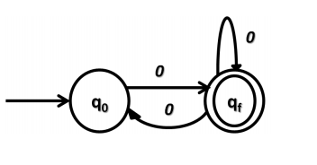
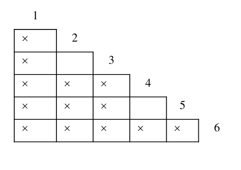
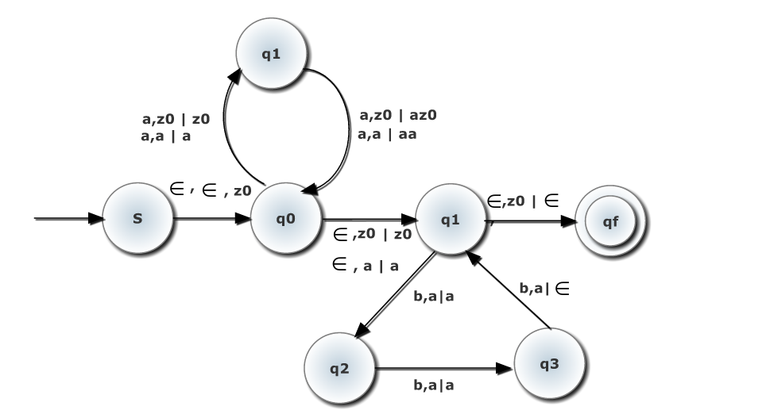

# Formal Languages and Automata

A **formal language** consists of strings whose letters are taken form an alphabet and are well formed according to a specific set of rules.

An **automaton** is a machine which is used to recognize formal languages. They are classified by the different formal language classes they are able to recognize.

## Examples

It's important to know the mathematical notation to describe languages as well.

1. Every string in the language consists of any number of 0s, then any number of 1s, then any number of 2s. This is denoted by $w=0^*1^*2^*$ - the * denotes that there can be any number of elements of that type.

# Finite Automata

A computational model with finite number of states. It is a finite representation of a formal language that may be an infinite set.

Examples of a finite automata could be an electric switch (two states).

An FA has no way of storing information. It can only remember a finite amount of information - the current state and the next transitions.

## Some definitions
A **symbol** is the smallest building block of an automata.

An **input alphabet ($\sum$)** is any finite non-empty set of symbols, like $\sum$ = {0,1}

A **string** is a finite sequence of symbols from some input alphabet $\sum$. It is normally denoted by **w**, with the length denotes as **|w|**. An empty string is represented as $\in$

We also have a notation that denotes all strings with a given size *i*:

$\sum^i$ = {**w** | **w** is a string over $\sum$ and **|w|** =i}

The set of all possible strings generated over an alphabet $\sum$ is denoted by $\sum$*

A **Language** over an input alphabet is a subset of $\sum$*

## Diagrammatic Representation

In an FA, states are represented by circles with **state** names, and **transitions** are represented by directional arrows labelled with **input alphabet symbols**. 

The automaton always starts from a particular state, called the **start state**. Every state can be an accept state or a non-accepting state. If the current state is an **accept state**, then at that point the input may be accepted. This is usually denoted by concentric circles.

## Transition Table Notation

Here we create the following representations:

**Initial state** $\rightarrow q$

**Intermediate state** $q$

**Final state** $\textcircled{q}$

{ width=250px }

The above DFA can be represented by the following table:

|   |a    |b    |
|---|-----|-----|
|$\rightarrow$ P|P|Q|
|\textcircled{Q}|P|Q|

If a state has no transition for a given alphabet, we would put a $\phi$ in its place.

# Deterministic Finite Automata

In a DFA, there must be exactly one transition from each state over each symbol of given input alphabet $\sum$

*Include example from slides*

As we can see from the $q_0$, there is exactly one outgoing transition for a, and exactly one outgoing transition for b. This same condition is verified for all other states as well.

## Steps to design a DFA

1. Construct the language *L* starting with the string of minimum length and gradually move towards other strings

2. Design the FA for the minimal length string identified in *L*

3. Transform that FA into a DFA for all other additional strings in *L*

Sometimes, we may create a **dump state**, which is some dummy transition that is used to dump an extra transition that we do not need for the language, but need to satisfy the DFA requirements

## Formal definition

A DFA $M$ is represented by a 5-tuple $(Q, \sum , \delta, q_{0}, F)$

$Q$ is the finite set of states

$\sum$ is the input alphabet

$\delta$ is the Transition Function, i.e. $Q \times \sum \to Q$

$q_{0} \in Q$  is the start state

$F \subseteq Q$ is the set of accept states

## Deterministic Property

\begin{thm}
Given a (state, input alphabet) pair, the computational model will deterministically go to a unique state. In mathematical terms, $\delta(q,a) \Rightarrow q'$ is a unique transition
\end{thm}

So, if a string is fixed, the DFA has a fixed unique walk from input state to the accept state that gives the desired string.

## Finite property

\begin{thm}
The set of states is finite.
\end{thm}

## Acceptance Mechanism of a DFA

We say $M$ accepts a string $w$ if and only if the DFA starting at the initial state ends in a accepting state after reading the string.

The DFA $M$ accepts a language $L \subseteq \sum^*$ if every string in $L$ is accepted by $M$ and no more.

The language accepted by $M$ is denoted as $L(M)$, where $L(M) = \{x \in \sum^* | \delta(q_{0},x) \in F\}$

A language $L_{1}$ is called a **regular language** or a **type 3 language** if there exists some DFA $M$ s.t. $L(M)=L_{1}$

## Complement of Language

The complement of a language is the set of string in $\sum^*$ but not in $L$. It is denoted by $\overline{L}$

A DFA that accepts a certain language can be converted into a complement DFA, that accepts $\overline{L}$ by making all accepting states non-accepting, and all non-accepting states accepting.

# Non-Deterministic Finite Automata

An FA is non-deterministic if from a state $q$ on a symbol $a$, the automaton can go to multiple $k$ states, where $k \geq 0$. So, computation will execute simultaneously along each of these paths.

Formally, we would say that from each state, there can be **any** number of transitions over $\sum^*$. Since we have no restrictions, we no longer need a dump state like in DFA

*Get example from slides*

As we can see, unlike in a DFA, there are two transitions over 1 from A

## Formal Definition

It is represented by a 5 tuple $N = (Q, \sum, \delta, q_{0}, D)$, where

$Q$ is a finite set of states

$\sum$ is the input alphabet

$\delta$ is a transition function on $Q \times \sum \rightarrow 2^{Q}$

$q_{0}$ is the start state

$F \subseteq Q$ is the set of accept states

## Acceptance mechanism

An NFA $N$ accepts a string $w$ if one of the computation paths leads to one of the accept states. Hence, $N$ will reject strings only if all the computation paths ends up in any of the non-accept states.

## Steps to design an NFA

These steps are **the same** as in a DFA, except in step 3 we transform it into an **NFA**

## Equivalence of NFA and DFA

\begin{thm}
For each nondeterministic finite automaton, there is an equivalent deterministic finite automaton
\end{thm}

Let us take an example: construct an equivalent DFA for the given NFA over the input alphabet $\sum = \{0,1\}$

{ width=250px }

The equivalent transition table would be

| | 0 | 1 |
|---|---|---|
|$\rightarrow q_{0}$|$\{q_{f}\}$| $\phi$|
|\textcircled{$q_f$}|$\{q_{0},q_{f}\}$| $\phi$|

If we converted this to a DFA, we would get the following transition table:

| | 0 | 1 |
|---|---|---|
|$\rightarrow q_0$| $q_f$ | DS |
|\textcircled{$q_f$}| $q_0 q_f$ | DS |
|DS|DS|DS|
|\textcircled{$q_0 q_f$} | $q_0 q_f$ | DS

*Fix encircling*

As we can see, we made all the $\phi$ transitions point to a dump state, and all transitions to multiple states became states of their own!

The resultant DFA is shown graphically below:

{ width=250px }

## $\in$ - NFA

Now, we extend the class of NFAs by allowing $\in$ transitions. These transitions allow the NFA to change its state without reading its input symbol. Such transitions are depicted by labelling it with a $\in$.

This change is just a convenient feature - no new languages can be represented with this. NFAs and $\in$-NFAs recognize exactly the same languages

With $\in$ NFA we can more simply define different languages. Say we have two conditions - the language has one zero *or* it has an odd number of 1s. We can now solve these independently, and then use $\in$ connections from a start node to these NFAs.

## Equivalence between $\in$-NFA and NFA

If $R \subseteq Q$, the $\in$ closure of $R$ is defined as:

\eqn{
$E(R) = \bigcup_{r \in R}$ {q | q can be reached from r by using 0 or more $\in$} 
}

So, the $\in$-closure($q$) is the set that contains $q$, together with all states that can be reached starting at $q$ following only $\in$ transitions.

When converting a $\in$ NFA to an NFA, transitions are defined based on the following formula:

\eqn{
$\delta'(q,a) = \in-\text{closure}(\delta(\in-\text{closure}(q),a))$
}

The right hand side is called the $\in$ closure over the symbol $a$.

Consider the NFA below

{ width=250px }

It's $\in$ closure looks like:

|Q|$\in$ closure|
|---|---|
|$q_0$| {$q_0,q_1,q_2$}|
|$q_1$|{$q_1,q_f$}|
|$q_f$|{$q_f$}|

Using the $\in$ closure over all the symbols, we can create the transition table for the NFA:

| | 0 | 1 |
|---|---|---|
|$\rightarrow q_0$|{$q_0,q_1,q_f$}|{$q_1,q_f$}|
|$q_1$|{$q_f$}|{$q_1,q_f$}|
|$q_f$|{$q_f$}|$\phi$|

As we can see, each state transitions to all states in its $\in$ closure over each symbol! It is also important to note, the number of states will remain the same (always) but the number of final states may increase. If, by reading $\in$ a state can reach a final state, make it also a final state.

Now, with this we can draw the NFA show in figure 5

{ width=250px }

\pagebreak

# Regular Expressions

This is a declarative way of representing a regular language. We use some operators to represent some regular language.

**Regular Languages** or Type-3 languages are restricted formal languages that can be denoted by the regular expression.

The conditions for a formal language to be regular is that it is finite(unnecessary?), and there should be no need for any memory in a finite automata used to represent this. For example $L = \{a^n b^m | n,m \geq 1, m > n \}$, is not regular since we cannot handle the condition $m>n$ without a memory element.

The regular expression operations are as given below:

* Null string - $\in$
* Single character - $a$
* Concatenation ($\cdot$), used to concatenate multiple strings.
* Union ($+$), used to do an OR - $a+b$ signifies we will either accept $a$ or $b$
* Positive Closure ($^+$), used to signify repetitions. For instance, $a^+$ signifies the $L=\{a,aa,aaa,...\}$
* Kleene Closure ($^*$), used like positive closure but also includes the null string $\in$

For example, the language $L=\{\in, a,b,ab,ba,aaa,...\}$ which signifies any combination of a's and b's can be given by the regular expression $\in+(a+b)^+$ or $(a+b)^*$

For every regular expression R, we have a unique language L(R) corresponding to it. The converse is not true.

The precedence of operators is:

* ()
* Kleene Closure/Positive Closure
* Concatenation
* Union

The method of designing a regex is much like a DFA! In fact, they have the same expressive power - one can be converted to the other.

## Example

Construct a regular expression that accepts all strings of 0s and 1s where each string starts and ends with a different symbol.

The language is $L=\{01,10,011,110,...\}$. The minimal strings will be "01" and "10".

The regex will be - $0\cdot(0+1)^* \cdot 1 + 1 \cdot (0+1)^* \cdot 0$

## Algebraic properties

* R1+(R2+R3) = (R1+R2)+R3 
* R1.(R2.R3) = (R1.R2).R3
* R1.(R2+R3) = R1.R2 + R1.R3
* (R1+R2).R3 = R1.R3 + R2.R3
* R1 + R2 = R2+R1 (Not true for concatenation)
* (R1\*)\* = R1\*
* R1.$\in$ = $\in$.R1 = R1
* R1 + $\phi$ = R1

## Equivalence of Regex and FAs

* Case 1: $R=\phi$

{ width=250px }

* Case 2: $R = \in$

{ width=250px }

* Case 3: $R=a$

{ width=250px }

* Case 4: $R=a+b$

{ width=500px }

\pagebreak

* Case 5: $R=a.b$

{ width=300px }

* Case 6: $R=a^+$

{ width=500px }

\pagebreak

* Case 7: $R=a^*$

{ width=500px }

Using these rules we are able to convert any regular expression to a finite automata.

# Generalized NFA

A GNFA is a NFA with the transitions being labelled by regular expressions. A GNFA is said to accept a string $w$ if $w$ can be written as $w = w_1w_2w_3...w_k$ and $\exists$ states $q_0,q_1,q_2...$ such that:

* $q_0$ is the initial state
* $q_k$ is the accept state
* $\forall i$ if $R_i$ is labelled on the transition $q_{i-1}$ to $q_i$ then $w_i \in L(R_i)$ 

GNFAs always have a unique accept state. THe start state has no incoming transitions and the accept state has no outgoing transitions

## Steps for conversion from DFA

1. Create a new start state $s$ and a new accept state $t$
2. Add $\in$ transition from $s$ to old start state
3. Add $\in$ transition from old accept states to $t$
4. Delete states one at a time, replace the resulting transitions with suitable labels as described further
5. Repeat the step 4 until all states besides $s$ and $t$ get deleted

# Closure Properties of Regular Languages

Closure properties on regular languages are operations on regular languages that are guaranteed to produce a regular language. The operations capable of this are called **regular operations**. We can check the closure properties by seeing whether we can crate an NFA or by using multiple closed operations to generate the one we are trying to check.

Regular languages are closed under the following operations:

* $L_1 \cdot L_2$ : One way to prove this is by saying this can be expressed by the concatenation of the regular expressions of $L_1$ and $L_2$. We can also construct a DFA for $L_1 \cdot L_2$ by chaining them one after another.
* $L_1 \cup L_2$ : Besides a simple proof using regular expressions, we can find the DFA via construction. Say $M_1$ and $M_2$ are the DFAs of $L_1$ and $L_2$ respectively, and try to construct a DFA $M$. M consists of pairs of states from its constituent DFAs - if we have states $q_1,q_2,q_3$ and $p_1,p_2,p_3$, then $M$ will have nine states $q_1p_1,q_1p_2...q_3p_3$. The transition step is updated such that if on a particular step, a string would cause $M_1$ to move from $q_1$ to $q_2$, and $p_1$ to $p_2$, then we would have a transiton from $q_1p_1$ to $q_2p_2$. The accept states would be the union of the accept states from $M_1$ and $M_2$.
* $L_1 \cap L_2$ : Same as above, but the accept states would be the intersection of the accept states from $M_1$ and $M_2$.
* $\overline{L_1}$ : As already discussed, we just need to change all accepting states non-accepting and all non-accepting states accepting.
* $L_1-L_2$ : The set difference of $A$ and $B$ can be expressed as $A \cup \overline{B}$. We can hence create a construction from the proofs given before this.
* $L_1^*$ 
* The reversal of $L_1$ - a language where every string is the reverse of any string under $L_1$. We can construct a DFA for this by exchanging final and initial state and reversing all the edges in the DFA
* A **homomorphism** on an alphabet is a function that gives a string for each symbol in that alphabet. The homomorphism over a set of alphabets would give the concatenation of the homomorphisms on the element alphabets. Languages are closed over homomorphisms.

Regular languages are not closed under the following operations

* Subset operation

These operations allow us to quickly check if a given language is regular.

# Pumping Lemma

If $L$ is a regular language, then there exists at least one constant $p$ such that for all possible strings $w \in L$ such that $|w| \geq p$ there exists a partition of $w$ in strings $x,y,z$ such that $w=xyz$, such that:

* $|y| > 0$
* $|xy|\leq p$
* for all $i \geq 0$ we have $xy^iz \in L$

## Contrapositive form

Let $L \subseteq \sum^*$. If for all $p \geq 0$, there exists $w \in L$ such that $|w| \geq p$ , such that for all partitions $w=xyz$ where $|xy| \leq p$ and $|y| > 0$, there exists some $i \geq 0$ such that $xy^iz \notin L$, then $L$ is not regular

## Examples

**Prove that $L=\{0^n1^n | n \geq 0\}$ is not regular**

**Proof:**

Given a $p \geq 0$, choose $w=0^p1^p$. In general, we try to choose words that are a function of $p$, and that its length is greater than $p$. Now, we are given a partition $w=xyz$ where $|xy| \leq p$ and $|y| \geq 0$. Note that $x$ and $y$ consist only of 0s, since $|xy| < p$ and we smartly chose our string to have $p$ zeros. 

Let use choose $i=0$. Then, we have $xy^0z = xz = 0^r1^p$ where $r = p-|y| \neq p$. Hence, $xy^0z \notin L$, $L$ is not regular. 

**Prove that $L=\{a^lb^mc^n | l+m \leq n\}$ is not regular**

**Proof:**

Given $p \geq 0$, let us choose $w = a^pb^pc^{2p}$. Now, given a partition $w=xyz$ where $|xy| \leq p$ and $|y| \geq 0$, we see that $x$ and $y$ only consist of a's. So, $y=a^t$ where $t \geq 0$. Now, choosing $i=2$, we get $xy^2z = a^{p+t}b^pc^{2p}$ which implied $|a| + |b| > |c|$. So, $xy^2z \notin L$ therefore $L$ is not regular.

# Minimization of DFA

How do we decide which states to collapse? We would want to collapse states which are equivalent. If two states are equivalent, starting from respective states, with the same input string, either both lead to the final states or none lead to final states

{ width=250px }

\pagebreak
As we can see, $q_0$ and $q_2$ have the same behavior. If we read 1, both go to $q_3$ and if we read 0, we go to $q_1$. Hence, they are equivalent. By merging them, we can get the minimal DFA in figure 12.

{ width=250px }

In terms of transition functions, we can create the following definition. Two states $p$ and $q$ are **indistinguishable** ($p \equiv q$) if $\delta(p,w) \in F$ implies $\delta(q,w) \in F$, or $\delta(p,w) \notin F$ implies $\delta(q,w) \notin F$, for all $w \in \sum^*$.

If two states are not indistinguishable, they are distinguishable. Another way to put this is to say that $p$ and $q$ are separated by $w$.

If two states $p$ and $q$ have no separating strings of length $\leq k$, then $p$ and $q$ are **k-equivalent**. This is denoted by $p \equiv_k q$. Essentially this means, instead of considering all $w \in \sum^*$, we only consider those whose $|w| \leq k$

## Steps to minimize DFA

1. Construct a 0-equivalence class by taking the set of accept states in one set and set of non-accept states in another set

2. From the $i$ equivalence class, find the $i+1$ equivalence class. Repeat this process of calculating the equivalence class until K-equivalent and K-1 equivalent classes are the same

3. Construct a DFA by taking all the sets of K-equivalence class as new states of minimal DFA

\pagebreak

{ width=250px }

For $E_0$, we have two equivalence classes $\{q_0\},\{q_1,q_2\}$. A string of length 0 separates these. The first equivalence class cannot be divided, as it has only one state. So, let us look at the second class.

For any string of length 1, $\{q_1,q_2\}$ have no separating words. So they are 1-equivalent. So, $E_1$ is $\{q_0\}$ and $\{q_1,q_2\}$. We cannot go any further, since $E_0$ and $E_1$ are the same. The resultant DFA will be:

{ width=250px }

## Table Filling Mechanism

The idea is to design a table for all $\{p,q\}$ pairs where $p,q \in Q$. We mark a pair if $\{p,q\}$ if $p \in F$ and $q \notin F$ or vice versa.

The algorithm is as follows:

1. Mark $\{p,q\}$ if $\{\delta(p,a),\delta(q,a)\}$ is marked for some $a \in \sum$
2. Repeat 1 until no more pairs can be marked

Two or more states will be equivalent if they are not marked.

We can try this on the following example.

{ width=250px }

\pagebreak
The filled table would look like:

{ width=250px }

With this, we can see (2,3) and (4,5) are unmarked, so they must be equivalent! Finally, we get the following DFA:

{ width=250px }

# Context Free Grammar

## Informal description

**Terminal symbols** are similar to input alphabet symbols. **Variable Symbols** can be replaced with a string of variables and terminals. **Production rules** dictate how variables are replaced. **Start variable** is the starting point of applying rules.

Computation proceeds as follows:

1. Write down the start variable as the current string
2. Pick a variable in the current string and replace it with one of its production rules.
3. Continue step 2 until no more variables are left.

Essentially, just like BNF from PPL.

## Formal description

A context grammar is the 4-tuple $(V, \sum, P,S)$ where:

* $V$ is the finite set called variables
* $\sum$ is a finite set disjoint from $V$ called terminals
* $P \subseteq V \times \{V \cup \sum \}^*$ is a finite set of production rules
* $S \in V$ is the start variable.

If $A \in V$, $u,v \in \{V \cup \Sigma\}$ and $A \rightarrow w$ is a rule, then we say that $uAv$ yields $uwv$ in one step, denoted by $uAv \Rightarrow uwv$. The language of G is $L(G) = \{w \in \Sigma^* | S \Rightarrow w\}$

## Derivation and Ambiguity

Derivation is the process of deriving strings from the given grammar. This is done by replacing variables with terminal symbols using the production rules. There are two types of derivation **leftmost derivation** and **rightmost derivation**. In leftmost derivation, we replace only the leftmost non-terminal, and in rightmost derivation we replace only the rightmost terminal.

Derivation results in the creation of a **parse tree**. Parse trees represent the syntactic structure of a string. Concatenating the symbols from left to right give the original string.

Below is the parse tree for the grammar `S -> 1S0S | 0S1S |`$\in$

**ADD PARSE TREE**

A CFG is **ambiguous** if there exists a string $w$ for which multiple parse trees could exist. This happens when the derivation results in a right hand side which has multiple non-terminals (like the aforementioned grammar). A Context Free Language (CFL) is **inherently ambiguous** if all the CFGs that accept it are ambiguous.

## Conversion from DFA

Any DFA can be represented in the form of a CFG, and it is quite easy to do so. We make each state a nonterminal, and make its transitions the rules. For instance, if there is a transition from $A$ to $B$ over $a$, we make the rule $A \rightarrow aB$. The accept states will always have the rule $A \rightarrow \in$.

## Chomsky Normal Form

A context free grammar is in Chomsky Normal Form if every rule is of the form:

* $A \rightarrow BC$
* $A \rightarrow a$

Here, $a$ is a terminal, and $A,B,C$ are any variable. $B$ and $C$ cannot be the start variable.

CNF can generate a string $w$ or length $|w|$ in $2|w|-1$ steps.

To convert a CFG to CNF, we follow the following steps:

1. Add a new start variable $S_0$ and the rule $S_0 \rightarrow S$ where $S$ was the original start variable. This way, $S$ will never be on the RHS.

2. Remove any $\in$ rule $A \rightarrow \in$ where $A$ is not the start variable. For any occurrence of $A$ on the RHS of a rule, add a new rule with that occurrence deleted.

3. Remove a unit rule $A \rightarrow B$. Then, whenever a rule $B \rightarrow u$ appears, we add the rule $A \rightarrow u$

4. We replace each rule $A \rightarrow u_1u_2...u_k$ where $k \geq 3$ and each $u_i$ is a variable or terminal symbol with $A \rightarrow u_1A_1$, $A_1 \rightarrow u_2A_2$, ... ,$A_{k-2} \rightarrow u_{k-1}u_k$

5. If there is a rule of the form $A \rightarrow uv$ where at least one of either $u$ or $v$ is a terminal symbol (let's assume $u$) then replace $A \rightarrow uv$ with $A \rightarrow Uv$ and add $U \rightarrow u$

### Example

Consider the following CFG:

$$S \rightarrow ASA | aB$$
$$A \rightarrow B | S$$
$$B \rightarrow b | \in$$

*Step 1:*
$$S_0 \rightarrow S$$
$$S \rightarrow ASA | aB$$
$$A \rightarrow B | S$$
$$B \rightarrow b | \in$$

*Step 2:*

First, we remove $B \rightarrow \in$, which gives:

$$S_0 \rightarrow S$$
$$S \rightarrow ASA | aB | a$$
$$A \rightarrow B | S | \in$$
$$B \rightarrow b$$

Now, we handle $A \rightarrow \in$

$$S_0 \rightarrow S$$
$$S \rightarrow ASA | aB | a | SA | AS$$
$$A \rightarrow B | S$$
$$B \rightarrow b$$

*Step 3:*

First, we handle $S_0 \rightarrow S$, giving:

$$S_0 \rightarrow ASA | aB | a | SA | AS$$
$$S \rightarrow ASA | aB | a | SA | AS$$
$$A \rightarrow B | S$$
$$B \rightarrow b$$

We do the same procedure, removing $A \rightarrow S$ and $A \rightarrow B$

$$S_0 \rightarrow ASA | aB | a | SA | AS$$
$$S \rightarrow ASA | aB | a | SA | AS$$
$$A \rightarrow b | ASA | aB | a | SA | AS$$
$$B \rightarrow b$$

*Step 4:*

Let us shorten the RHS, and replace $ASA$ with $C \rightarrow SA$. This gives us:

$$S_0 \rightarrow AC | aB | a | SA | AS$$
$$S \rightarrow AC | aB | a | SA | AS$$
$$A \rightarrow b | AC | aB | a | SA | AS$$
$$B \rightarrow b$$
$$C \rightarrow SA$$

*Step 5:*

We can replace the $aB$ with $DB$ where $D \rightarrow a$

$$S_0 \rightarrow AC | DB | a | SA | AS$$
$$S \rightarrow AC | DB | a | SA | AS$$
$$A \rightarrow b | AC | DB | a | SA | AS$$
$$B \rightarrow b$$
$$C \rightarrow SA$$
$$D \rightarrow a$$

## Closure properties

### Set Union

Context Free Languages are always closed under the union operation. We can prove this by construction. Given two grammars $G_1 = (V_1,\sum,R_1,S_1)$ and $G_2 =(V_2, \sum, R_2,S_2)$, we try to find a construction of union that gives us a CFL. The output of this would be $G_3 = (V_3,\sum,R_3,S_3)$ where we have $V_3 = V_1 \cup V_2 \cup \{S\}$ and $S_3 = S$. The new set of production rules will be given by $R_3 = R_1 \cup R_2 \cup \{S \rightarrow S_1 | S_2\}$, so now we can either follow the path of $G_1$ or $G_2$.

### Set Concatenation

CFLs are closed under concatenation. Once again, we could prove this with construction. Considering the same terms as the previous proof, we would once again have $V_3 = V_1 \cup V_2 \cup \{S\}$ and $S_3 = S$. This time, we would have $R_3 = R_1 \cup R_2 \cup \{S \rightarrow S_1 S_2\}$

### Kleene Closure

CFLs are closed under Kleene closure. In the proof by construction,  $V_2 = V_1 \cup \{S\}$, $S_2 = S$, and $R_2 = R_1 \cup \{S \rightarrow SS_1|\epsilon\}$.

### Transpose operation

The transpose operation is defined as a reverse operation. CFLs are closed under transpose operation. The production rules $R^T$ would be constructed by reversing the symbols on LHS and RHS in every production rule in $R$

### Intersection

The intersection of a CFL and a regular language is always a CFL. The proof of this is much more involved than the others and is given [here](http://www.cs.umd.edu/~gasarch/BLOGPAPERS/cfg.pdf)

The intersection of 2 CFLs may not be a CFL.

### Complement operation

CFLs are not closed under complement operations.

# Chomsky Heirarchy of Grammars

## Type 3 Language

Type 3 languages, or regular languages are those whose production rules are given by $A \rightarrow a$ or $A \rightarrow aB$ where $a$ is a terminal and $B$ is a nonterminal. These can be represented by finite state automaton.

## Type 2 language

Type 2 languages, or context free languages are those whose production rules are of the form $A \rightarrow \alpha$ where $\alpha$ is a string of terminals and non terminals. These can be represented by non-deterministic pushdown automata.

## Type 1 language

Type 1 languages, or context sensitive languages are those whose production rules are of the form $\alpha A \beta \rightarrow \alpha \gamma \beta$ where $\alpha, \beta, \gamma$ are strings of terminals and non terminals. The rule $S \rightarrow \in$ is allowed, as long as $S$ does not appear on the right side of any rule.

## Type 0 language

Type 0 languages or recursively enumerable languages encompass all languages. They have no constraints whatsoever, and are represented by a Turing machine.

# Pushdown Automata

Pushdown automata are capable of expressing context free languages. PDAs are for **recognizing context free languages**, while CFGs are for generating them. Of course, they are equivalent in expressive power.

A PDA are essentially $\in$ NFAs with an unbounded stack, which allows us to manipulate additional memory beyond the finite amount available in a regular NFAs. A schematic representation of the PDA is given below:

{ width=250px }

The stack is also allowed to have a different alphabet, denote by $\Gamma$. Given an input, the PDA does the following:

* Reads $a_i$ from $w$ where $a_i \in \sum \cup \in$
* Goes from state $p$ to $q$
* Replaces the topmost element of the stack $X$ with $Y$ where $X,Y \in \Gamma^*$

This is represented by $(p,a_i,X) \rightarrow (q,Y)$. If $X$ is $\in$, we are pushing in $Y$, and if $Y$ is $\in$, then we are popping $X$. In a PDA diagram, this is represented by an arrow from state $p$ to state $q$ on which we write $a_i,X|Y$.

One assumption we make is that the stack holds a special symbol $z_0$ which indicates the bottom of the stack.

## Designing a PDA

Consider the language $L = \{0^n1^n|n \geq 1\}$.

Let us first consider the string $w = 000111$.

We first push the special element $z_0$ to denote the bottom of the stack and move from the start state.

The transitions $0,z_0|0z_0$ and $0,0|00$ denote the transition where we read $0$ from the input string and push it to the stack. After we read all the 0s, we would have $000$ in the stack.

Once we read $1$, we start popping from the stack with the transitions $1,0|\in$. If the string is "good", it would pop out all the zeros from the stack, no more and no less.

Finally, after reading the entire string the input to the PDA becomes $\in$. So, we check whether we have emptied the stack with the transition $\in, z_0 | \in$.

As we can see, we are able to **recognize** the grammar. This does not **generate** the grammar. The resultant PDA is given below.

{ width=300px }

Another example is the language $L = a^{2p}b^{3p},p \geq 0$. You can see the resultant PDA below:

{ width=400px }

The first step is the same as always, putting in the bottom of the stack. The first cycle ($q_0,q_1$) handles recognizing $a$ and the second cycle $q_2,q_3,q_4$ handles $b$. For every two $a$, we put in a **single** $a$, which the $b$ cycle reads and then adds the required number of $b$ for. 

## Formal Definition

A PDA consists of a  6-tuple $(Q,\sum, \Gamma, \delta, q_0, F)$, where the definitions are the same as in a NFA, but $\Gamma$ is the stack alphabet.

The transition function $\delta$ is a finite subset of $(Q \times (\sum \cup \{ \in \}) \times \Gamma_{\in}) \times Q \times \Gamma^*$. It takes a (state, input alphabet, stack alphabet) tuple as an input, and gives output in the form (state, stack alphabet). Due to non-determinism of the PDA, there can be multiple transitions on the same tuple ($p,a,X$)

A PDA is said to accept a string $w \in \sum^*$ if there exists:

* A sequence of symbols $a_1,a_2,... a_n \in \sum_{\in}$ 
* States $r_0,r_1,...r_m \in Q$
* Strings $s_0,s_1,..s_m \in \Gamma^*$ such that

the initial condition is $w=a_1,a_2,...a_m$, $r=q_0$, $s_0=z_0$. Then $\forall i$, if $\delta(r_{i-1},a_i,X) \in (r_i,Y)$ then $s_{i-1} = Xt$ and $s_i = Yt$ for some $t \in \Gamma^*$ and $X,Y \in \Gamma_{\in}$, and $r_m \in F$.

## Equivalence between CFG and PDA

Every CFG is accepted by a PDA. Whenever we are given a CFG $G$, we aim to construct a PDA that simulates leftmost derivations on $G$.

The PDA will have:

* Two states, $p$ and $q$
* $\sum$ which consists of the terminals of $G$
* $\Gamma$ which consists of all symbols (non-terminals and terminals) of $G$
* $S$ which is the start symbol of $G$

At each step, the PDA $P$ represents some left sentential form. If the stack of $P$ is $\alpha$, and $P$ has so far consumed $x$ from its input, the  $P$ represents left sentential form $x\alpha$. When the stack is empty, the input consumed is a string in $L(G)$.

Let us look at the transition function of a PDA:

* Initially, $\delta(p,\in,\in) = (q,S)$. 
* For each variable $A$, $\delta(q,\in,A) = \{(q,\beta) | A \rightarrow \beta \text{ is a production rule of P}\}$.
* For each terminal $a$, $\delta(q,a,a) = \{(q, \in)\}$

There is yet another way to do this. With the same terminology, we have the transition function to be:

* $((p,a,\in)(p,a)) \forall a \in \sum$ 
* $((p,\in,\alpha^R)(p,A)) \forall$ rules of the form $A \rightarrow \alpha$ in $R$ 
* $((p,\in,S),(q,\in))$

The difference between these methods will be clear when discussing parsing.

# Deterministic Pushdown Automata

Pushdown automata are integral to parsers in compilers. However, a PDA is not of immediate practical use in parsing, because it is a non-deterministic device.

A deterministic PDA is one where every combination of state, input symbol and stack top results in one transition.

Two strings are **consistent** if the first is a prefix of the second, or vice versa. Two transitions $(p,a,\beta) \rightarrow (q,\gamma)$ and $(p,a_1,\beta_1) \rightarrow (q_1, \gamma_1)$ are **compatible** of $a$ and $a_1$ are consistent, and $\beta$ and $\beta_1$ are also consistent. A PDA is deterministic if it has no two distinct compatible transitions.

Any language recognized by a deterministic PDA is a **deterministic context free language**. It must also be able to sense the end of the input string (say with an end marker '#'). Some DCFLs do not need this second condition, but others need it to be a deterministic PDA.

Some examples of DCFLs are:

* $\{wzw^R | w \in \sum-\{z\}\}$
* $\{0^n1^n|n \geq 0\}$

## Simple PDA

We say that a PDA is simple if whenever we have $((q,a,\beta)(p,\gamma))$ as a transition in the PDA and $q$ is not the start state, then $\beta \in \Gamma$ and $|\gamma| \leq 2$. This means that there is no transition in $M$ that pops more than one symbol from the stack.

Let us consider that we have a PDA $(\{s,q_1,q_2,q_f\},\{a,b\},\{a,b\}, \Delta, s, \{q_f\})$. The transitions are:

* $(s,a,\in)(q_1,a)$
* $(q_1,a,\in)(q_1,a)$
* $(q_1,b,\in)(q_2,\in)$
* $(q_2,\in,aaaa)(q_1,aaa)$
* $(q_1,\#,a)(q_f,\in)$
* $(q_f,\in,a)(q_1,a)$

Transition number 4 means that this is not a simple PDA! How can we convert it into a simple PDA? We follow the following steps:

1. We create a new start state and make a transition to the old start state where we push $z_0$. So, we have $(s',\in,\in)(s,z_0)$
2. We create a new final state and make a transition from the old final state where we pop $z_0$. So, we should have $(q_f, \in, z_0)(q_f',\in)$
3. Anywhere where $|\beta|$ is more than 1, we ensure that it is 1. So, we would split our offending transition into $(q_2,\in,a)(q_a,\in)$,  $(q_a,\in,a)(q_{aa},\in)$,  $(q_{aa},\in,a)(q_{aaa},\in)$, $(q_{aaa},\in,a)(q_1,aaa)$
4. Ensure that $|\gamma| \leq 1$. The offending transition is $(q_{aaa},\in,a)(q_1,aaa)$. We can fix this by making it $(q_{aaa},\in,a)(r_1,a)$, $(r_1,\in,\in)(r_2,a)$, $(r_2,\in,\in),(r_3,a)$
5. Ensure that if $\beta = \in$, then $|\beta| = 1$. For example, we would change $(q_1,a,\in)(q_1,a)$, which means push if there is *anything* on the stack, into $(q_1,a,a)(q_1,aa)$, $(q_1,a,b)(q_1,ab)$, $(q_1,a,z_0)(q_1,az_0)$

## Closure Properties of a DCFL

### Complement Operation

If there exists DCFL for the language $L\#$, then complement($L$)# is also expressible by a DCFL.

We can prove this by a construction. We say that a triple $(q,a,A)$ is a dead end if there is no state $p$ and stack symbol $\alpha$ such that the configuration $(q,a,A)$ yields $(p,\in,\alpha)$ or $(p,a,\in)$. For each dead end triple, we remove all compatible transitions with $(q,a,A)$ from $\Delta$ and add the following:

* $(q,a,A)(r, \in)$
* $(r,a,\in)(r,\in) \forall a \in \sum$ 
* $(r,\#,\in)(r',\in)$

Finally, we add $(r',\in,A)(r',\in)$ for all $A \in \Gamma \cup \{z_0\}$ where $r'$ is a new non accepting state. Then, switching the final and non final states, we have our desired PDA.

This theorem could help us prove that some language is not a DCFL. If we complement a language and it is not a CFL, it also cannot be a DCFL.

### Other operations

DCFLs aren't closed under union, intersection, Kleene Closure or reversal.

# Pumping Lemma for CFL

Let $G = (V,\sum,R,S)$ be a CFG. Then any string $w \in L(G)$ of length greater than $\Phi(G)^{|V|}$ (i.e. there exists a constant $p$ such that $|w| \geq p$) can be rewritten as $w = uvxyz$ such that:

1. $|vxy| \leq p$
2. $|vy| > 0$
3. For all $i \geq 0$, $uv^ixy^iz$ is in L(G)

## Example

Let us consider an example. Prove that $L = \{a^nb^nc^n | n \geq 0\}$ is not a CFL.

Suppose $L$ is a CFL and let $p$ be the pumping length. Let $e=a^pb^pc^p$. Then, according to pumping lemma, $w$ can be rewritten as $uvxyz$ with the required conditions. 

Let case 1 be that $v$ and $y$ contain only one type of alphabet symbol. So, let us have $u=a^e,v=e^f, x = \in,y=a^g,z=b^pc^p$ where $e+f+g=p$. Now let us say $i=0$. This means what $w=a^eb^pc^p$, which is not in the language. So, the requirements of the pumping lemma have not been met, and it is not a CFL.

The second case is that $v$ and $y$ contain more than one type of symbol. In such a case, if $i =2$, then $uv^2xy^2z \notin L$. Normally we would need to rigorously prove this for all cases. This is just an overview of the proof.

## Proof

The **fanout** of $G$, denoted by $\Phi(G)$ is the largest number of symbols on the RHS of any rule in R. A **path** in a parse tree is a sequence of distinct nodes, each connected to the previous by a line segment. The first node must be the root, and the last one is a leaf. 

Given these definitions, we can say that the yield (the generated word) of any parse tree of $G$ of height $h$ has length at most $\Phi(G)^h$. This means that the parse tree of any string $w \in L(G)$ with $|w| > \Phi(G)^h$ must have a path longer than $h$.

So, now we have a proof. Let $w$ be a string and let T be the parse tree with root labelled S and with yield w that has smallest number of leaves among all parse trees with the same root and yield. Since T's yield is > $\Phi(G)^{|V|}$, T has a path of length at least $(|V|+1)$, so the path has at least $|V|+2$ nodes, with only one labelled as a terminal, and the remaining non-terminals. This means that the number of nodes in the path are greater than number of non terminals, i.e., at least one non terminal will repeat itself along the path. So, $v$ and $y$ can be repeated an infinite number of times.

# Parsing

A **parser** is an algorithm to determine whether a given string is in the language generated by a given CFG, and, if so, to construct the parse tree of the string.

Given a deterministic CFG F, we can make the following types of PDA's for it:

* Non-deterministic PDA
* Deterministic PDA which is not a parser
* Deterministic PDA which acts as a top down parser
* Deterministic PDA which acts as a bottom up parser

Let $L=\{a^bb^n|n \geq 0\}$. The corresponding grammar would be $G = (\{a,b,s\},{a,b},R,S)$, where R contains $S \rightarrow aSb|\in$. It is obvious that we need the ability to look ahead in the input string to know what rule to use, so that we can build the parse tree. This is denoted by a function $LL(k)$, where we look ahead $k$ input symbols.

Let us convert the above CFG into a PDA. This will give us $M = (\{p,q\},\{a,b\},\{a,b,S\}, \Delta,p,\{q\})$, which would have the rules:

* $((p,\in,\in)(q,S))$
* $((q,\in,S)(q,aSb))$
* $((q,\in,S)(q,e))$
* $((q,a,a)(q,\in))$
* $((q,b,b)(q,\in))$

Now, we need to configure the lookahead into the PDA. This is easily done by augmenting the above PDA to have some lookahead nodes. The parser shown is an LL(1) grammar.

{ width=300px }

The parsing process can be described in the form of a **parsing table**.

|State|Unread Input|Stack|Transition Used| Rule of G|
|---|---|---|---|---|---|

By filling this we can simulate the parsing process and build a parse tree.

For certain CFL's, LL(1) will not be enough. Moreover, not all CFLs have deterministic PDA's that can be derived from the standard non deterministic one via the lookahead idea. Let us consider a grammar with the following rules:

1. $E \rightarrow E + T$
2. $E \rightarrow T$
3. $T \rightarrow T*F$
4. $T \rightarrow F$
5. $F \rightarrow (E)$
6. $F \rightarrow id$
7. $F \rightarrow id(E)$

The rules 6 and 7 create a sort of ambiguity that we cannot solve by lookahead. To solve this, we use **left factoring**. Whenever we have rules $A \rightarrow \alpha \beta_1 | \alpha \beta_2 |... | \alpha \beta_n$ where $\alpha \neq \in$ and $n \geq 2$, then replace them by the rules:

$$A \rightarrow \alpha A'$$
$$A' \rightarrow \beta_1 | \beta_2 | \beta_3 | ... | \beta_n$$

This allows us to defer the decision of choosing when to use a production rule to one rule later. Left recursion is also undesirable in our parser. Whenever rules of the form $A \rightarrow A\alpha_1 | A \alpha_2 |...| A\alpha_n |\beta_1 | \beta_2 |... |\beta_m$ where $n > 0$ are present, then replace them by the rules:

$$A \rightarrow \beta_1 A' | \beta_2 A' | ... | \beta_m A'$$
$$A' \rightarrow \alpha_1 A' | \alpha_2 A' | ... | \in$$

So far, we have been using Method 1 of converting a CFG to PDA. This method creates a **top down parser**. As we can see, the top down parser starts from $S$, the start symbol, and ends once we have only terminals. Method 2, on the other hand, acts as a **bottom up parser** - it starts from the non-terminals, and ends when we reach the start symbol $S$. This method is also called the **shift-reduce method**. The second method does not always result in a deterministic PDA.

## Examples

Consider the language $L = \{a^nbc^n|n \geq 0\}$. It's grammar is given by $S \rightarrow aSb|c$. The corresponding PDA will be:

{ width=300px }

Let us see the parsing table:

|State|Input String| Stack| Action|Transition Used | Rule of G|
|---|---|---|---|---|---|
|p|aacbb| |  |||
|p|acbb|a |Shift |1||
|p|cbb|aa|Shift|1||
|p|bb|caa|Shift|3||
|p|bb|Saa|Reduce|5|$S \rightarrow c$|
|p|b|bSaa|Shift|2||
|p|b|Sa|Reduce|4|$S \rightarrow aSb$|
|p||bSa|Shift|2||
|p||S|Reduce|4|$S \rightarrow aSb$|
|q||||6||

Going over this in a reverse order gives us the parse tree. Machines would need to convert our PDA into a deterministic PDA, but this is enough for understanding.

# Turing Machines

Turing machines,informally, have the following characteristics:

* There is an input tape, on which symbols are written
* There is a head that points at one block on the tape, and is able to move left or right on the tape.
* The head consumes the symbol in the block and write a new symbol on the block

Turing machines can simulate any data structure, it can simulate branching, loops, sequences, etc. Turing machines can even simulate extensions to itself, like having multiple tapes, multiple heads, non-determinism, etc.

A programming language is **Turing Complete** if it is equivalent to a Turing machine.

Now to move on to the formal definition. A Turing machine is a 5 tuple $(K,\sum,\delta,s,H)$, where:

* $K$ is a finite set of states
* $\sum$ is a set of symbols. It contains the blank symbol ($\sqcup$) and the left end symbol($\triangleright$). It does not contain $\leftarrow$ and $\rightarrow$
* $s \in K$ is the initial state
* $H \subset K$ and is the set of halting states
* $\delta$, the transition function from $(K-H) \times \sum$ to $K \times (\sum \cup \{\rightarrow, \leftarrow \})$, such that:

1. for all $q \in K-H$ if $\delta(q,\triangleright) = (p,b)$ then $b = \rightarrow$
2. for all $q \in K-H$ and $a \in sum$ if $\delta(q,a) = (p,b)$ then $b \neq \triangleright$

The initial configuration of a Turing machine is generally $\triangleright \sqcup w$, where the head points to the blank symbol. In general the configuration specifies the tape contents, the state, and the position of the head. Thing of a tape $\triangleright aaba$ where the head points at the first $a$. Then, the configuration would be denoted by $(q,\triangleright a, aba)$

From now on, we will use the following notation for diagrammatic representation:

* $a$ : write $a$ onto the tape
* $L$ : Move left
* $R$ : Move right
* $R_{\sqcup}$ : Move right until blank
* $L_{\sqcup}$ : Move left until blank

There are two types of problems when considering Turing machines:

1. No computation is needed, and only a decision is required
2. Computation is required, like when adding two numbers, or copying a string.

A machine is a **symbol writing machine** if for each $a \in \sum \cup \{\rightarrow, \leftarrow\} - \{\triangleright \}$, TM $M_a = (\{S,h\},\sum,\delta,\{h\})$ where for each $b \in \sum- \{\triangleright\}, \delta(S,b) = (h,a)$.

This machine writes a symbol to wherever the head is pointing to, and halts. Since $a$ can be $\rightarrow$ or $\leftarrow$, it could also just move left or right then halt.

## Examples

Let us consider a turing machine which transforms $\triangleright \sqcup w \sqcup$ to $\triangleright \sqcup w \sqcup w \sqcup$

{ width=300px }

*Note: before we halt, we should add a $R_\sqcup$ so that we end at the right state*

Let us consider a turing machine which transforms $\triangleright \sqcup w \sqcup$ to $\triangleright \sqcup w \sqcup w^R \sqcup$. Initially, the configuration points at the last blank. 

{ width=300px }

## Recursive Languages

A Turing Machine $M$ **decides** $L$ if for any string $w \in \sum_0^*$, if $w \in L$ then $M$ accepts $w$; and if $w \notin L$, then $M$ rejects $w$.

By "accept", we mean that $M$ halts in an accept state. If it "rejects", it halts in a reject state.

A Turing Machine $M$ **semi-decides** $L$ if for any string $w \in \sum_0^*$, if $w \in L$ then $M$ accepts $w$. It does not say that if $w \notin L$, it will halt. It will only surely halt if it is in $L$.

A language is **recursive** or **Turing Decidable** if a Turing Machine decides it.

A language is **recursively enumerable** or **Turing recognizable** iff there is a TM that semi-decides it

Of course, if a language is recursive, it is also recursively enumerable. If $L$ is recursive, then it's complement $L'$ is also recursive. However, recursively enumerable languages are not closed under complement.

Suppose $M$ halts on input $w$ and from configuration $\triangleright \underline{\sqcup} w$ halts in configuration $\triangleright \underline{\sqcup} y$. $y$ is the output of $M$ on $w$ and is denoted by $M(w)$.

Let $f$ be any function from $\sum_0^*$ to $\sum_0^*$. $M$ is said to **compute** a function $f$ if for all $w \in \sum_0^*$, $M(w) = f(w)$. A function is a **recursive function** if a TM computes $f$.

## Multi-Tape Turing Machine

Let $k \geq 1$ be an integer. A $k$ tape TM is a quintuple $(K, \sum, \delta, s, H)$. $\delta$ is defined as $(K_H) \times \sum^k \rightarrow K \times (\sum \cup \{\rightarrow, \leftarrow\})$

This means that it reads a symbol from the $k$ read write heads (so $\sum^k$). Then, it has a string of $k$ smbols, each specifying the operation on the $k$ tapes.

It's configuration would be specifited by $(q,(w_1\underline{a_1}u_1,... w_k \underline{a_k} u_k))$.

The superscript on a symbol indicates the tape number.

Let us consider the example of a MTTM that copies a string from tape 1 to tape 2 in Fig 27. The initial configurations are the default ones, $((\triangleright \underline{\sqcup} w), (\triangleright \underline{\sqcup}))$

{ width=300px }

MTTMs are no more powerful than a Turing Machine. In fact, any MTTM can be converted to an equivalent Turing Machine. One high level way of doing this is that we put markers on the symbols that the read write heads point to. So now, we can go over all the markers and compute accordingly.

## Conventions

The TM state is represented as $\{q\}\{0,1\}^+$

The tape symbol is represented as $\{a\}\{0,1\}^+$

Let $M = (K,\sum,\delta,s,H)$. Let $i$ and $j$ be the smallest integers such that $2^i \geq |K|$ and $2^j \geq |\sum|+2$. Now, we define the following representations for special symbols:

* $\sqcup$ : $a0^j$
* $\triangleright$ : $a0^{j-1}1$
* $\leftarrow$ : $a0^{j-2}10$
* $\rightarrow$ : $a0^{j-2}11$
* Start state : $q0^i$

Encoding of TM $M$ is the sequence of strings of the form $(q,a,p,b)$ with $q$ and $p$ representing states and $a$ and $b$ representing tape symbols. The encoding is represented by "M".

There is no representation for halting states. They will be determined indirectly. A state is a halting state if it is not present as the first component of any tuple.

## Universal Turing Machine

A TM is a **Universal Turing Machine** $U$ if $U$ halts on input "M""w" iff $M$ halts on some input $w$. How do we design this?

We have 3 tapes, where the first tape has $\triangleright \sqcup$ "M";"w". Initially, we point at the blanks on every tape. We then do the following steps:

1. Write start state onto tape 3
2. Move "M" onto the second tape, and then shift "w" towards the left. So now tape 1 looks like $\triangleright \sqcup$"w".
3. Scan second tape, find the quadruple with first entry as tape 3 content and second entry as tape 1 content.
4. Copy third entry onto tape 3, and take action correspoding to the 4th entry.
5. Repeat 3 and 4 until we reach a halting state.

## Decidability and Undecidability

### Examples of Decidable Languages

* $A_{DFA}$ = {"B","w"| B is  DFA which accepts w }
* $A_{CFG}$
* $A_{NFA}$
* $A_{REX}$
* $E_{DFA}$ = {"A" | A is a DFA and L(A) = $\phi$}
* $E_{CFG}$
* $EQ_{DFA}$ = {"A","B" | A and B are DFAs and L(A) = L(B)}

$EQ_{CFG}$ is undecidable.

### Closure in Decidable Languages

Decidable languages are closed under union operation. Let us have two TMs $M_1$ and $M_2$. To decide $L_1 \cup L_2$, a TM $M$ will first simulate $M_1$ on $x$. If $M_1$ accepts, $M$ halts in accept state. If it rejects, we can do the same for $M_2$. If both reject, it lands in reject state.

$L$ is Turing decidable if and only if $L$ and $L^C$ are both Turing recognizable.

Decidable languages are also closed under interesection

### Halting Problem

The halting problem is a problem where for any program $R$ run on a legal input $x$, decide if $R$ terminates on $X$. This problem boils to down to proving that $HALT_{TM} = \{"M"w" | \text{M is a TM and M halts on w}\}$ is undecidable.

Let us assume that a turing machine for $HALT_{TM}$ is $H$. Assume that we have a program $S$ that takes the input as a legal program $R$, and makes a copy of it. Now it passes both copies to $H$, which is thus being asked - "Does $R$ halt when it is given it's own text as input?". This will go into an infinite loop if the output of $H$ is "YES" (does halt on input) and a "NO" (if it does not halt).

Now we pass this program $S$ to itself. This creates a contradiction - if $S$ does halt, then $H(S,S)$ = "YES". Hence, the program $S$ fails to terminate. There is another contradiction if it does not halt. So, the Turing machine $H$ does not exist.

### Reducibility and Unreducibility

A function $f: \sum^* \rightarrow \sum^*$ is a **computable function** if some Turing Machine M, on every input $w$, halts with just $f(w)$ on its tape. Computable functions may also be transformations of machine descriptions, that is, they take M as input and convert it into M'.

A language $A$ is **reducible** to language $B$, written as $A \leq_m B$, if there is a computable function $f : \sum^* \rightarrow \sum^*$ where for every $w$, $w \in A \xleftrightarrow{} f(w) \in B$. $f$ is called a **reduction** from $A$ to $B$.

If $A \leq_m B$ and $B$ is decidable, then $A$ is decidable.

If $A \leq_m B$ and $A$ is known to be undecidable, then $B$ is undecidable too.

Here is an example of using these theorems. Let $A_{TM} = \{"M" "w" | M \text{ is a TM and } M \text{ accepts } w\}$ and $HALT_{TM}$ be the halting Turing machine. Assume $R$ decides $HALT_{TM}$. Below is the construction of TM $S$ which decides $A_TM$.

1. Run TM $R$ on input "M" "W"
2. If $R$ rejects, reject
3. If $R$ accepts, simulate $M$ on $W$ until it halts
4. If $M$ accepted,accept. If $M$ rejected, then reject.

